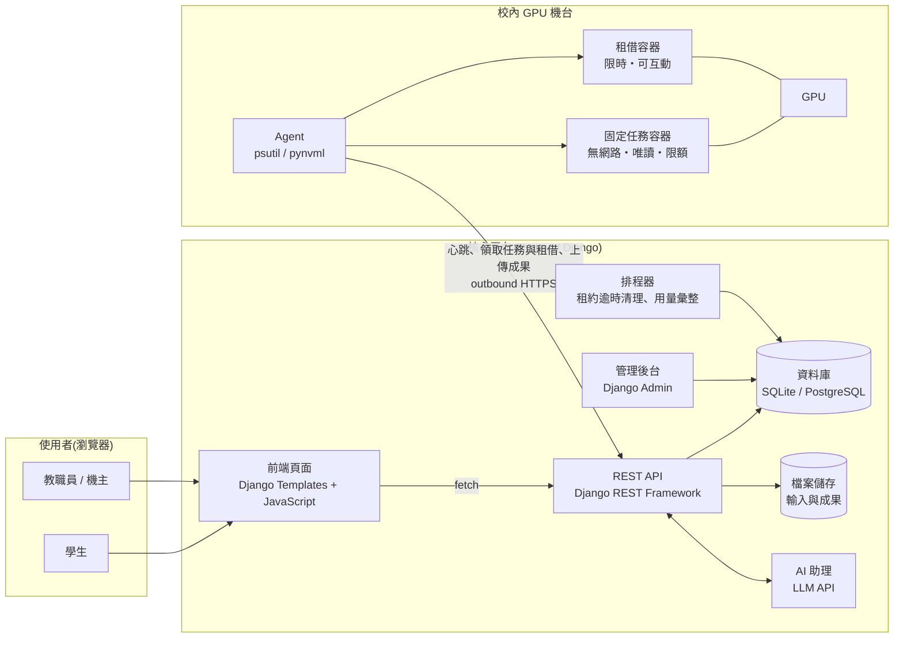

# PowerShare — 校園 GPU 任務共享平台

> 東吳大學黑客松競賽參賽專案

校內的 GPU 在課餘時間大多閒置,學生要跑語音轉逐字稿或影像處理卻沒有設備。
PowerShare 讓機主把自己的 GPU 掛上平台、隨時可以收回,使用者上傳檔案後由閒置設備接手處理,取回成果。

本文件為團隊開發手冊,定義開發規範、介面契約、分工範圍與驗收標準。
任一成員(或 AI coding assistant)依本文件即可確認自身工作內容、完成標準,以及卡關時的處理方式。

**核心原則:介面契約(§4)先行凍結,各模組再平行開發。每項工作均訂有驗收條件與降級方案,卡關時應改採降級方案繼續推進,不等待其他模組。**

> 本版整合 `codex/compute-relay-demo` 分支的任務型設計:GPU 容器(`workers/`)、機台 Agent(`agent/`)、
> 展示素材與驗收文件均自該分支移植,平台端改以 Django 重寫。原分支的實作狀態見 [驗收表](docs/acceptance.csv)。

* * *

## 模組與閱讀範圍

| 負責模組 | 初次閱讀順序 | 日常參照 |
|---|---|---|
| **全員(必讀)** | §0 → §1 → §2 → §3 | §8 風險表 |
| 後端 / API / AI 助理 | §4 全部 → §6.1 | §4 契約、§6.1 驗收表 |
| 機台 Agent / 容器 | §2 → §4.5 → §4.6 → §4.10 → §6.2 | [架構](docs/architecture.md)、[部署](docs/deployment.md) |
| 前端 / 儀表板 | §4.2 → §4.3 → §4.8 → §4.9 → §6.3 | §4.8 呼叫方式、§4.9 用量欄位、§6.3 驗收表 |
| 測試 / 整合 / 部署 | §3 → §4 → §7 | §3.4 對外測試部署、[驗收表](docs/acceptance.csv) |
| 使用者測試 | §1 → §3.3 → §6.5 | §6.5 驗收表、附錄 A |

## 目錄

- [§0 開發規範](#0-開發規範)
- [§1 專案總覽](#1-專案總覽)
- [§2 系統架構與技術棧](#2-系統架構與技術棧)
- [§3 共同前置工作(全員)](#3-共同前置工作全員)
- [§4 資料與 API 介面契約(Frozen)](#4-資料與-api-介面契約frozen)
- [§5 資源安全與隔離設計](#5-資源安全與隔離設計)
- [§6 分工任務與驗收](#6-分工任務與驗收)
- [§7 整合驗收(全員)](#7-整合驗收全員)
- [§8 風險與因應方案](#8-風險與因應方案)
- [§9 未來擴充方向](#9-未來擴充方向)
- [§10 參考案例](#10-參考案例)
- [附錄 A:週次執行矩陣](#附錄-a週次執行矩陣)
- [附錄 B:AI coding assistant 使用方式](#附錄-bai-coding-assistant-使用方式)

* * *

# §0 開發規範

**本章規範優先於文件其他章節。**

1. **§4 為凍結契約**。模型欄位、JSON 欄位名稱與型別、API 路徑與錯誤代碼不得私自更動。如需修改,應先於群組公告、經全員確認並更新本文件後,方可動工。
2. **各成員僅在所屬資料夾內作業**(§3.1)。一律開 feature branch,經 PR 且至少一人審閱後合併至 `main`;`main` 須由 repo 擁有者於 GitHub 設定分支保護。
3. **卡關逾預估時間 1.5 倍,應立即改採降級方案**(§6、§8 各項均已列出)。
4. **命名與格式**:程式碼識別字一律使用英文,註解可用中文。Python 進 repo 前執行 `black` 與 `ruff`;JavaScript 採 ES module。
5. **前端呼叫 API 一律透過 `frontend/static/js/api.js`**(§4.8),不得於各頁面自行呼叫 `fetch`。
6. **資料庫 migration 僅由後端負責人產生**,並與 `models.py` 的變更於同一個 PR 提交。
7. **帳號密碼與金鑰不得提交至 repo**,包含 `.env`、受測帳號密碼檔與節點 token。
8. **實測與模擬要分清楚**:自動化測試使用模擬節點,不能當作 GPU 或三機實測結果;數據一律登記於 [`docs/acceptance.csv`](docs/acceptance.csv)。
9. **每完成一項工作,自行對照 §6 驗收條件檢查**,通過後於群組回報。
10. **10/23 起功能凍結**(見附錄 A),僅修正缺陷與使用者測試發現的問題。

* * *

# §1 專案總覽

## 1.1 定位

校內閒置的 GPU 與需要運算的學生之間缺少媒合方式。PowerShare 以「任務」為單位共享算力:
使用者上傳檔案,平台把每個檔案派給目前閒置且通過自我測試的 GPU,完成後取回成果。
固定任務無法涵蓋的需求,另以「互動式租借」提供限時的容器操作環境(§4.10)。

機主保有完全控制權:隨時可在網站關閉分享或在機台本機停止,正在執行的檔案自動回到佇列由其他設備接手。

平台同時記錄各機台的使用狀態與用量,於儀表板呈現目前閒置的算力並可匯出留存(§4.9)。

## 1.2 任務目錄與兩種使用方式

**使用方式一:固定任務。** 使用者上傳檔案,平台派給閒置設備執行預先定義好的流程。
任務類型、模型版本與成果檔名固定於 `backend/core/profiles.py`,使用者不能指定命令、映像、模型或任意參數。

| 任務類型 | 輸入 | 成果 | 模型 / 工具 | 狀態 |
|---|---|---|---|---|
| `asr` | 音訊 | 逐字稿 `transcript.txt`、字幕 `subtitles.srt` | `whisper-small-v1` | 已開放 |
| `upscale` | 圖片 | 2 倍放大 `upscaled.png` | `realesrgan-x2-v1` | 已開放 |
| `render` | `.blend` 場景檔 | `render.png`、`render-log.txt` | `blender-4.2-cycles-v1` | 規劃中 |
| `animate` | `.blend` 場景檔與影格範圍 | `frames.zip`、`preview.mp4` | `blender-4.2-frames-v1` | 規劃中 |
| `dataset` | CSV / Parquet 資料集 | `dataset.parquet`、`summary.json` | `datatools-v1` | 規劃中 |
| `train` | 資料集與 `train.yaml` | `model.safetensors`、`metrics.json` | `pytorch-2.4-train-v1` | 規劃中 |

**狀態的意義**:`available`(已開放)代表 `workers/` 已有對應容器,使用者可送出;
`planned`(規劃中)代表介面、成果檔名與資源需求已定義並公告於目錄,容器尚未建置,
送出時由 `BatchCreateSerializer.validate_kind` 擋下。新增任務的步驟見 §6.2。

**使用方式二:互動式租借。** 使用者申請一段時間,由開放租借的設備啟動固定映像的容器,
自行進入操作,到期自動回收。與固定任務的差異見 §4.10。

## 1.3 運作方式

1. **機主掛上設備** — 機台執行 `agent prepare` 下載模型並實跑 CUDA 自我測試,通過後以一次性配對碼登錄平台。
2. **使用者送出工作** — 上傳一批檔案,每個檔案成為一件可獨立排隊、重試的工作。
3. **平台派工** — 依公平順序把工作派給閒置設備,給 20 秒租約;Agent 每 5 秒續約。
4. **機主隨時可收回** — 關閉分享或本機停止後,容器立即停止,未完成的檔案重新排隊。
5. **取回成果** — 使用者下載單一成果或整批 ZIP;成果只有本人看得到。
6. **另一條路徑:互動式租借** — 使用者申請時數,平台派給開放租借的設備啟動容器並轉交連線資訊,到期或機主收回時停止。
7. **用量留存** — 每次心跳依取樣間隔留存一筆機台狀態,並彙整為每日用量,於儀表板呈現與匯出。

## 1.4 範圍界定

**MVP 包含**

* 固定任務:語音轉逐字稿與字幕、圖片 2 倍放大(其餘任務類型先登記於目錄,見 §1.2)
* 一次性配對碼登錄 GPU、機主開關與每日開放時段
* 公平派工、租約、逾時重排與重試上限
* 上傳限制、每人同時執行上限與每日額度
* 閒置算力儀表板:機台狀態取樣、每日用量彙整與 CSV 匯出(§4.9)
* 互動式租借:申請、排隊、時數控制與回收(§4.10,平台端)
* AI 助理(以自然語言送出工作與說明佇列狀態)
* 使用者測試所需的個人帳號批次建立

**初步版本,尚未完成**

* 規劃中任務(`render`、`animate`、`dataset`、`train`)的容器與模型固定作業
* 互動式租借的機台端:容器啟動與對外連線通道的方式待確認(§4.10)
* 租借容器的資料保存與清除機制

**不包含**

* 校外人士使用、收費與額度交易
* 跨機合併顯示記憶體、斷點續跑
* 使用者自行提供程式碼或映像給固定任務執行
* 可信硬體認證(詳見 §5)

> 「不包含」為刻意界定的範圍取捨,非技術限制;「初步版本」為已定義介面但尚未完成的項目。

* * *

# §2 系統架構與技術棧

## 2.1 架構圖



## 2.2 一次任務的資料流

```
使用者上傳一批檔案
    ↓
POST /api/batches         ← 檢查檔案大小、數量與每日額度
    ↓
每個檔案建立一件 Job (status=queued)
    ↓
Agent 每 5 秒心跳,設備開放時呼叫 POST /api/agent/claim
    ↓
平台在交易內鎖定節點,依公平順序取出工作,建立 Attempt 並給 20 秒租約
    ↓
Agent 下載輸入 → 啟動固定容器 → GPU 運算 → 上傳成果
    ↓
POST /api/agent/attempts/{id}/complete   ← 確認租約仍有效,否則拒絕
    ↓
Job 完成,使用者下載成果;或因逾時、機主收回而重新排隊(最多三次)
```

互動式租借走同一條 Agent 通道,但改以 `rental_id` 續約:

```
使用者申請時數
    ↓
POST /api/rentals          ← 檢查同時只有一段租借、每日時數上限
    ↓
Rental (status=queued)
    ↓
開放租借的設備呼叫 POST /api/agent/rentals/claim  ← 該設備沒有進行中的工作才會派給它
    ↓
Agent 啟動容器並備妥連線通道 → POST /api/agent/rentals/{id}/ready(時數自此起算)
    ↓
使用者取得連線位址與權杖,自行操作;Agent 每 5 秒以 rental_id 續約
    ↓
時數到期、使用者結束或機主收回 → 容器停止 → POST /api/agent/rentals/{id}/ended
```

## 2.3 為什麼機台不需要開放連接埠

校園機台位於 NAT 與防火牆後方,不具公網 IP。本設計中**沒有任何連線是由平台連向機台**:
Agent 主動輪詢取得任務,成果也由 Agent 上傳。使用者只與平台互動,不直接連進機台,
因此不需要反向隧道或中繼伺服器,機台零 inbound port。

這也是任務型設計相對於「預約整台機器再遠端連入」的主要優勢:
機主隨時可以收回設備,未完成的檔案自動由其他設備接手。

## 2.4 技術棧

| 模組 | 技術 | 選用理由 |
|---|---|---|
| 後端框架 | **Django 5.2 LTS** | 內建 ORM、migration、認證與管理後台 |
| REST API | **Django REST Framework** | 以 serializer 定義 JSON;可瀏覽 API 便於手動測試 |
| 資料庫 | SQLite(本機開發)→ PostgreSQL(Docker Compose) | 以 `DATABASE_URL` 切換 |
| 檔案儲存 | 本機目錄(`DJANGO_DATA_DIR`) | 不經 `MEDIA_URL` 對外,一律由通過權限檢查的 view 提供 |
| 認證 | Django session(使用者)、Bearer token(節點) | 節點 token 只存雜湊,可撤銷 |
| 管理後台 | **Django Admin** | 帳號、設備、工作與事件的維護 |
| 前端 | HTML + CSS + JavaScript(ES modules) | 無須 Node.js 與建置工具 |
| 機台 Agent | `httpx`、`psutil`、`pynvml`(套件 `nvidia-ml-py`) | 自 `codex/compute-relay-demo` 分支移植 |
| 任務容器 | Docker + 固定映像(`workers/`) | 無網路、唯讀根檔案系統、限制 CPU/RAM/PID,GPU 整張指派 |
| 模型 | faster-whisper(CTranslate2)、Real-ESRGAN | 版本與權重雜湊固定,見 [THIRD_PARTY.md](THIRD_PARTY.md) |
| 排程 | **APScheduler**(`run_scheduler`,Compose 中為獨立服務) | 每秒清理逾期租約與失聯節點 |
| AI 助理 | Claude API / OpenAI API(function calling) | 無須自行訓練模型 |
| 部署 | Docker Compose + **gunicorn** + **WhiteNoise** | DEBUG 關閉時仍能提供靜態檔 |

* * *

# §3 共同前置工作(全員)

## 3.1 專案結構與檔案歸屬

```
SCU_contest/
├── README.md
├── THIRD_PARTY.md                第三方模型與套件來源
├── .env.example
├── docker-compose.yml            [測試/整合] db、migrate、web、scheduler
├── pytest.ini                    [測試/整合]
├── backend/                      [後端] Django 專案
│   ├── manage.py
│   ├── requirements.txt
│   ├── Dockerfile
│   ├── config/                   settings.py、settings_test.py、根路由 urls.py
│   └── core/
│       ├── models.py             凍結契約 §4.1
│       ├── serializers.py        凍結契約 §4.2
│       ├── urls.py               凍結契約 §4.3
│       ├── profiles.py           任務目錄與租借環境 §4.1
│       ├── services.py           派工協定 §4.5
│       ├── usage.py              用量取樣與彙整 §4.9
│       ├── rentals.py            互動式租借流程 §4.10
│       ├── scheduling.py         租約逾時清理、用量彙整
│       ├── authentication.py     節點 token 驗證
│       ├── exceptions.py         錯誤格式 §4.4
│       ├── throttles.py          登入次數限制
│       ├── views/                auth、state、batches、jobs、nodes、usage、rentals、agent、ai
│       ├── ai_assistant.py       AI 助理 §4.7
│       ├── seed_data.py          示範帳號與展示素材對照 §4.6
│       ├── admin.py              Django Admin 設定
│       ├── management/commands/  seed、import_users、run_scheduler、aggregate_usage
│       └── migrations/
├── agent/                        [Agent] 機台端程式(移植自 codex 分支)
│   ├── main.py                   CLI:doctor / prepare / pair / run / enable / stop / status
│   ├── hardware.py               NVML 讀值與 Docker 版本
│   ├── prepare.py                下載模型、建置映像、CUDA 自我測試
│   ├── runtime.py                容器啟動、隔離參數與 watchdog
│   ├── profiles.py               與後端一致的任務類型
│   └── requirements.txt
├── workers/                      [Agent] 固定任務容器
│   ├── worker.py                 ASR 與放大的執行程式
│   ├── asr.Dockerfile
│   ├── upscale.Dockerfile
│   └── models.json               模型版本與權重來源
├── frontend/                     [前端] 由 Django 直接提供
│   ├── templates/                base、home、login、workbench、nodes、dashboard、rentals、assistant、display
│   └── static/                   css/style.css、js/(api、auth、login、workbench、nodes、dashboard、rentals、display、assistant)
├── scripts/                      [測試/整合] benchmark、憑證與素材產生
├── demo-assets/                  展示素材(離線合成語音與團隊產生的校準圖片)
├── docs/                         架構、部署、驗收表、實測紀錄、展示腳本
└── tests/                        [測試/整合] 契約、派工、Agent、使用者流程、指令
```

**頁面路由**

| 路徑 | 內容 | 是否需登入 |
|---|---|---|
| `/` | 服務說明:服務內容、任務目錄、限制、申請與提供設備流程、使用規範 | 公開 |
| `/login/` | 登入 | 公開 |
| `/workbench/` | 工作台:送出批次、查看與取消自己的工作、下載成果 | 需登入 |
| `/rentals/` | 自由租借:申請時數、查看連線資訊與結束租借(§4.10) | 需登入 |
| `/dashboard/` | 閒置算力儀表板:各機台狀態、使用率曲線、每日用量與 CSV 匯出(§4.9) | 需登入 |
| `/nodes/` | 我的設備:取得配對碼、開關分享與租借、查看平台設備狀態 | 需登入 |
| `/assistant/` | AI 助理對話框 | 需登入 |
| `/display/` | 大螢幕:設備即時狀態與佇列統計 | 需登入 |
| `/admin/` | Django Admin | 管理者 |

## 3.2 環境需求

* Python 3.11–3.12、Git、現代瀏覽器(前端無須 Node.js)
* 中央服務:Docker Desktop(整合負責人必裝)
* GPU 機台:NVIDIA 驅動、Docker(Windows 用 Docker Desktop 的 WSL2 Linux 容器;Linux 用 NVIDIA Container Toolkit)
* gunicorn 僅在 Docker(Linux)中使用,本機開發一律 `runserver`

## 3.3 啟動方式

```bash
git clone https://github.com/thechi222/SCU_contest.git
cd SCU_contest
cp .env.example .env                  # 本機開發保留 DJANGO_DEBUG=1

cd backend
python -m venv .venv
source .venv/bin/activate             # Windows:.venv\Scripts\activate
pip install -r requirements.txt
python manage.py migrate
python manage.py seed                 # 建立示範帳號,密碼只顯示於終端機
python manage.py createsuperuser
python manage.py runserver
```

```bash
# 排程器(另開終端機):清理逾期租約與租借、每 5 分鐘彙整用量
cd backend && python manage.py run_scheduler

# 手動重算用量彙整(排程器未執行時使用)
cd backend && python manage.py aggregate_usage --days 7 --prune

# 測試(於 repo 根目錄)
pip install -r tests/requirements.txt
pytest
```

機台端的 `prepare`、`pair`、`run` 步驟見 [部署說明](docs/deployment.md)。

**建立受測者帳號**

```bash
# accounts.csv 欄位:email,name,role(role 為 student 或 staff)
python manage.py import_users accounts.csv --output ~/powershare-credentials.csv
```

密碼隨機產生,只寫入 `--output` 指定的檔案(檔案已存在時拒絕執行),請存放於 repo 以外的位置。

啟動後:前端 http://localhost:8000/ ,管理後台 http://localhost:8000/admin/ 。

## 3.4 對外測試部署

以 HTTPS tunnel 對外服務(例如使用者測試期間)時:

1. `DJANGO_DEBUG=0`,並設定長度至少 50 字元的 `DJANGO_SECRET_KEY`;不符合時服務拒絕啟動。
2. `DJANGO_ALLOWED_HOSTS` 加入 tunnel 網域與機台 Agent 連線用的區網 IP。
3. `DJANGO_CSRF_TRUSTED_ORIGINS` 設為 tunnel 的 HTTPS 網址。未設定時,登入後的所有寫入請求都會回 403;設定後 cookie 僅走 HTTPS。
4. 使用固定網域的 tunnel;臨時網域每次重啟都會變更。
5. `/admin/` 以 tunnel 的存取控制限制或僅於本機使用,管理者帳號使用長隨機密碼。
6. 停用示範帳號(Django Admin 取消 `is_active`),受測者使用個人帳號。
7. 對外開放前,以受測帳號實際完成一次「登入 → 上傳 → 取得成果」。

區域網路的憑證與三台機台的部署見 [部署說明](docs/deployment.md)。

* * *

# §4 資料與 API 介面契約(Frozen)

> **本章為全專案唯一不得私自變更的章節。** 如需修改,應先於群組公告並經全員確認後,方可動工。

## 4.1 資料模型

```python
# ---- backend/core/profiles.py ----
"""任務目錄與互動式租借的工作環境。Agent 的自我測試結果須與本檔一致。

`status` 欄位:
  * `available` — 已有對應的 worker 容器,使用者可送出。
  * `planned`   — 介面、成果檔名與資源需求已定義,worker 容器尚未完成,暫不開放送出。

新增任務類型的步驟見 README §6.2:先在此登記,再補上 `workers/` 的容器與模型版本,
最後把 `status` 改為 `available`。任務鍵長度不得超過 10 個字元(見 §4.1 `Job.kind`)。
"""

TASKS = {
    "asr": {
        "label": "語音轉逐字稿與字幕",
        "profile": "whisper-small-v1",
        "status": "available",
        "inputs": "音訊檔(wav / mp3 / m4a)",
        "artifacts": ["transcript.txt", "subtitles.srt"],
        "min_vram_mb": 4096,
        "note": "逐字稿保留模型輸出的用字,建議自行校對後再使用。",
    },
    "upscale": {
        "label": "圖片 2 倍放大",
        "profile": "realesrgan-x2-v1",
        "status": "available",
        "inputs": "圖片檔(png / jpg),原圖不超過 2048×2048",
        "artifacts": ["upscaled.png"],
        "min_vram_mb": 4096,
        "note": "固定 2 倍放大,不提供其他倍率或臉部修復參數。",
    },
    "render": {
        "label": "3D 靜態算圖",
        "profile": "blender-4.2-cycles-v1",
        "status": "planned",
        "inputs": "Blender 場景檔(.blend,含已打包的貼圖)",
        "artifacts": ["render.png", "render-log.txt"],
        "min_vram_mb": 8192,
        "note": "以固定的 Blender 版本與 Cycles GPU 算圖,輸出單張影像。",
    },
    "animate": {
        "label": "動畫影格算圖",
        "profile": "blender-4.2-frames-v1",
        "status": "planned",
        "inputs": "Blender 場景檔(.blend)與影格範圍設定",
        "artifacts": ["frames.zip", "preview.mp4", "render-log.txt"],
        "min_vram_mb": 8192,
        "note": "逐格算圖後合成預覽影片;影格數上限由平台設定。",
    },
    "dataset": {
        "label": "資料集批次處理",
        "profile": "datatools-v1",
        "status": "planned",
        "inputs": "資料集壓縮檔(csv / parquet)",
        "artifacts": ["dataset.parquet", "summary.json", "run-log.txt"],
        "min_vram_mb": 4096,
        "note": "以固定的清理、特徵與統計流程處理,不接受自訂程式碼。",
    },
    "train": {
        "label": "機器學習訓練",
        "profile": "pytorch-2.4-train-v1",
        "status": "planned",
        "inputs": "資料集與固定格式的設定檔(train.yaml)",
        "artifacts": ["model.safetensors", "metrics.json", "train-log.txt"],
        "min_vram_mb": 12288,
        "note": "僅提供平台預先定義的模型骨架與可填寫的超參數欄位。",
    },
}

PROFILES = {kind: task["profile"] for kind, task in TASKS.items()}
ARTIFACT_NAMES = {kind: task["artifacts"] for kind, task in TASKS.items()}
AVAILABLE_KINDS = [kind for kind, task in TASKS.items() if task["status"] == "available"]


WORKSPACES = {
    "pytorch": {
        "label": "PyTorch 訓練環境",
        "image": "powershare/workspace-pytorch:2.4-cu124",
        "status": "planned",
        "entry": "jupyter",
        "min_vram_mb": 8192,
        "note": "PyTorch 2.4、CUDA 12.4 與常用套件,以 JupyterLab 進入。",
    },
    "datasci": {
        "label": "資料科學環境",
        "image": "powershare/workspace-datasci:1.0",
        "status": "planned",
        "entry": "jupyter",
        "min_vram_mb": 4096,
        "note": "pandas、scikit-learn、RAPIDS,以 JupyterLab 進入。",
    },
    "blender": {
        "label": "Blender 算圖環境",
        "image": "powershare/workspace-blender:4.2",
        "status": "planned",
        "entry": "shell",
        "min_vram_mb": 8192,
        "note": "Blender 4.2 命令列環境,以終端機進入。",
    },
}


def task_catalog() -> list[dict]:
    """供 API 與前端顯示的任務目錄;規劃中的任務一併列出,由 status 標示能否送出。"""
    return [{"kind": kind, **task} for kind, task in TASKS.items()]


def workspace_catalog() -> list[dict]:
    return [{"key": key, **workspace} for key, workspace in WORKSPACES.items()]
```

```python
# ---- backend/core/models.py(後端負責人維護,全員唯讀參照)----
import uuid

from django.contrib.auth.models import AbstractUser
from django.db import models

from core.profiles import PROFILES


def job_input_path(instance, filename):
    return f"inputs/{instance.id}/source"


def artifact_path(instance, filename):
    return f"artifacts/{instance.job_id}/{instance.id}/{filename}"


class User(AbstractUser):
    class Role(models.TextChoices):
        STUDENT = "student", "學生"
        STAFF = "staff", "教職員"

    email = models.EmailField(unique=True)
    name = models.CharField(max_length=100)
    role = models.CharField(max_length=10, choices=Role.choices)   # 無預設值,建立帳號時須指定
    max_running = models.PositiveSmallIntegerField(default=2)      # 同時執行中的工作上限
    daily_limit = models.PositiveIntegerField(default=100)         # 每日提交檔案數上限
    last_dispatch = models.BigIntegerField(default=0)              # 公平派工用的序號,越小越優先

    USERNAME_FIELD = "email"
    REQUIRED_FIELDS = ["username", "name", "role"]

    class Meta:
        constraints = [
            models.CheckConstraint(condition=models.Q(role__in=["student", "staff"]), name="user_role_valid"),
        ]


class Node(models.Model):
    """一張參與共享的 GPU。由 Agent 以一次性配對碼登錄。"""

    id = models.UUIDField(primary_key=True, default=uuid.uuid4, editable=False)
    owner = models.ForeignKey(User, on_delete=models.PROTECT, related_name="nodes")
    name = models.CharField(max_length=60)
    token_hash = models.CharField(max_length=64, unique=True, editable=False)   # 節點 token 的 SHA-256
    gpu_uuid = models.CharField(max_length=100, unique=True)
    gpu_name = models.CharField(max_length=120)
    memory_mb = models.PositiveIntegerField()
    capabilities = models.JSONField(default=dict)   # {kind: {profile, cuda_verified, peak_vram_mb}}
    environment = models.JSONField(default=dict)    # 驅動、作業系統、容器 image ID 等佐證
    telemetry = models.JSONField(default=dict)      # 最近一次心跳的 GPU 監控數值
    sharing = models.BooleanField(default=False)        # 平台端開關,由機主於網站切換
    local_enabled = models.BooleanField(default=False)  # 機台端開關,由 Agent 的 ENABLED 檔回報
    allow_rental = models.BooleanField(default=False)   # 機主另行同意才接受互動式租借
    revoked = models.BooleanField(default=False)        # 撤銷後 token 失效
    schedule_start = models.CharField(max_length=5, null=True, blank=True)   # "HH:MM",空值代表不限時段
    schedule_end = models.CharField(max_length=5, null=True, blank=True)
    utc_offset_minutes = models.SmallIntegerField(default=480)
    last_seen = models.DateTimeField(null=True, blank=True)
    created_at = models.DateTimeField(auto_now_add=True)


class PairingCode(models.Model):
    """一次性配對碼,只存雜湊,預設 10 分鐘內有效。"""

    code_hash = models.CharField(max_length=64, primary_key=True)
    owner = models.ForeignKey(User, on_delete=models.CASCADE, related_name="pairing_codes")
    expires_at = models.DateTimeField()
    used_at = models.DateTimeField(null=True, blank=True)


class Batch(models.Model):
    id = models.UUIDField(primary_key=True, default=uuid.uuid4, editable=False)
    user = models.ForeignKey(User, on_delete=models.PROTECT, related_name="batches")
    name = models.CharField(max_length=100)
    kind = models.CharField(max_length=10, choices=[(k, k) for k in PROFILES])
    archived = models.BooleanField(default=False)
    created_at = models.DateTimeField(auto_now_add=True)


class Job(models.Model):
    class Status(models.TextChoices):
        QUEUED = "queued", "排隊中"
        LOADING = "loading", "準備中"
        RUNNING = "running", "執行中"
        RETRYING = "retrying", "重新排隊"
        COMPLETED = "completed", "已完成"
        FAILED = "failed", "失敗"
        CANCELLED = "cancelled", "已取消"

    ACTIVE = ("loading", "running")
    PENDING = ("queued", "retrying")

    id = models.UUIDField(primary_key=True, default=uuid.uuid4, editable=False)
    batch = models.ForeignKey(Batch, on_delete=models.CASCADE, related_name="jobs")
    user = models.ForeignKey(User, on_delete=models.PROTECT, related_name="jobs")
    kind = models.CharField(max_length=10, choices=[(k, k) for k in PROFILES])
    profile = models.CharField(max_length=40)          # 送出時固定的模型版本
    filename = models.CharField(max_length=255)        # 使用者原始檔名,僅供顯示
    input_file = models.FileField(upload_to=job_input_path, max_length=255)
    input_bytes = models.PositiveBigIntegerField()
    status = models.CharField(max_length=10, choices=Status.choices, default=Status.QUEUED)
    attempt_count = models.PositiveSmallIntegerField(default=0)
    stage = models.CharField(max_length=20, default="等待可用設備")
    progress = models.FloatField(null=True, blank=True)
    error = models.TextField(blank=True)
    created_at = models.DateTimeField(auto_now_add=True)
    completed_at = models.DateTimeField(null=True, blank=True)

    class Meta:
        indexes = [
            models.Index(fields=["status", "created_at"]),
            models.Index(fields=["user", "-created_at"]),
        ]


class Attempt(models.Model):
    """一次派工。租約到期或節點停止後結束,工作重新排隊。"""

    id = models.UUIDField(primary_key=True, default=uuid.uuid4, editable=False)
    job = models.ForeignKey(Job, on_delete=models.CASCADE, related_name="attempts")
    node = models.ForeignKey(Node, on_delete=models.PROTECT, related_name="attempts")
    started_at = models.DateTimeField(auto_now_add=True)
    lease_until = models.DateTimeField()
    ended_at = models.DateTimeField(null=True, blank=True)
    outcome = models.CharField(max_length=20, blank=True)   # succeeded / failed / expired / cancelled
    error = models.TextField(blank=True)
    gpu_verified = models.BooleanField(default=False)
    metrics = models.JSONField(default=dict)                # worker 回報的 gpu_seconds、engine 等

    class Meta:
        constraints = [
            models.UniqueConstraint(
                fields=["node"], condition=models.Q(ended_at__isnull=True), name="one_active_attempt_per_node",
            ),
            models.UniqueConstraint(
                fields=["job"], condition=models.Q(ended_at__isnull=True), name="one_active_attempt_per_job",
            ),
        ]
        indexes = [models.Index(fields=["ended_at", "lease_until"])]


class Artifact(models.Model):
    id = models.UUIDField(primary_key=True, default=uuid.uuid4, editable=False)
    job = models.ForeignKey(Job, on_delete=models.CASCADE, related_name="artifacts")
    name = models.CharField(max_length=100)
    file = models.FileField(upload_to=artifact_path, max_length=255)
    media_type = models.CharField(max_length=100)
    size = models.PositiveBigIntegerField()


class Rental(models.Model):
    """互動式租借:使用者在限定時間內取得一個固定映像的 GPU 容器,自行操作。

    與 Job 共用同一批節點,但一台節點同時只會有一件工作或一段租借(見 §4.5)。
    """

    class Status(models.TextChoices):
        QUEUED = "queued", "排隊中"
        STARTING = "starting", "啟動中"
        ACTIVE = "active", "使用中"
        ENDING = "ending", "結束中"
        ENDED = "ended", "已結束"
        EXPIRED = "expired", "已到期"
        FAILED = "failed", "啟動失敗"
        CANCELLED = "cancelled", "已取消"

    OPEN = ("queued", "starting", "active", "ending")   # 仍佔用佇列或節點
    ON_NODE = ("starting", "active", "ending")          # 已指派節點

    id = models.UUIDField(primary_key=True, default=uuid.uuid4, editable=False)
    user = models.ForeignKey(User, on_delete=models.PROTECT, related_name="rentals")
    node = models.ForeignKey(Node, on_delete=models.PROTECT, null=True, blank=True, related_name="rentals")
    workspace = models.CharField(max_length=20)         # WORKSPACES 的鍵
    image = models.CharField(max_length=120)            # 申請時固定的映像版本
    minutes = models.PositiveSmallIntegerField()        # 申請時數(分鐘)
    purpose = models.CharField(max_length=200, blank=True)
    status = models.CharField(max_length=10, choices=Status.choices, default=Status.QUEUED)
    connect_url = models.CharField(max_length=300, blank=True)   # Agent 回報的連線位址
    connect_token = models.CharField(max_length=120, blank=True)  # 只給租借者,結束時清除
    connection = models.JSONField(default=dict)         # 通道型態與其他連線資訊
    lease_until = models.DateTimeField(null=True, blank=True)
    created_at = models.DateTimeField(auto_now_add=True)
    started_at = models.DateTimeField(null=True, blank=True)
    expires_at = models.DateTimeField(null=True, blank=True)
    ended_at = models.DateTimeField(null=True, blank=True)
    end_reason = models.CharField(max_length=200, blank=True)

    class Meta:
        constraints = [
            models.UniqueConstraint(
                fields=["node"],
                condition=models.Q(status__in=["starting", "active", "ending"]),
                name="one_open_rental_per_node",
            ),
        ]
        indexes = [
            models.Index(fields=["status", "created_at"]),
            models.Index(fields=["user", "-created_at"]),
        ]


class UsageSample(models.Model):
    """節點狀態取樣。心跳時每 settings.USAGE_SAMPLE_SECONDS 最多寫入一筆,供儀表板繪圖與匯出。"""

    class State(models.TextChoices):
        BUSY = "busy", "執行工作"
        RENTED = "rented", "租借中"
        IDLE = "idle", "閒置可用"
        PAUSED = "paused", "未開放"
        OFFLINE = "offline", "離線"

    id = models.BigAutoField(primary_key=True)
    node = models.ForeignKey(Node, on_delete=models.CASCADE, related_name="usage_samples")
    captured_at = models.DateTimeField()
    state = models.CharField(max_length=10, choices=State.choices)
    gpu_utilization = models.FloatField(null=True, blank=True)        # 0–100
    memory_used_mb = models.PositiveIntegerField(null=True, blank=True)
    temperature_c = models.FloatField(null=True, blank=True)
    power_w = models.FloatField(null=True, blank=True)
    interval_seconds = models.FloatField(default=0)   # 距離上一筆取樣的秒數
    busy_seconds = models.FloatField(default=0)       # 區間內視為有工作的秒數

    class Meta:
        indexes = [
            models.Index(fields=["node", "-captured_at"]),
            models.Index(fields=["-captured_at"]),
        ]


class NodeDailyUsage(models.Model):
    """每日用量彙整。取樣資料會定期清除,長期統計以本表保存。"""

    id = models.BigAutoField(primary_key=True)
    node = models.ForeignKey(Node, on_delete=models.CASCADE, related_name="daily_usage")
    day = models.DateField()
    busy_seconds = models.FloatField(default=0)
    rented_seconds = models.FloatField(default=0)
    idle_seconds = models.FloatField(default=0)
    offline_seconds = models.FloatField(default=0)
    gpu_seconds = models.FloatField(default=0)        # worker 回報的實際 GPU 執行秒數
    jobs_completed = models.PositiveIntegerField(default=0)
    samples = models.PositiveIntegerField(default=0)
    avg_utilization = models.FloatField(null=True, blank=True)
    peak_utilization = models.FloatField(null=True, blank=True)
    updated_at = models.DateTimeField(auto_now=True)

    class Meta:
        constraints = [
            models.UniqueConstraint(fields=["node", "day"], name="one_usage_row_per_node_day"),
        ]
        indexes = [models.Index(fields=["-day"])]


class Event(models.Model):
    """稽核紀錄。使用者只看得到與自己的工作或設備相關的事件。"""

    id = models.BigAutoField(primary_key=True)
    user = models.ForeignKey(User, on_delete=models.SET_NULL, null=True, blank=True, related_name="events")
    node = models.ForeignKey(Node, on_delete=models.SET_NULL, null=True, blank=True, related_name="events")
    job = models.ForeignKey(Job, on_delete=models.SET_NULL, null=True, blank=True, related_name="events")
    kind = models.CharField(max_length=40)
    message = models.CharField(max_length=300)
    created_at = models.DateTimeField(auto_now_add=True)

    class Meta:
        indexes = [models.Index(fields=["user", "-id"])]
```

**狀態定義**

| 模型 | 狀態 | 意義 |
|---|---|---|
| Job | `queued` → `loading` → `running` → `completed` | 排隊 → 下載輸入與載入模型 → GPU 運算 → 完成 |
| Job | `retrying` | 上一次執行中斷,等待其他設備接手 |
| Job | `failed` | 已達重試上限(`MAX_JOB_ATTEMPTS`,預設 3) |
| Job | `cancelled` | 使用者取消,不自動重試,可手動重送 |
| Attempt | `outcome` = `succeeded` / `failed` / `expired` / `cancelled` | 成功 / 執行失敗 / 租約逾時 / 機主收回或使用者取消 |
| Node | `sharing` | 機主於網站開啟分享 |
| Node | `local_enabled` | 機台端 `agent enable`(心跳回報) |
| Node | `allow_rental` | 機主另行同意接受互動式租借(§4.10) |
| Node | `revoked` | 已撤銷,token 失效 |
| Rental | `queued` → `starting` → `active` → `ending` → `ended` | 排隊 → 設備啟動容器 → 使用中 → 停止中 → 已結束 |
| Rental | `expired` / `failed` / `cancelled` | 時數到期 / 啟動失敗或設備失聯 / 使用者取消 |
| UsageSample | `state` = `busy` / `rented` / `idle` / `paused` / `offline` | 執行工作 / 租借中 / 閒置可用 / 未開放 / 離線 |

節點要同時 `sharing`、`local_enabled`、未 `revoked` 且在開放時段內才會取得工作;
要再加上 `allow_rental` 才會取得互動式租借。一台節點同時只會有一件工作或一段租借。

## 4.2 API 資料格式

欄位由 `backend/core/serializers.py` 定義。主要回傳格式:

```json
// GET /api/state
{
  "user": {"id": 1, "email": "student@scu.edu.tw", "name": "示範學生", "role": "student",
           "max_running": 2, "daily_limit": 100, "is_admin": false},
  "nodes": [{"id": "…", "name": "實驗室 RTX 3090", "owner_name": "王老師", "is_mine": false,
             "gpu_name": "NVIDIA RTX 3090", "memory_mb": 24576, "kinds": ["asr", "upscale"],
             "sharing": true, "local_enabled": true, "revoked": false,
             "schedule_start": "18:00", "schedule_end": "23:00", "utc_offset_minutes": 480,
             "telemetry": {"gpu_utilization": 42, "memory_used_mb": 3011}, "last_seen": "…+08:00"}],
  "batches": [{"id": "…", "name": "課堂錄音", "kind": "asr", "archived": false, "created_at": "…",
               "jobs": [{"id": "…", "batch_id": "…", "kind": "asr", "profile": "whisper-small-v1",
                         "filename": "lecture.wav", "input_bytes": 1048576, "status": "running",
                         "stage": "GPU 運算中", "progress": null, "attempt_count": 1, "error": "",
                         "artifacts": [{"id": "…", "name": "transcript.txt",
                                        "media_type": "text/plain", "size": 2048}],
                         "created_at": "…", "completed_at": null}]}],
  "rentals": [{"id": "…", "workspace": "pytorch", "workspace_label": "PyTorch 訓練環境",
               "image": "powershare/workspace-pytorch:2.4-cu124", "minutes": 60, "purpose": "專題訓練",
               "status": "active", "node_name": "實驗室 RTX 3090", "connect_url": "https://…",
               "connect_token": "…", "connection": {}, "seconds_left": 2280.0,
               "created_at": "…", "started_at": "…", "expires_at": "…", "ended_at": null,
               "end_reason": ""}],
  "events": [{"id": 12, "kind": "dispatch", "message": "lecture.wav 派給 實驗室 RTX 3090",
              "created_at": "…"}],
  "tasks": [{"kind": "asr", "label": "語音轉逐字稿與字幕", "profile": "whisper-small-v1",
             "status": "available", "inputs": "音訊檔(wav / mp3 / m4a)",
             "artifacts": ["transcript.txt", "subtitles.srt"], "min_vram_mb": 4096, "note": "…"}],
  "limits": {"kinds": ["asr", "upscale"], "max_file_bytes": 52428800, "max_batch_files": 20,
             "max_batch_bytes": 157286400, "max_running": 2, "daily_limit": 100,
             "rental_max_minutes": 120, "rental_daily_minutes": 240}
}
```

```json
// GET /api/usage/summary(儀表板,§4.9)
{
  "generated_at": "…+08:00",
  "totals": {"nodes_total": 3, "nodes_online": 2, "nodes_idle": 1, "nodes_working": 1,
             "idle_vram_mb": 24576, "online_vram_mb": 32768, "avg_utilization": 46.5,
             "jobs_queued": 4, "jobs_running": 1, "rentals_open": 0},
  "nodes": [{"id": "…", "name": "實驗室 RTX 3090", "owner_name": "王老師", "is_mine": false,
             "gpu_name": "NVIDIA RTX 3090", "memory_mb": 24576, "kinds": ["asr", "upscale"],
             "allow_rental": false, "state": "busy", "gpu_utilization": 93.0,
             "memory_used_mb": 7014, "temperature_c": 68.0, "power_w": 210.0,
             "last_seen": "…+08:00",
             "today": {"busy_seconds": 5400.0, "rented_seconds": 0.0, "idle_seconds": 21600.0,
                       "gpu_seconds": 4820.5, "jobs_completed": 37},
             "series": [{"t": "…+08:00", "u": 93.0, "state": "busy"}]}],
  "days": [{"day": "2026-09-23", "busy_seconds": 5400.0, "rented_seconds": 0.0,
            "idle_seconds": 21600.0, "gpu_seconds": 4820.5, "jobs_completed": 37}],
  "settings": {"sample_seconds": 60, "retention_days": 14, "series_hours": 6}
}
```

```json
// GET /api/tasks(公開的任務目錄與租借環境)
{
  "tasks": [{"kind": "train", "label": "機器學習訓練", "profile": "pytorch-2.4-train-v1",
             "status": "planned", "inputs": "…", "artifacts": ["model.safetensors"],
             "min_vram_mb": 12288, "note": "…"}],
  "workspaces": [{"key": "pytorch", "label": "PyTorch 訓練環境",
                  "image": "powershare/workspace-pytorch:2.4-cu124", "status": "planned",
                  "entry": "jupyter", "min_vram_mb": 8192, "note": "…"}]
}
```

**格式約定**

* `user_id` 為整數;`Node`、`Batch`、`Job`、`Attempt`、`Artifact` 的 `id` 為 UUID 字串。
* 時間欄位採 ISO 8601,一律帶 `+08:00`。
* 無值欄位回傳 `null`。
* 上傳限制:單檔 50 MB、每批 20 個檔案、整批 150 MB;`upscale` 的原圖不得超過 2048×2048。

## 4.3 API 路由

| 方法 | 路徑 | Request Body | 回傳 | 認證 |
|---|---|---|---|---|
| GET | `/api/health` | — | `{"status": "ok"}` | 公開 |
| GET | `/api/state` | — | 見 §4.2 | 需登入 |
| POST | `/api/auth/login` | `{email, password}` | `User` | 公開(每帳號每分鐘 10 次) |
| POST | `/api/auth/logout` | — | `204` | 需登入 |
| GET | `/api/auth/me` | — | `User` | 需登入 |
| POST | `/api/auth/password` | `{current_password, new_password}` | `204` | 需登入 |
| POST | `/api/batches` | multipart:`kind`、`name`、`files` | `201` `Batch` | 需登入 |
| GET | `/api/batches/{id}/download` | — | ZIP | 需登入(限本人) |
| POST | `/api/jobs/{id}/cancel` | — | `Job` | 需登入(限本人) |
| POST | `/api/jobs/{id}/retry` | — | `Job` | 需登入(限本人) |
| GET | `/api/jobs/{id}/input` | — | 原始檔案 | 需登入(限本人) |
| GET | `/api/artifacts/{id}` | — | 成果檔案 | 需登入(限本人) |
| GET | `/api/tasks` | — | `{tasks, workspaces}` | 公開 |
| POST | `/api/pairing-codes` | — | `{code, expires_at}` | 需登入 |
| PATCH | `/api/nodes/{id}` | `{name?, sharing?, allow_rental?, revoked?, schedule_start?, schedule_end?, utc_offset_minutes?}` | `Node` | 需登入(限機主) |
| GET | `/api/usage/summary` | `?hours=`(1–72) | 見 §4.2 | 需登入 |
| GET | `/api/usage/nodes/{id}` | `?hours=` | `{node, series}` | 需登入 |
| GET | `/api/usage/export` | `?days=`(1–365)、`?node=` | CSV | 需登入 |
| GET | `/api/rentals` | — | `{rentals, workspaces, limits, nodes_open_to_rental, queue_length}` | 需登入 |
| POST | `/api/rentals` | `{workspace, minutes, purpose?}` | `201` `Rental` | 需登入 |
| POST | `/api/rentals/{id}/cancel` | — | `Rental` | 需登入(限本人) |
| POST | `/api/agent/pair` | `{code, name, gpu_uuid, gpu_name, memory_mb, capabilities, environment}` | `{node_id, token}` | 配對碼 |
| POST | `/api/agent/heartbeat` | `{attempt_id?, rental_id?, local_enabled, capabilities?, environment?, telemetry?, stage?, progress?}` | `{stop, lease_seconds, sharing, within_schedule}` | 節點 token |
| POST | `/api/agent/claim` | — | `{assignment}` 或 `{assignment: null}` | 節點 token |
| GET | `/api/agent/attempts/{id}/input` | — | 原始檔案 | 節點 token |
| POST | `/api/agent/attempts/{id}/complete` | multipart:`files`、`metrics` | `200` | 節點 token |
| POST | `/api/agent/attempts/{id}/fail` | `{reason}` | `200` | 節點 token |
| POST | `/api/agent/rentals/claim` | — | `{rental}` 或 `{rental: null}` | 節點 token |
| POST | `/api/agent/rentals/{id}/ready` | `{connect_url, connect_token?, connection?}` | `{status, expires_at}` | 節點 token |
| POST | `/api/agent/rentals/{id}/ended` | `{reason?}` | `200` | 節點 token |
| POST | `/api/ai/assist` | `{message}` | `{reply, batch}` | 需登入 |

* 路徑結尾不加斜線;無法對應的 `/api/` 路徑一律回 JSON 404。
* **需登入**:Django session,寫入類請求須附 `X-CSRFToken`(由 `api.js` 處理)。
* **節點 token**:`Authorization: Bearer <token>`,由 `agent pair` 取得,只存雜湊,撤銷後立即失效。
* 存取他人的工作、成果或設備一律回 `404 NOT_FOUND`。
* `claim` 的 `assignment` 欄位:`{attempt_id, job_id, kind, profile, input_url, input_bytes, lease_seconds}`。
* `rentals/claim` 的 `rental` 欄位:`{rental_id, workspace, image, entry, minutes, lease_seconds}`。
* 心跳的 `stop` 針對該次回報的項目:帶 `attempt_id` 時指工作,帶 `rental_id` 時指租借容器。

## 4.4 錯誤回傳格式

```json
{ "detail": "這次執行已結束,結果不予採用", "code": "ATTEMPT_NOT_ACTIVE" }
```

```python
from core.exceptions import ApiError

raise ApiError("超過每日上限", code="QUOTA_EXCEEDED", status_code=429)
```

| code | HTTP | 說明 |
|---|---|---|
| `VALIDATION_ERROR` | 400 | 欄位驗證失敗(含檔案大小、數量、圖片尺寸) |
| `ARTIFACT_MISMATCH` | 400 | 成果檔名與任務類型不符 |
| `LOGIN_FAILED` | 403 | 帳號或密碼不正確 |
| `NOT_AUTHENTICATED` | 403 | 未登入,或 Agent 未附 token |
| `AUTHENTICATION_FAILED` | 403 | 節點 token 無效或已撤銷 |
| `PERMISSION_DENIED` | 403 | 權限不足(含 CSRF 驗證失敗) |
| `PAIRING_CODE_INVALID` | 403 | 配對碼無效、已使用或已過期 |
| `NOT_FOUND` | 404 | 資源不存在,或非本人 / 非本機台的資源 |
| `ATTEMPT_NOT_ACTIVE` | 409 | 該次執行已結束,結果不予採用 |
| `JOB_NOT_ACTIVE` / `JOB_NOT_RETRYABLE` | 409 | 工作已結束 / 不可重送 |
| `NODE_EXISTS` | 409 | 這張 GPU 已登錄過 |
| `RENTAL_TOO_LONG` | 400 | 租借時數超過單次上限(§4.10) |
| `RENTAL_ALREADY_OPEN` | 409 | 已有一段進行中的租借 |
| `RENTAL_NOT_ACTIVE` | 409 | 該段租借已結束 |
| `QUOTA_EXCEEDED` | 429 | 超過每日檔案上限或每日租借時數上限 |
| `THROTTLED` | 429 | 登入嘗試次數過多 |
| `SERVER_ERROR` | 500 | 未預期錯誤(DEBUG 關閉時不含細節) |

## 4.5 派工協定

派工、續約、回報與逾時處理集中在 `core/services.py`,view 只負責驗證與序列化。
行為以 `tests/test_dispatch.py` 為準。

```python
# ---- backend/core/services.py(後端負責人維護,全員唯讀參照)----
"""派工協定。所有狀態轉換都在交易內完成,並以租約與 attempt 識別避免延遲結果覆蓋新狀態。"""

from datetime import datetime, timedelta, timezone as dt_timezone

from django.conf import settings
from django.db import transaction
from django.db.models import Count, Max, Q
from django.utils import timezone

from core.exceptions import ApiError
from core.models import Attempt, Event, Job, Node, Rental


def record(kind: str, message: str, *, user=None, node=None, job=None) -> None:
    Event.objects.create(kind=kind, message=message[:300], user=user, node=node, job=job)


def within_schedule(node: Node, now=None) -> bool:
    """節點設定的每日開放時段;未設定時視為全天開放。"""
    if not node.schedule_start or not node.schedule_end:
        return True
    now = now or timezone.now()
    local = now.astimezone(dt_timezone(timedelta(minutes=node.utc_offset_minutes)))
    current = local.strftime("%H:%M")
    if node.schedule_start <= node.schedule_end:
        return node.schedule_start <= current < node.schedule_end
    return current >= node.schedule_start or current < node.schedule_end   # 跨午夜


def node_accepts_work(node: Node) -> bool:
    return bool(node.sharing and node.local_enabled and not node.revoked and within_schedule(node))


def end_attempt(attempt: Attempt, outcome: str, error: str = "", *, now=None) -> None:
    attempt.ended_at = now or timezone.now()
    attempt.outcome = outcome
    attempt.error = error[:400]
    attempt.save(update_fields=["ended_at", "outcome", "error"])


def requeue_or_fail(job: Job, reason: str) -> None:
    """接力重試:未達上限則重新排隊,達上限標為失敗。"""
    if job.attempt_count >= settings.MAX_JOB_ATTEMPTS:
        job.status = Job.Status.FAILED
        job.error = reason[:400]
        job.completed_at = timezone.now()
        job.stage = "已結束"
    else:
        job.status = Job.Status.RETRYING
        job.error = reason[:400]
        job.stage = "等待可用設備"
        job.progress = None
    job.save(update_fields=["status", "error", "stage", "progress", "completed_at"])
    record("job", f"{job.filename}:{reason}", user=job.user, job=job)


@transaction.atomic
def claim_job(node: Node) -> Attempt | None:
    """為節點取出一件工作並建立 attempt。節點未開放、已有進行中的 attempt 或無合適工作時回傳 None。"""
    node = Node.objects.select_for_update().get(pk=node.pk)
    if not node_accepts_work(node):
        return None
    if Attempt.objects.filter(node=node, ended_at__isnull=True).exists():
        return None
    if Rental.objects.filter(node=node, status__in=Rental.ON_NODE).exists():
        return None   # 互動式租借期間整台設備由租借者使用(§4.10)

    kinds = [kind for kind in node.capabilities if node.capabilities[kind].get("cuda_verified")]
    if not kinds:
        return None

    over_limit = [
        row["user"]
        for row in Job.objects.filter(status__in=Job.ACTIVE)
        .values("user", "user__max_running")
        .annotate(running=Count("id"))
        if row["running"] >= row["user__max_running"]
    ]

    job = (
        Job.objects.select_for_update(skip_locked=True)
        .filter(status__in=Job.PENDING, kind__in=kinds)
        .exclude(user_id__in=over_limit)
        .select_related("user")
        .order_by("user__last_dispatch", "created_at")
        .first()
    )
    if job is None:
        return None

    now = timezone.now()
    attempt = Attempt.objects.create(
        job=job, node=node, lease_until=now + timedelta(seconds=settings.LEASE_SECONDS),
    )
    job.status = Job.Status.LOADING
    job.stage = "下載輸入"
    job.attempt_count += 1
    job.progress = None
    job.save(update_fields=["status", "stage", "attempt_count", "progress"])

    next_turn = (Job.objects.aggregate(top=Max("user__last_dispatch"))["top"] or 0) + 1
    type(job.user).objects.filter(pk=job.user_id).update(last_dispatch=next_turn)
    record("dispatch", f"{job.filename} 派給 {node.name}", user=job.user, node=node, job=job)
    return attempt


@transaction.atomic
def renew_lease(node: Node, attempt_id, stage: str | None, progress: float | None) -> bool:
    """續約成功回傳 True;attempt 已結束、節點已關閉分享或不在開放時段時回傳 False,Agent 應立即停止容器。"""
    attempt = (
        Attempt.objects.select_for_update()
        .filter(pk=attempt_id, node=node, ended_at__isnull=True)
        .select_related("job")
        .first()
    )
    if attempt is None:
        return False
    if not node_accepts_work(node):
        end_attempt(attempt, "cancelled", "機主已停止分享")
        requeue_or_fail(attempt.job, "機主收回設備,工作重新排隊")
        return False

    attempt.lease_until = timezone.now() + timedelta(seconds=settings.LEASE_SECONDS)
    attempt.save(update_fields=["lease_until"])

    job = attempt.job
    updates = []
    if stage and job.stage != stage:
        job.stage = stage
        updates.append("stage")
    if job.status != Job.Status.RUNNING and stage in ("GPU 運算中", "上傳結果"):
        job.status = Job.Status.RUNNING
        updates.append("status")
    if progress is not None:
        job.progress = progress
        updates.append("progress")
    if updates:
        job.save(update_fields=updates)
    return True


@transaction.atomic
def complete_attempt(node: Node, attempt_id, artifacts: list, metrics: dict) -> None:
    """只接受仍持有租約的 attempt 回報,避免逾時後的舊結果覆寫重新派工的工作。"""
    attempt = (
        Attempt.objects.select_for_update()
        .filter(pk=attempt_id, node=node, ended_at__isnull=True)
        .select_related("job")
        .first()
    )
    if attempt is None:
        raise ApiError("這次執行已結束,結果不予採用", code="ATTEMPT_NOT_ACTIVE", status_code=409)

    attempt.metrics = metrics
    attempt.gpu_verified = bool(metrics.get("cuda_verified"))
    attempt.save(update_fields=["metrics", "gpu_verified"])
    end_attempt(attempt, "succeeded")

    job = attempt.job
    for artifact in artifacts:
        artifact.job = job
        artifact.save()
    job.status = Job.Status.COMPLETED
    job.stage = "已完成"
    job.progress = 1.0
    job.error = ""
    job.completed_at = timezone.now()
    job.save(update_fields=["status", "stage", "progress", "error", "completed_at"])
    record("job", f"{job.filename} 已完成", user=job.user, node=node, job=job)


@transaction.atomic
def fail_attempt(node: Node, attempt_id, reason: str) -> None:
    attempt = (
        Attempt.objects.select_for_update()
        .filter(pk=attempt_id, node=node, ended_at__isnull=True)
        .select_related("job")
        .first()
    )
    if attempt is None:
        raise ApiError("這次執行已結束", code="ATTEMPT_NOT_ACTIVE", status_code=409)
    end_attempt(attempt, "failed", reason)
    requeue_or_fail(attempt.job, reason)


def expire_leases() -> int:
    """由排程器每秒呼叫。租約逾時代表節點失聯,工作重新排隊。"""
    now = timezone.now()
    expired = list(
        Attempt.objects.filter(ended_at__isnull=True, lease_until__lt=now).select_related("job", "node")
    )
    for attempt in expired:
        with transaction.atomic():
            fresh = Attempt.objects.select_for_update().filter(pk=attempt.pk, ended_at__isnull=True).first()
            if fresh is None:
                continue
            end_attempt(fresh, "expired", "租約逾時")
            requeue_or_fail(attempt.job, "設備失去聯繫,工作重新排隊")
    return len(expired)


def mark_offline_nodes() -> int:
    """心跳中斷的節點不再視為線上;進行中的工作由租約逾時處理。"""
    deadline = timezone.now() - timedelta(seconds=settings.NODE_OFFLINE_SECONDS)
    return Node.objects.filter(
        Q(last_seen__lt=deadline) | Q(last_seen__isnull=True), local_enabled=True,
    ).update(local_enabled=False)


@transaction.atomic
def cancel_job(user, job_id) -> Job:
    job = Job.objects.select_for_update().filter(pk=job_id, user=user).first()
    if job is None:
        raise ApiError("找不到這件工作", code="NOT_FOUND", status_code=404)
    if job.status in (Job.Status.COMPLETED, Job.Status.FAILED, Job.Status.CANCELLED):
        raise ApiError("這件工作已結束", code="JOB_NOT_ACTIVE", status_code=409)

    active = Attempt.objects.select_for_update().filter(job=job, ended_at__isnull=True).first()
    if active is not None:
        end_attempt(active, "cancelled", "使用者取消")
    job.status = Job.Status.CANCELLED
    job.stage = "已取消"
    job.completed_at = timezone.now()
    job.save(update_fields=["status", "stage", "completed_at"])
    record("job", f"{job.filename} 已取消", user=user, job=job)
    return job


@transaction.atomic
def retry_job(user, job_id) -> Job:
    job = Job.objects.select_for_update().filter(pk=job_id, user=user).first()
    if job is None:
        raise ApiError("找不到這件工作", code="NOT_FOUND", status_code=404)
    if job.status not in (Job.Status.FAILED, Job.Status.CANCELLED):
        raise ApiError("只有失敗或已取消的工作可以重送", code="JOB_NOT_RETRYABLE", status_code=409)

    job.status = Job.Status.QUEUED
    job.attempt_count = 0
    job.error = ""
    job.stage = "等待可用設備"
    job.progress = None
    job.completed_at = None
    job.save(update_fields=["status", "attempt_count", "error", "stage", "progress", "completed_at"])
    record("job", f"{job.filename} 重新送出", user=user, job=job)
    return job


def check_daily_quota(user, file_count: int) -> None:
    since = timezone.now() - timedelta(days=1)
    used = Job.objects.filter(user=user, created_at__gte=since).count()
    if used + file_count > user.daily_limit:
        raise ApiError(
            f"超過每日上限({user.daily_limit} 個檔案)", code="QUOTA_EXCEEDED", status_code=429,
        )
```

重點:

* 同一節點、同一工作各自只能有一個未結束的 `Attempt`(資料庫條件式唯一索引)。
* 派工在交易內鎖定節點;排序依 `User.last_dispatch`、建立時間,達到同時執行上限的使用者跳過。
* 租約 20 秒,Agent 每 5 秒續約;逾時、機主收回或節點失聯都會結束該次執行並重新排隊。
* 完成與失敗回報都會再次確認租約仍有效,逾時後送達的結果回 `ATTEMPT_NOT_ACTIVE`。
* 節點上有進行中的互動式租借時不派工(§4.10);租借流程本身實作於 `core/rentals.py`,不改動本協定。

## 4.6 Agent 通道

Agent 只發出 outbound 請求,機台零 inbound port。流程:

1. `agent prepare` 下載模型、建置容器映像、實跑 CUDA 自我測試,固定 image ID、模型 SHA-256、GPU UUID 與驅動版本。
2. 使用者於 `/nodes/` 取得一次性配對碼(10 分鐘有效),機台執行 `agent pair` 取得節點 token。
3. `agent run` 每 5 秒送心跳;心跳回傳 `stop` 為 true 時立即停止容器。
4. 機台 `agent enable` 且網站分享開啟時才會 `claim`;取得工作後下載輸入、執行容器、上傳成果。
5. 續約失敗或本機 `stop` 時,watchdog 立即停止容器,平台端由租約逾時重新排隊。

只有 `capabilities` 通過驗證(模型版本相符且 `cuda_verified` 為 true)的任務類型會被接受,
未通過自我測試的 GPU 無法配對,也無法在心跳中宣稱能力。

**互動式租借共用同一條通道(§4.10)**

* 機主開啟 `allow_rental` 後,Agent 另行呼叫 `POST /api/agent/rentals/claim`;
  該節點有進行中的工作或租借時一律回 `{"rental": null}`。
* 領取後啟動租借映像並備妥連線通道,以 `POST /api/agent/rentals/{id}/ready` 回報 `connect_url`
  與 `connect_token`;逾 `RENTAL_START_SECONDS`(預設 180 秒)未回報即退回佇列。
* 心跳改帶 `rental_id` 續約,`stop` 為 true 時立即停止容器並以
  `POST /api/agent/rentals/{id}/ended` 回報。
* 心跳同時依取樣間隔留存一筆用量紀錄(§4.9),Agent 端無須額外呼叫。

> Agent 端的租借容器啟動與連線通道尚未實作(§1.4),此節定義的是平台端已就緒的介面。

**Agent 端環境變數**

| 變數 | 說明 |
|---|---|
| `AGENT_CPU_LIMIT` | 每個工作容器可用的 CPU 核心數 |
| `AGENT_MEM_LIMIT_GB` | 每個工作容器可用的記憶體(GB) |

容器的隔離參數(無網路、唯讀根檔案系統、移除 capabilities、限制 PID)見 `agent/runtime.py` 與
[架構文件](docs/architecture.md)。

## 4.7 AI 助理函式簽章

```python
# ---- backend/core/ai_assistant.py(後端 / AI 負責人)----
from dataclasses import dataclass

from core.models import Batch, User


@dataclass
class AIAssistResult:
    reply: str                 # 給使用者的自然語言回覆
    batch: Batch | None        # 助理代為送出批次時帶回


def handle_ai_request(user: User, message: str) -> AIAssistResult:
    """用 LLM function calling 解析 message,可呼叫下列工具函式:

      describe_queue(user) -> dict
          目前排隊、執行中與已完成的工作數,以及可用設備數。

      submit_batch(user, kind, name, files) -> Batch
          以使用者已上傳的檔案建立批次;kind 只能是 core.profiles.PROFILES 的鍵。

    助理不得自行指定模型、容器或參數;任務類型以外的需求一律以自然語言回覆說明。
    由 AIAssistView 以 AIAssistResponseSerializer 序列化後回傳。
    """
    ...


def generate_usage_summary(batch: Batch) -> str:
    """把一個批次的執行結果轉成摘要,內容須包含檔案數、各次執行的 GPU 秒數與參與設備。
    若加入估算值(例如相較單機的節省時間),須註明計算方式與量測來源。"""
    ...
```

## 4.8 前端 API 呼叫方式

```js
import { api, ApiError, pollState } from "./api.js";

pollState((state) => render(state));          // 每 2 秒輪詢 /api/state,未登入時導向 /login/

const form = new FormData();                   // 上傳批次
form.append("kind", "asr");
form.append("name", "課堂錄音");
form.append("files", file);
try {
  await api("/api/batches", { method: "POST", body: form });
} catch (err) {
  if (err instanceof ApiError && err.code === "QUOTA_EXCEEDED") { /* 顯示額度訊息 */ }
}
```

`api()` 統一處理:附帶 session cookie、非 GET 請求加上 `X-CSRFToken`(每次從 cookie 讀取,
登入後 token 更換也不受影響)、JSON 與 `FormData` 兩種 body、`204` 回傳 `null`、
非 2xx 拋出含 `status`、`detail`、`code` 的 `ApiError`。

**各頁面的資料來源**

| 頁面 | 模組 | 端點與更新頻率 |
|---|---|---|
| 工作台 `/workbench/` | `workbench.js` | `pollState()` 每 2 秒 `/api/state`;任務選單由 `state.tasks` 產生,`planned` 不可選 |
| 我的設備 `/nodes/` | `nodes.js` | `pollState()`;`PATCH /api/nodes/{id}` 切換 `sharing` 與 `allow_rental` |
| 儀表板 `/dashboard/` | `dashboard.js` | 每 5 秒 `/api/usage/summary`;曲線以內嵌 SVG 繪製,不使用外部圖表套件 |
| 自由租借 `/rentals/` | `rentals.js` | 每 5 秒 `/api/rentals`;`POST /api/rentals` 申請、`/cancel` 結束 |
| 即時看板 `/display/` | `display.js` | `pollState()`,大螢幕用 |
| 服務說明 `/` | 無 | 公開頁面,純靜態內容 |

## 4.9 用量取樣與儀表板

> §4.9 與 §4.10 為初步版本,尚未納入凍結範圍(§4.1–§4.8 已凍結)。
> 這兩節的欄位在機台端與容器方案確定前仍可能調整,變更時同樣須於群組公告。

閒置算力儀表板的資料分兩層保存,實作於 `core/usage.py`,行為以 `tests/test_usage.py` 為準。

| 層級 | 模型 | 寫入時機 | 保留期間 |
|---|---|---|---|
| 即時取樣 | `UsageSample` | Agent 心跳,每台節點最多每 `USAGE_SAMPLE_SECONDS`(預設 60 秒)一筆 | `USAGE_RETENTION_DAYS`(預設 14 天) |
| 每日彙整 | `NodeDailyUsage` | 排程器每 `USAGE_ROLLUP_SECONDS`(預設 300 秒)重算當日,或 `aggregate_usage` 指令 | 永久 |

* 取樣的 `state` 由平台判定(§4.1),不採信機台自述;`interval_seconds` 為距上一筆的秒數,
  上限 15 分鐘,避免離線空窗灌入統計。
* `busy_seconds` 只在 `busy` 與 `rented` 時累計;`NodeDailyUsage.gpu_seconds` 取自
  `Attempt.metrics.gpu_seconds`(worker 實測),兩者意義不同,不可互相取代。
* 彙整為冪等運算:同一天重算結果相同,可安全重跑。
* 取樣清除後每日彙整仍保留,長期統計不受影響。
* `GET /api/usage/export` 以串流輸出 CSV,欄位固定為
  `day,node,gpu,busy_seconds,rented_seconds,idle_seconds,offline_seconds,gpu_seconds,jobs_completed,avg_utilization,peak_utilization`。

## 4.10 互動式租借

固定任務之外的第二種使用方式:使用者取得一個限時的 GPU 容器自行操作。
狀態機實作於 `core/rentals.py`,行為以 `tests/test_rentals.py` 為準。

| 項目 | 固定任務(§4.5) | 互動式租借 |
|---|---|---|
| 送出內容 | 檔案 | 時數與工作環境 |
| 執行內容 | 平台定義的流程 | 使用者自行於容器內操作 |
| 結束條件 | 工作完成 | 時數到期、使用者結束或機主收回 |
| 中斷處理 | 自動重新排隊(最多三次) | 啟動中退回佇列;使用中標記 `failed`(容器狀態無法轉移) |
| 設備範圍 | 所有分享中的設備 | 另行開啟 `allow_rental` 的設備 |

**限制**(`backend/config/settings.py`)

| 設定 | 預設 | 意義 |
|---|---|---|
| `RENTAL_MAX_MINUTES` | 120 | 單次租借時數上限 |
| `RENTAL_DAILY_MINUTES` | 240 | 每人每日租借時數合計上限 |
| `RENTAL_START_SECONDS` | 180 | 設備領取後須在此秒數內回報可連線 |

* 每人同時只能有一段未結束的租借。
* 時數自 `ready` 回報起算,不含容器啟動時間。
* 結束時清除 `connect_url` 與 `connect_token`,權杖不再保留。
* 租借期間該節點不再接受固定任務(`services.claim_job` 於領取時檢查)。

**尚未完成**:機台端啟動容器與對外連線通道的方式待確認。
校園機台位於 NAT 後方(§2.3),平台不會主動連入機台,連線須由機台端自行建立對外通道;
候選方案與取捨見 [架構文件](docs/architecture.md)。在此之前,申請會停留在 `queued`。

* * *
# §5 資源安全與隔離設計

> 「讓別人的程式在我的電腦上跑」是本專案最常被質疑的部分,全員都要能說明本章內容。
> 完整版見 [架構與可靠性](docs/architecture.md)。

| 機制 | 做法 | 對外說明 |
|---|---|---|
| 固定任務 | 任務類型與模型版本固定於任務目錄,使用者不能指定命令、映像或參數 | 平台上跑的是平台自己的程式,不是使用者上傳的程式 |
| 互動式租借 | 機主須另行開啟 `allow_rental`;容器限時、到期自動回收,結束時清除連線權杖 | 願意開放自由操作的設備才會收到租借,且有時間上限 |
| 容器隔離 | 無網路、唯讀根檔案系統、移除 Linux capabilities、禁止提權、限制 CPU/RAM/PID | 工作容器碰不到主機系統,也無法對外連線 |
| GPU 分配 | 以 `--gpus` 指派整張 GPU 給單一工作獨占 | Docker 無法限制 GPU 使用率與顯示記憶體,因此不與他人共用同一張卡 |
| 機主控制 | 網站分享開關與機台 `stop` 皆立即停止容器,檔案重新排隊 | 機主隨時可以收回設備,不必等工作結束 |
| 自我測試 | 只有通過 CUDA 自我測試、模型版本相符的設備能登錄與接單 | 不會把工作派給沒有能力完成的機器 |
| 網路方向 | 全部由機台主動 outbound,機台零 inbound port | 不需要在校園網路開放任何連接埠 |
| 節點驗證 | 每台設備一把 token,只存雜湊,配對碼一次性且 10 分鐘有效,可撤銷 | 無法冒用其他設備的身分接單 |
| 帳號發放 | 由管理者批次建立個人帳號,密碼隨機產生 | 每位使用者的操作可個別追溯 |
| 登入保護 | 每帳號每分鐘最多 10 次登入嘗試 | 降低密碼遭暴力破解的風險 |
| 資料範圍 | 使用者只能存取自己的輸入與成果;租借的連線資訊只回傳給租借者本人 | 成果不會被其他使用者看到 |
| 用量紀錄 | 只記錄設備層級的狀態與使用率,不含使用者上傳內容 | 儀表板看得到機器忙不忙,看不到別人處理什麼檔案 |
| 錯誤資訊 | 對外環境關閉 DEBUG,錯誤只回代碼 | 不外洩原始碼、路徑與連線字串 |

**誠實說明的限制**:本版以受管理且信任的校內設備為前提。Agent 回報的 CUDA 與硬體佐證
無法抵抗惡意機主偽造;機主也可能接觸自己設備處理的檔案;管理者可查看全平台資料。
試用請使用公開或已取得同意的素材。

互動式租借的風險高於固定任務:容器內由使用者自行操作,隔離參數(是否給網路、可用資源、
可掛載的目錄)與稽核方式尚未定案,正式開放前須與設備提供單位確認,並於 §4.10 補上結論。

* * *

# §6 分工任務與驗收

> 平台端的派工協定、Agent 通道與使用者流程已實作並有測試(`pytest` 全數通過)。
> 下表為各模組接下來的工作;「已完成」項目列出對應的驗收證據,供回歸檢查。

## 6.1 後端 / API / AI 助理負責人 — 擁有 `backend/`

| # | 工作項目 | 驗收條件 | 降級方案 |
|---|---|---|---|
| 1 | 維護 §4 契約 | `models.py`、`serializers.py`、`urls.py`、`services.py` 與 migration 與本文件一致 | 無 |
| 2 | 派工協定(已完成) | `tests/test_dispatch.py` 全數通過 | — |
| 3 | Agent 通道(已完成) | `tests/test_agent.py` 全數通過 | — |
| 4 | 使用者流程(已完成) | `tests/test_jobs.py` 全數通過 | — |
| 5 | AI 助理 `/api/ai/assist` | 輸入「把這幾個錄音轉成逐字稿」能建立對應批次;無法處理的需求以自然語言說明 | function calling 不穩定時,先以關鍵字判斷任務類型 |
| 6 | AI 使用報告 | `generate_usage_summary()` 產出含檔案數、GPU 秒數與參與設備的摘要;估算值註明計算方式 | 先以固定模板填入數值 |
| 7 | 管理者報表 | Django Admin 可查詢各設備的執行次數與成功率 | 以 Admin 既有清單與篩選代替 |
| 8 | 節點開放時段 | `schedule_start` / `schedule_end` 於網站可設定,超出時段不派工 | 僅提供分享開關,不做時段 |
| 9 | 用量取樣與彙整(初步完成) | `tests/test_usage.py` 全數通過;排程器每 5 分鐘彙整,`aggregate_usage` 可手動重算 | — |
| 10 | 互動式租借狀態機(初步完成) | `tests/test_rentals.py` 全數通過;逾時、到期與機主收回均正確結束 | — |
| 11 | 租借配額與稽核 | 每人時數上限可由管理者依單位調整;租借的開始與結束皆留存事件 | 先以 `settings` 常數固定 |

## 6.2 機台 Agent / 容器負責人 — 擁有 `agent/`、`workers/`

| # | 工作項目 | 驗收條件 | 降級方案 |
|---|---|---|---|
| 1 | 環境檢查 | `agent doctor` 在實機讀出 GPU、驅動與 Docker 版本 | — |
| 2 | 模型與映像準備 | `agent prepare --kind asr` 與 `--kind upscale` 通過 CUDA 自我測試,記錄 image ID 與模型 SHA-256 | 先完成一種任務類型 |
| 3 | 配對與接單 | `agent pair` 後 `run` + `enable`,網站可見設備在線並取得工作 | — |
| 4 | 實跑兩種任務 | 送出 `demo-assets/` 的素材,成果可下載且內容正確 | 先完成一種任務類型,另一種列為待辦並登記於驗收表 |
| 5 | 機主收回 | 網站 OFF 與本機 `stop` 都能在數秒內停止容器,工作由其他設備接手 | — |
| 6 | 資源限制 | `docker stats` 可見容器受限於 `AGENT_CPU_LIMIT` 與 `AGENT_MEM_LIMIT_GB` | 手動 `docker run` 驗證參數 |
| 7 | 多 GPU 主機 | 每張卡以不同 `--dir` 與 `--gpu` 各自接單 | 單卡即可,多卡列為後續 |
| 8 | 新增任務類型 | 依 §1.2 目錄補上容器與模型固定作業,`prepare` 通過自我測試後把 `status` 改為 `available` | 先完成一種(建議 `render`),其餘維持 `planned` |
| 9 | 租借容器與通道 | Agent 實作 `rentals/claim` → 啟動映像 → `ready` → 心跳續約 → `ended`;決定對外通道方式並記錄於 §4.10 | 先於校內網路直連測試,對外通道列為待辦 |

## 6.3 前端 / 儀表板負責人 — 擁有 `frontend/`

| # | 工作項目 | 驗收條件 | 降級方案 |
|---|---|---|---|
| 1 | 登入與工作台(已完成) | 可登入、上傳批次、查看狀態、取消與重送、下載成果 | — |
| 2 | 設備頁(已完成) | 可取得配對碼、開關分享、查看平台設備狀態 | — |
| 3 | 大螢幕(已完成) | 顯示各設備即時使用率與佇列統計 | — |
| 4 | 上傳體驗 | 顯示上傳進度、拖放檔案、超過限制時即時提示 | 僅顯示送出後的結果 |
| 5 | 開放時段設定 | 機主可於設備頁設定每日開放時段 | 由管理者於 Admin 設定 |
| 6 | AI 助理對話框 | 顯示 AI 回覆與助理代為送出的批次 | — |
| 7 | 使用報告頁 | 批次完成後顯示摘要與各設備的執行紀錄 | 先顯示原始數值 |
| 8 | 閒置算力儀表板(初步完成) | `/dashboard/` 顯示各機台狀態、使用率曲線與每日用量,可匯出 CSV | — |
| 9 | 自由租借頁(初步完成) | `/rentals/` 可申請、顯示排隊與連線資訊、結束租借 | — |
| 10 | 儀表板細節 | 可切換時間範圍、點選單一機台查看細節(`/api/usage/nodes/{id}`) | 維持固定 6 小時範圍 |

## 6.4 測試 / 整合 / 部署負責人 — 擁有 `tests/`、`docker-compose.yml`、`scripts/`

| # | 工作項目 | 驗收條件 | 降級方案 |
|---|---|---|---|
| 1 | 契約與協定測試(已完成) | `pytest` 全數通過 | — |
| 2 | Docker Compose | `docker compose up --build` 啟動 db、migrate、web、scheduler,首頁與 JavaScript 正常載入 | 本機 SQLite 執行 |
| 3 | 對外測試部署 | 依 §3.4 設定,經固定網域的 HTTPS tunnel 完成一次「登入 → 上傳 → 取得成果」 | 臨時網域,每次重啟更新設定 |
| 4 | 三機同時派工 | 兩個帳號同時送件,三台設備同時執行,大螢幕可見 | 兩台設備亦可,於報告註明 |
| 5 | 效能量測 | `scripts/benchmark.py` 以相同檔案比較單機與三機,JSON 存於 `docs/measurements/` | 記錄單機基準,三機列為待辦 |
| 6 | 驗收表維護 | [`docs/acceptance.csv`](docs/acceptance.csv) 每週更新,區分已驗證與待驗證 | — |
| 7 | 異常演練 | 執行中拔網路線 / 關閉 Agent,工作於租約逾時後由其他設備完成 | 以關閉分享模擬 |
| 8 | 用量資料驗證 | 連續執行數小時後,`aggregate_usage` 的每日數字與 `Attempt` 紀錄一致 | 以測試資料比對 |

## 6.5 使用者測試負責人 — 擁有使用者測試的計畫、紀錄與數據

| # | 工作項目 | 驗收條件 | 降級方案 |
|---|---|---|---|
| 1 | 測試計畫 | 10/5 前定稿:受測任務(登入 → 上傳 → 取回成果)、成功標準、量測指標(任務完成率、完成時間、SUS 問卷)與訪談題綱 | — |
| 2 | 招募與同意 | 10/12 前確認 15 位校內受測者並取得知情同意 | 以實際招募人數進行,並於結果註明 |
| 3 | 受測帳號 | 以 `import_users` 建立個人帳號,密碼檔不進 repo | — |
| 4 | 測試執行 | 10/13–10/19 完成測試,記錄完成情形、耗時與問題 | 無法到場者改線上進行 |
| 5 | 數據整理 | 10/23 前彙整量化與質化結果,缺陷回報對應模組 | — |
| 6 | 素材同意 | 受測者上傳的音訊或圖片取得使用同意,測試後依約定清除 | 僅使用平台提供的展示素材 |

* * *

# §7 整合驗收(全員)

```
1. 以個人帳號登入
     ↓
2. 機主於 /nodes/ 開啟分享,機台 agent enable
     ↓
3. 上傳一批音訊與圖片
     ↓
4. 大螢幕可見工作分別派給不同設備,GPU 使用率上升
     ↓
5. 關閉其中一台的分享 → 該檔案回到排隊,由另一台接手完成
     ↓
6. 下載逐字稿、字幕與放大後的圖片
     ↓
7. 檢視 AI 生成的使用報告
```

| 驗收項 | 條件 | 降級方案 |
|---|---|---|
| 派工與重試 | 重疊送件、逾時、機主收回三種情境行為正確 | 以 `pytest` 結果佐證,實機補測 |
| GPU 實跑 | 成果由具 CUDA 的容器產生,`metrics.cuda_verified` 為 true | — |
| 機主收回 | 關閉分享後數秒內容器停止,檔案重新排隊 | — |
| 多機同時執行 | 兩個帳號送件時三台設備同時執行 | 兩台設備,於報告註明 |
| 對外部署 | 經 HTTPS tunnel 完成一次完整流程 | — |
| 誠實標示 | 驗收表區分已驗證與待驗證,模擬素材有標示 | — |

* * *

# §8 風險與因應方案

| 風險 | 問題描述 | 因應方案 |
|---|---|---|
| 機主信任 | 機主可能接觸自己設備處理的檔案 | 明確告知使用者;試用使用公開或已同意的素材(§5) |
| 惡意機主偽造回報 | Agent 佐證無法遠端認證 | 限受管理的校內設備;成果異常可回報並重送 |
| GPU 環境差異 | 驅動、CUDA、WSL2 設定不一致導致 `prepare` 失敗 | `agent doctor` 先檢查;失敗機台不登錄,不影響平台 |
| 模型下載量大 | 首次 `prepare` 需數 GB 流量 | 提前於各機台完成,展示當天不需連外 |
| 設備數量不足 | 借不到三台 GPU | 以團隊筆電加一台 GPU 機台驗證流程,報告註明台數 |
| 對外部署設定 | tunnel、CSRF 或 DEBUG 設定錯誤 | 依 §3.4 設定,測試前實際演練 |
| 資料保存 | 使用者上傳內容的保存與清除未定 | 測試期間明訂保存期限,結束後清除 |
| 測試數據混雜 | 受測者共用帳號會混淆數據 | 每人個人帳號(§6.5) |
| Migration 衝突 | 多人同時改模型 | 僅後端負責人產生 migration(§0 規範 6) |
| 證據被誤用 | 模擬測試被當成實機成果 | 驗收表與 §0 規範 8 |
| 租借容器濫用 | 容器內可自行操作,可能被用於非授權用途 | 限時、機主自行選擇是否開放、保留操作紀錄;隔離參數未定前不對外開放(§5) |
| 租借通道未定 | 機台位於 NAT 後方,連線方式尚未確認 | 先完成平台端流程,通道方案確定前申請停留在排隊中(§4.10) |
| 任務目錄過度承諾 | 目錄列出的規劃中任務被誤認為可用 | 目錄以 `status` 標示,送出時由後端擋下,前端一律標註「準備中」 |
| 用量資料膨脹 | 取樣筆數隨設備與時間成長 | 每台每分鐘最多一筆,逾期自動清除,長期只保留每日彙整(§4.9) |

* * *

# §9 未來擴充方向

* **互動式租借的完整化** — 機台端容器與對外通道、資料保存策略、時段預約(平台端流程見 §4.10)
* **更多任務類型** — 完成目錄中規劃中的任務,並依課程需求持續擴充(例如影像去背、模型推論)
* **用量分析** — 由每日彙整推估尖峰時段與可節省的等待時間,供設備提供單位參考
* **校外開放與收費** — 校外身分審核、額度與計費
* **斷點續跑與跨機合併** — 長工作分段處理
* **閒置時間預測** — 以 `NodeDailyUsage` 的歷史紀錄推薦送件時段
* **碳足跡統計** — 以可查證的電力碳排係數估算
* **帳號系統整合** — 串接學校既有帳號或 Google 帳號

* * *

# §10 參考案例

| 案例 | 參考重點 |
|---|---|
| [Vast.ai](https://vast.ai) / [RunPod](https://www.runpod.io) / [Salad](https://salad.com) | 去中心化 GPU 市場的媒合模式 |
| [BOINC](https://boinc.berkeley.edu) | 志願提供閒置算力的分散式運算 |
| [國網中心 TWCC](https://www.twcc.ai) | 學術運算資源的使用與額度制度 |
| [faster-whisper](https://github.com/SYSTRAN/faster-whisper) / [Real-ESRGAN](https://github.com/xinntao/Real-ESRGAN) | 本專案採用的模型與授權(見 [THIRD_PARTY.md](THIRD_PARTY.md)) |

* * *

# 附錄 A:週次執行矩陣

| 週次 | 後端 / AI | Agent / 容器 | 前端 | 測試 / 整合 | 使用者測試 |
|---|---|---|---|---|---|
| **W1** 09/15–09/21 | 契約與派工協定(已完成) | 取得 GPU 機台,`doctor` 檢查 | 工作台與設備頁(已完成) | pytest 與 Compose 骨架 | 擬定測試計畫大綱 |
| **W2** 09/22–09/28 | AI 助理雛形 | `prepare` 通過自我測試 | 上傳體驗與開放時段設定 | Compose 實際啟動 | 設計受測任務與問卷 |
| **W3** 09/29–10/05 | AI 使用報告 | `pair` + `run` 實機接單 | AI 對話框 | §3.4 對外部署(10/5 檢查點) | 10/5 測試計畫定稿 |
| **W4** 10/06–10/12 | 管理者報表 | 兩種任務實跑成功 | 使用報告頁 | 三機派工與 benchmark,10/12 可測版本 | 招募與建立受測帳號 |
| **W5** 10/13–10/19 | 修正測試回報的缺陷 | 同左 | 同左 | 測試期間監控 | 執行使用者測試 |
| **W6** 10/20–10/26 | 10/23 起功能凍結 | 同左 | 同左 | 異常演練、驗收表更新 | 10/23 前完成數據整理 |
| **W7** 10/27–10/30 | 最終檢查 | 最終檢查 | 最終檢查 | 最終檢查 | 測試結果歸檔 |

* * *

# 附錄 B:AI coding assistant 使用方式

| 工作內容 | 提供的段落 |
|---|---|
| 實作後端 API | §4.1–§4.5 + §6.1 對應項目 |
| 實作 Agent 或容器 | §4.6 + §6.2 + §5 + [docs/architecture.md](docs/architecture.md) |
| 實作前端 | §4.2 + §4.3 + §4.8 + §6.3 對應項目 |
| 撰寫測試 | §4.3 + §4.4 + §4.5 + §7 |

**提示詞範例:**

> 以下是專案的介面契約(貼上 §4.1–§4.5),請實作 `core/ai_assistant.py` 的 `handle_ai_request()`,
> 以 function calling 判斷任務類型並呼叫既有的批次建立流程。
> **不得變更契約中任何欄位名稱或型別,也不得修改 `models.py`、`serializers.py` 與 `services.py`,
> 並確認 `pytest` 全數通過。**

最後一句為必要條件,否則模型可能自行變更欄位或派工邏輯,導致與其他模組的實作不一致。
