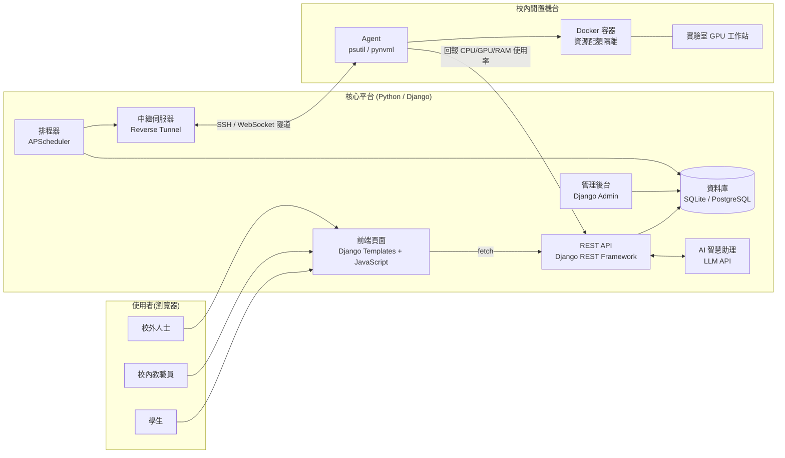

# PowerShare — 校園閒置算力租借平台

> 東吳大學黑客松競賽參賽專案

本文件為團隊開發手冊,定義專案的開發規範、介面契約、分工範圍與驗收標準。任一成員(或 AI coding assistant)依本文件即可確認自身工作內容、完成標準,以及卡關時的處理方式。

**核心原則:介面契約(§4)先行凍結,各模組再平行開發。每項工作均訂有驗收條件與降級方案,卡關時應改採降級方案繼續推進,不等待其他模組。**

* * *

## 模組與閱讀範圍

| 負責模組 | 初次閱讀順序 | 日常參照 |
|---|---|---|
| **全員(必讀)** | §0 → §1 → §2 → §3 | §8 風險表 |
| 後端 / API / AI 助理 | §4 全部 → §6.1 | §4 契約、§6.1 驗收表 |
| 機台 Agent / 容器 | §2 架構 → §4.3 → §4.5 → §6.2 | §4.5 契約、§5 隔離設計 |
| 前端 / 儀表板 | §4.2 → §4.3 → §4.8 → §6.3 | §4.7 種子資料、§4.8 呼叫方式、§6.3 驗收表 |
| 測試 / 整合 / 部署 | §3 → §4 → §7 | §7 整合驗收表 |

## 目錄

- [§0 開發規範](#0-開發規範)
- [§1 專案總覽](#1-專案總覽)
- [§2 系統架構與技術棧](#2-系統架構與技術棧)
- [§3 共同前置工作(全員)](#3-共同前置工作全員)
- [§4 資料與 API 介面契約(Frozen)](#4-資料與-api-介面契約frozen)
- [§5 資源安全與隔離設計](#5-資源安全與隔離設計)
- [§6 分工任務與驗收](#6-分工任務與驗收)
- [§7 整合驗收(全員)](#7-整合驗收全員)
- [§8 風險與因應方案](#8-風險與因應方案)
- [§9 未來擴充方向](#9-未來擴充方向)
- [§10 參考案例](#10-參考案例)
- [附錄 A:週次執行矩陣](#附錄-a週次執行矩陣)
- [附錄 B:AI coding assistant 使用方式](#附錄-bai-coding-assistant-使用方式)

* * *

# §0 開發規範

**本章規範優先於文件其他章節。**

1. **§4 為凍結契約**。其中的模型欄位、JSON 欄位名稱與型別、API 路徑不得私自更動。如需修改,應先於群組公告、經全員確認並更新本文件後,方可動工。
2. **各成員僅在所屬資料夾內作業**(§3.1 標明各目錄的負責模組)。`main` 分支受保護,一律開 feature branch,經 PR 且至少一人審閱後合併。
3. **卡關逾預估時間 1.5 倍,應立即改採降級方案**(§6、§8 各項均已列出)。
4. **命名與格式**:程式碼識別字(變數、函式、類別)一律使用英文,註解可用中文。Python 程式碼進 repo 前須執行 `black` 與 `ruff`;JavaScript 採 ES module 撰寫。
5. **前端呼叫 API 一律透過 `frontend/static/js/api.js`**(§4.8),不得於各頁面自行呼叫 `fetch`。
6. **資料庫 migration 僅由後端負責人產生**。`models.py` 的變更須連同對應的 migration 檔於同一個 PR 提交。
7. **每完成一項工作,應自行對照 §6 該項驗收條件檢查**,通過後於群組回報。
8. **W6 起功能凍結**(見附錄 A),僅修正缺陷,不新增功能。

* * *

# §1 專案總覽

## 1.1 定位

PowerShare 將校園內閒置的電腦與 GPU 工作站(實驗室、系辦、研究室)整合為可預約、可分級計費的共享運算資源池。

## 1.2 運作方式

校內大量機台於課餘、夜間與寒暑假期間處於閒置狀態;同時,修習 AI 與深度學習課程的學生因本機設備效能不足,須另行租用成本較高的雲端運算服務。PowerShare 以三項機制銜接供需兩端:

1. **狀態監控** — 每台參與機台部署 Agent,每 10 秒回報 CPU / RAM / GPU 使用率,閒置機台自動標記為可租用。
2. **預約與分級定價** — 平台顯示各機台規格、即時狀態,以及依使用者身分(學生 / 校內教職員 / 校外人士)計算的費率。
3. **隔離執行環境** — 租用者取得的是機台上獨立的 Docker 容器,資源用量受配額限制,時段結束即銷毀,不影響主機環境與其他使用者資料。

平台另設 AI 助理,使用者可用自然語言描述需求(例如「本週五下午兩小時,至少 16GB VRAM」),由系統完成機台篩選與預約建立。

## 1.3 範圍界定

**MVP 包含**

* 機台清單與即時閒置狀態
* 三級身分(學生 / 校內教職員 / 校外人士)分級定價與預約
* 預約成功後透過瀏覽器直接存取(Jupyter / code-server)
* AI 自然語言預約助理
* AI 使用報告生成(費用、相較雲端節省金額、估算碳排)

**不包含**

* 真實金流與付款機制(以虛擬額度替代)
* 跨校 / 多機房大規模調度
* 自行訓練語言模型(直接呼叫 Claude / OpenAI API)
* 校務系統帳號整合(以 email 網域模擬身分判定)

> 上述不包含項目為刻意界定的範圍取捨,非技術限制。

* * *

# §2 系統架構與技術棧

## 2.1 架構圖



前端頁面與 REST API 由同一個 Django 服務提供(同源),瀏覽器以 JavaScript 呼叫 API 取得資料後渲染畫面。

## 2.2 一次租借的資料流

```
使用者於前端頁面送出預約(JavaScript)
    ↓
POST /api/bookings          ← 後端檢查時段衝突、額度,並計算費用
    ↓
Booking 建立 (status=pending)
    ↓
排程器等待 start_time 到達
    ↓
透過 Relay 通知該機台的 Agent
    ↓
Agent 執行 start_session_container()   ← 啟動限流 Docker 容器
    ↓
回傳 access_url 寫入 Booking (status=active)
    ↓
使用者以瀏覽器連線執行運算作業
    ↓
end_time 到達 → stop_session_container() → 容器銷毀
    ↓
寫入 UsageReport,由 AI 生成使用報告 (status=done)
```

## 2.3 中繼伺服器(Relay)的必要性

校園機台位於實驗室網路的 NAT 與防火牆後方,**不具公網 IP,外部無法直接連入**。若要求資訊單位對外開放 port,除不易取得核准外,亦會擴大資安風險。

本專案採用的作法為:**由機台主動對中繼伺服器建立 outbound 連線(反向隧道)**,使用者請求由中繼伺服器沿既有通道轉發至機台。機台本身無須開放任何 inbound port。

## 2.4 技術棧

| 模組 | 技術 | 選用理由 |
|---|---|---|
| 後端框架 | **Django 5.2 LTS** | 內建 ORM、migration、認證系統與管理後台,減少自行建置的基礎設施 |
| REST API | **Django REST Framework** | 以 serializer 定義 JSON 格式;提供可瀏覽 API,可直接於瀏覽器測試 |
| 資料庫 | SQLite(開發)→ PostgreSQL(正式) | 以 `DATABASE_URL` 環境變數切換,程式碼無須修改 |
| 認證 | Django 內建 session 認證,依 email 網域判定身分 | 前端與 API 同源,無須另行管理 token;`@scu.edu.tw` 判定為校內,其餘為校外 |
| 管理後台 | **Django Admin**(`/admin/`) | 機台、預約、使用者資料可直接檢視與維護 |
| 前端 | **HTML + CSS + JavaScript(ES modules)**,由 Django Templates 提供 | 無須 Node.js 與建置工具,瀏覽器原生支援 |
| 圖表 | **Chart.js**(CDN 載入) | 輕量,適合繪製使用率曲線 |
| 機台監控 | `psutil`、`pynvml` / `GPUtil` | 純 Python 實作,跨平台讀取 CPU / RAM / GPU |
| 資源隔離 | Docker + `docker-py` | 以 `--cpus` `--memory` `--gpus` 限制資源用量 |
| 遠端存取 | Jupyter / **code-server** | 使用者免安裝環境,瀏覽器即可操作 |
| 中繼隧道 | `frp` 或 SSH reverse tunnel | 解決機台無公網 IP 的連線問題 |
| 排程 | **APScheduler**(以 management command 獨立執行) | 無須另行部署 Redis;獨立行程可避免開發伺服器自動重載時重複啟動排程 |
| AI 助理 | Claude API / OpenAI API(function calling) | 無須自行訓練模型 |
| 部署 | Docker Compose | 單一指令啟動 Web 服務與資料庫 |

* * *

# §3 共同前置工作(全員)

## 3.1 專案結構與檔案歸屬

```
SCU_contest/
├── README.md
├── .env.example                  環境變數範本
├── docker-compose.yml            [測試/整合]
├── pytest.ini                    [測試/整合]
├── backend/                      [後端] Django 專案
│   ├── manage.py
│   ├── requirements.txt
│   ├── Dockerfile
│   ├── config/                   專案設定(settings.py、根路由 urls.py)
│   └── core/                     主要應用程式
│       ├── models.py             凍結契約 §4.1
│       ├── serializers.py        凍結契約 §4.2
│       ├── urls.py               凍結契約 §4.3
│       ├── exceptions.py         錯誤格式 §4.4
│       ├── permissions.py        Agent token 驗證
│       ├── views/                依功能拆分:auth、machines、bookings、agent、ai
│       ├── ai_assistant.py       AI 助理 §4.6
│       ├── seed_data.py          種子資料 §4.7
│       ├── admin.py              Django Admin 設定
│       ├── management/commands/  seed 指令
│       └── migrations/
├── agent/                        [Agent] 機台端程式
│   ├── monitor.py                §4.5
│   ├── container_manager.py      §4.5
│   └── requirements.txt
├── frontend/                     [前端] 由 Django 直接提供
│   ├── templates/                base、index、bookings、assistant
│   └── static/
│       ├── css/style.css
│       └── js/                   api.js(共用)、auth.js、machines.js、bookings.js、assistant.js
├── relay/                        [Agent] 中繼伺服器
└── tests/                        [測試/整合]
    ├── requirements.txt
    └── test_contract.py
```

> `views/` 依功能拆分為多個檔案,`frontend/static/js/` 依頁面拆分,目的在於讓不同工作項目修改不同檔案,降低 merge conflict。

**頁面路由**

| 路徑 | 模板 | 腳本 | 內容 |
|---|---|---|---|
| `/` | `index.html` | `machines.js` | 機台列表、即時使用率 |
| `/bookings/` | `bookings.html` | `bookings.js` | 預約表單、我的預約、使用報告 |
| `/assistant/` | `assistant.html` | `assistant.js` | AI 助理對話框 |
| `/admin/` | Django Admin | — | 資料維護後台 |

所有頁面皆繼承 `base.html`,並載入負責身分切換的 `auth.js`。

## 3.2 環境需求

* Python 3.11 以上
* Git
* 瀏覽器(Chrome、Edge 或 Firefox 最新版);前端無須安裝 Node.js
* Docker Desktop(Agent / 容器負責人必裝,其餘成員建議安裝)
* 具 NVIDIA GPU 的機台:對應 CUDA 驅動與 nvidia-container-toolkit

## 3.3 啟動方式

```bash
git clone https://github.com/thechi222/SCU_contest.git
cd SCU_contest
cp .env.example .env              # 填入 AGENT_TOKEN 與 LLM API key

# 方式一:Docker Compose(Web + PostgreSQL,啟動時自動執行 migrate 與 seed)
docker compose up --build

# 方式二:本機開發(預設使用 SQLite)
cd backend
python -m venv .venv
source .venv/bin/activate         # Windows:.venv\Scripts\activate
pip install -r requirements.txt
python manage.py migrate
python manage.py seed             # 載入 §4.7 種子機台與示範帳號,可重複執行
python manage.py createsuperuser  # 建立 Django Admin 管理員帳號(選用)
python manage.py runserver
```

```bash
# 機台 Agent(另開終端機)
cd agent
pip install -r requirements.txt
python monitor.py --server http://localhost:8000 --machine-id lab-gpu-01

# 契約測試(於 repo 根目錄執行)
pip install -r tests/requirements.txt
pytest
```

啟動後:

* 前端頁面:http://localhost:8000/
* 可瀏覽 API:http://localhost:8000/api/machines(以瀏覽器直接開啟 API 路徑即可測試)
* 管理後台:http://localhost:8000/admin/
* 示範帳號:`demo.student@scu.edu.tw`、`demo.staff@scu.edu.tw`、`demo.guest@example.com`,密碼皆為 `demo1234`(僅供開發環境)

* * *

# §4 資料與 API 介面契約(Frozen)

> **本章為全專案唯一不得私自變更的章節。** 如需修改,應先於群組公告並經全員確認後,方可動工。

## 4.1 資料模型

```python
# ---- backend/core/models.py(後端負責人維護,全員唯讀參照)----
import uuid

from django.contrib.auth.models import AbstractUser
from django.db import models


class User(AbstractUser):
    class Role(models.TextChoices):
        STUDENT = "student", "學生"
        STAFF = "staff", "校內教職員"
        EXTERNAL = "external", "校外人士"

    email = models.EmailField(unique=True)
    name = models.CharField(max_length=100)
    role = models.CharField(max_length=10, choices=Role.choices, default=Role.EXTERNAL)  # 依 email 網域判定
    credit = models.FloatField(default=0)                                              # 虛擬額度

    USERNAME_FIELD = "email"
    REQUIRED_FIELDS = ["username", "name"]


class Machine(models.Model):
    class Status(models.TextChoices):
        IDLE = "idle", "閒置"
        RENTED = "rented", "租用中"
        OFFLINE = "offline", "離線"

    id = models.CharField(primary_key=True, max_length=50)   # 例如 "lab-gpu-01"
    name = models.CharField(max_length=100)
    cpu_model = models.CharField(max_length=100)
    gpu_model = models.CharField(max_length=100, null=True, blank=True)
    ram_gb = models.IntegerField()
    gpu_vram_gb = models.IntegerField(null=True, blank=True)
    status = models.CharField(max_length=10, choices=Status.choices, default=Status.OFFLINE)
    owner_dept = models.CharField(max_length=100)
    price_per_hour = models.JSONField()                      # {"student": 10, "staff": 20, "external": 50}


class Booking(models.Model):
    class Status(models.TextChoices):
        PENDING = "pending", "待開始"
        ACTIVE = "active", "使用中"
        DONE = "done", "已結束"
        CANCELLED = "cancelled", "已取消"

    id = models.UUIDField(primary_key=True, default=uuid.uuid4, editable=False)
    user = models.ForeignKey(User, on_delete=models.PROTECT, related_name="bookings")
    machine = models.ForeignKey(Machine, on_delete=models.PROTECT, related_name="bookings")
    start_time = models.DateTimeField()
    end_time = models.DateTimeField()
    status = models.CharField(max_length=10, choices=Status.choices, default=Status.PENDING)
    access_url = models.URLField(max_length=500, null=True, blank=True)   # 容器啟動後才有值
    estimated_cost = models.FloatField()


class AgentHeartbeat(models.Model):
    machine = models.ForeignKey(Machine, on_delete=models.CASCADE, related_name="heartbeats")
    cpu_percent = models.FloatField()
    ram_percent = models.FloatField()
    gpu_percent = models.FloatField(null=True, blank=True)
    gpu_vram_used_gb = models.FloatField(null=True, blank=True)
    timestamp = models.DateTimeField()

    class Meta:
        indexes = [models.Index(fields=["machine", "-timestamp"])]


class UsageReport(models.Model):
    booking = models.OneToOneField(
        Booking, on_delete=models.CASCADE, primary_key=True, related_name="report",
    )
    duration_hours = models.FloatField()
    cpu_avg = models.FloatField()
    gpu_avg = models.FloatField(null=True, blank=True)
    cost = models.FloatField()
    summary_text = models.TextField()                        # AI 生成的摘要
```

## 4.2 API 資料格式

API 的 JSON 格式由下列 serializer 定義,前端依此讀寫欄位。

```python
# ---- backend/core/serializers.py(後端負責人維護,全員唯讀參照)----
from rest_framework import serializers

from core.models import AgentHeartbeat, Booking, Machine, UsageReport, User


class UserSerializer(serializers.ModelSerializer):
    class Meta:
        model = User
        fields = ["id", "email", "name", "role", "credit"]


class LoginSerializer(serializers.Serializer):
    email = serializers.EmailField()
    password = serializers.CharField(write_only=True)


class MachineSerializer(serializers.ModelSerializer):
    class Meta:
        model = Machine
        fields = [
            "id", "name", "cpu_model", "gpu_model", "ram_gb",
            "gpu_vram_gb", "status", "owner_dept", "price_per_hour",
        ]


class BookingCreateSerializer(serializers.Serializer):
    machine_id = serializers.CharField()
    start_time = serializers.DateTimeField()
    end_time = serializers.DateTimeField()


class BookingSerializer(serializers.ModelSerializer):
    class Meta:
        model = Booking
        fields = [
            "id", "user_id", "machine_id", "start_time", "end_time",
            "status", "access_url", "estimated_cost",
        ]


class AgentHeartbeatSerializer(serializers.ModelSerializer):
    machine_id = serializers.PrimaryKeyRelatedField(
        source="machine", queryset=Machine.objects.all(),
    )

    class Meta:
        model = AgentHeartbeat
        fields = [
            "machine_id", "cpu_percent", "ram_percent",
            "gpu_percent", "gpu_vram_used_gb", "timestamp",
        ]


class UsageReportSerializer(serializers.ModelSerializer):
    class Meta:
        model = UsageReport
        fields = [
            "booking_id", "duration_hours", "cpu_avg",
            "gpu_avg", "cost", "summary_text",
        ]


class AIAssistRequestSerializer(serializers.Serializer):
    message = serializers.CharField()              # 自然語言需求描述


class AIAssistResponseSerializer(serializers.Serializer):
    reply = serializers.CharField()                # 給使用者的自然語言回覆
    booking = BookingSerializer(allow_null=True)   # 成功建立預約時帶回
```

**格式約定**

* `user_id` 為整數;`machine_id` 為字串(例如 `"lab-gpu-01"`);預約的 `id` 與 `booking_id` 為 UUID 字串。
* 時間欄位採 ISO 8601。未帶時區的輸入(例如 `<input type="datetime-local">` 的 `2026-09-18T14:00`)以台北時間解讀,回傳值一律帶 `+08:00`。
* 無值欄位回傳 `null`。

**回傳範例**(`BookingSerializer`)

```json
{
  "id": "5e2deb6b-4df1-4c0e-91e5-e8d765f0b392",
  "user_id": 1,
  "machine_id": "lab-gpu-01",
  "start_time": "2026-09-18T14:00:00+08:00",
  "end_time": "2026-09-18T16:00:00+08:00",
  "status": "pending",
  "access_url": null,
  "estimated_cost": 30.0
}
```

## 4.3 API 路由

| 方法 | 路徑 | Request Body | 回傳 | 認證 | 呼叫端 |
|---|---|---|---|---|---|
| POST | `/api/auth/login` | `LoginSerializer` | `UserSerializer` | 公開 | 前端 |
| POST | `/api/auth/logout` | — | `204 No Content` | 需登入 | 前端 |
| GET | `/api/auth/me` | — | `UserSerializer` | 需登入 | 前端 |
| GET | `/api/machines` | — | `MachineSerializer[]` | 公開 | 前端、AI 助理 |
| GET | `/api/machines/{id}/metrics` | — | `AgentHeartbeatSerializer[]`(最近 60 筆,由舊到新) | 公開 | 前端 |
| GET | `/api/bookings` | — | `BookingSerializer[]`(僅目前使用者) | 需登入 | 前端 |
| POST | `/api/bookings` | `BookingCreateSerializer` | `BookingSerializer` | 需登入 | 前端 |
| GET | `/api/bookings/{id}` | — | `BookingSerializer` | 需登入 | 前端 |
| POST | `/api/bookings/{id}/cancel` | — | `BookingSerializer` | 需登入 | 前端 |
| GET | `/api/bookings/{id}/report` | — | `UsageReportSerializer` | 需登入 | 前端 |
| POST | `/api/agent/heartbeat` | `AgentHeartbeatSerializer` | `200 OK` | Agent Token | Agent |
| POST | `/api/ai/assist` | `AIAssistRequestSerializer` | `AIAssistResponseSerializer` | 需登入 | 前端 |

* 路徑結尾不加斜線。
* **需登入**:使用 Django session;寫入類請求須附 `X-CSRFToken` 標頭(由 `api.js` 自動處理)。
* **Agent Token**:Header `X-Agent-Token` 須與環境變數 `AGENT_TOKEN` 相符。
* 預約相關路由僅能存取目前使用者本人的預約,存取他人預約時回傳 `404 NOT_FOUND`。

## 4.4 錯誤回傳格式

所有錯誤統一回傳:

```json
{ "detail": "時段與既有預約衝突", "code": "BOOKING_CONFLICT" }
```

業務錯誤由後端以 `ApiError` 拋出;DRF 內建錯誤(未登入、權限不足、驗證失敗等)由 `core.exceptions.api_exception_handler` 自動轉為相同格式。

```python
from core.exceptions import ApiError

raise ApiError("時段與既有預約衝突", code="BOOKING_CONFLICT", status_code=409)
```

| code | HTTP 狀態 | 說明 |
|---|---|---|
| `BOOKING_CONFLICT` | 409 | 時段與既有預約衝突 |
| `MACHINE_OFFLINE` | 409 | 機台離線 |
| `INSUFFICIENT_CREDIT` | 400 | 額度不足 |
| `NOT_AUTHENTICATED` | 403 | 未登入 |
| `PERMISSION_DENIED` | 403 | 權限不足(含 CSRF 驗證失敗、Agent token 錯誤) |
| `NOT_FOUND` | 404 | 資源不存在,或非本人的預約 |
| `VALIDATION_ERROR` | 400 | 欄位驗證失敗,`detail` 為各欄位的錯誤訊息 |

## 4.5 Agent 端函式簽章

```python
# ---- agent/monitor.py(機台 Agent 負責人)----
def collect_metrics() -> dict:
    """讀取本機 CPU/RAM/GPU 使用率。回傳欄位需符合 AgentHeartbeat。
    無 GPU 的機器,gpu_* 欄位回 None。"""
    ...


def send_heartbeat(base_url: str, machine_id: str) -> None:
    """每 10 秒呼叫一次,POST collect_metrics() 的結果到 /api/agent/heartbeat。
    Header 須帶 X-Agent-Token,值取自環境變數 AGENT_TOKEN。"""
    ...
```

```python
# ---- agent/container_manager.py(機台 Agent 負責人)----
def start_session_container(
    machine_id: str,
    booking_id: str,
    cpu_limit: float,        # 例如 2.0 = 2 核
    mem_limit_gb: int,
    gpu: bool,
) -> str:
    """啟動限流 Docker 容器,回傳可存取的 URL(code-server / Jupyter token URL)。
    此 URL 會被寫進 Booking.access_url。"""
    ...


def stop_session_container(booking_id: str) -> None:
    """銷毀容器、清除暫存資料、回收資源。逾時也由排程器呼叫此函式。"""
    ...
```

## 4.6 AI 助理函式簽章

```python
# ---- backend/core/ai_assistant.py(後端 / AI 負責人)----
from dataclasses import dataclass

from core.models import Booking, UsageReport, User


@dataclass
class AIAssistResult:
    reply: str                   # 給使用者的自然語言回覆
    booking: Booking | None      # 成功建立預約時帶回


def handle_ai_request(user: User, message: str) -> AIAssistResult:
    """用 LLM function calling 解析 message,可呼叫下列工具函式:

      list_available_machines(need_gpu: bool,
                              min_vram_gb: int | None,
                              start: datetime,
                              end: datetime) -> list[Machine]

      create_booking(user: User, machine_id: str,
                     start: datetime, end: datetime) -> Booking

    回傳自然語言回覆 + (若成功建立)對應的 Booking。
    由 AIAssistView 以 AIAssistResponseSerializer 序列化後回傳。
    """
    ...


def generate_usage_summary(report: UsageReport) -> str:
    """把使用紀錄轉成摘要,內容需包含:使用時長、平均使用率、
    花費、相較雲端 GPU 省下的金額、估算省下的碳排。"""
    ...
```

## 4.7 測試種子資料(全員共用)

> 所有模組的測試資料統一使用下列機台與示範帳號,確保前端畫面與後端回傳內容一致。執行 `python manage.py seed` 即可載入資料庫。

```python
# ---- backend/core/seed_data.py ----
SEED_MACHINES = [
    {
        "id": "lab-gpu-01", "name": "資訊實驗室 GPU 工作站 #1",
        "cpu_model": "Intel i7-12700", "gpu_model": "NVIDIA RTX 3090",
        "ram_gb": 64, "gpu_vram_gb": 24, "status": "idle",
        "owner_dept": "資訊管理學系",
        "price_per_hour": {"student": 15, "staff": 25, "external": 60},
    },
    {
        "id": "lab-gpu-02", "name": "資訊實驗室 GPU 工作站 #2",
        "cpu_model": "AMD Ryzen 9 5900X", "gpu_model": "NVIDIA RTX 3060",
        "ram_gb": 32, "gpu_vram_gb": 12, "status": "rented",
        "owner_dept": "資訊管理學系",
        "price_per_hour": {"student": 10, "staff": 18, "external": 40},
    },
    {
        "id": "office-pc-07", "name": "系辦公室電腦 #7",
        "cpu_model": "Intel i5-11400", "gpu_model": None,
        "ram_gb": 16, "gpu_vram_gb": None, "status": "idle",
        "owner_dept": "巨量資料管理學院",
        "price_per_hour": {"student": 5, "staff": 8, "external": 20},
    },
]

# 示範帳號僅供開發環境使用
SEED_PASSWORD = "demo1234"

SEED_USERS = [
    {"email": "demo.student@scu.edu.tw", "name": "示範學生", "role": "student", "credit": 1000},
    {"email": "demo.staff@scu.edu.tw", "name": "示範教職員", "role": "staff", "credit": 1000},
    {"email": "demo.guest@example.com", "name": "示範校外人士", "role": "external", "credit": 1000},
]
```

## 4.8 前端 API 呼叫方式

前端頁面一律透過 `frontend/static/js/api.js` 呼叫 API:

```js
import { api, ApiError } from "./api.js";

const machines = await api("/api/machines");

try {
  const booking = await api("/api/bookings", {
    method: "POST",
    body: { machine_id: "lab-gpu-01", start_time: "2026-09-18T14:00", end_time: "2026-09-18T16:00" },
  });
} catch (err) {
  if (err instanceof ApiError && err.code === "BOOKING_CONFLICT") {
    // 顯示時段衝突訊息
  }
}
```

`api()` 統一處理下列事項:

* 以 `credentials: "same-origin"` 附帶 session cookie。
* 非 GET 請求自動附上 `X-CSRFToken` 標頭,值取自 Django 於頁面載入時發出的 `csrftoken` cookie。
* 自動序列化 request body 並解析 JSON 回應;`204` 回應回傳 `null`。
* 非 2xx 回應拋出 `ApiError`,可讀取 `status`、`detail`、`code`(對應 §4.4)。

* * *

# §5 資源安全與隔離設計

> 「開放外部使用者於校內機台執行程式」的安全性是本專案的核心議題,全員均須理解並能說明本章內容。

| 機制 | 做法 | 對外說明 |
|---|---|---|
| 容器隔離 | 每個 session 使用獨立 Docker 容器 | 租用者取得的是機台上隔離的執行環境,無法存取主機系統與他人資料 |
| 資源配額 | 以 cgroups 限制 `--cpus` `--memory` `--gpus` | 用量上限由平台指定,單一使用者無法耗盡整台機器資源 |
| 網路隔離 | 機台零 inbound port,全數走 outbound 反向隧道 | 機台無須對外開放任何連接埠 |
| 機台驗證 | 心跳 API 須附 `X-Agent-Token` | 僅持有金鑰的機台可回報狀態,避免偽造機台狀態 |
| 身分審核 | 校外人士註冊須經人工審核 | 搭配使用條款與完整日誌留存,可追溯不當使用行為 |
| 跨站請求防護 | 寫入類 API 須通過 Django CSRF 驗證 | 防止惡意網站冒用已登入使用者的身分送出預約 |
| 逾時回收 | 時段結束強制銷毀容器 | 資源不會被長期佔用 |
| 資料不落地 | 容器銷毀時清除暫存資料 | 後續使用者無法取得前一位使用者遺留的任何資料 |

* * *

# §6 分工任務與驗收

> 每項工作均訂有**驗收條件**(完成標準)與**降級方案**(替代作法)。卡關逾預估時間 1.5 倍時應改採降級方案。

## 6.1 後端 / API / AI 助理負責人 — 擁有 `backend/`

| # | 工作項目 | 驗收條件 | 降級方案 |
|---|---|---|---|
| 1 | 維護 §4 契約檔案 | `models.py`、`serializers.py`、`urls.py`、`seed_data.py` 與 migration 均與本文件一致,其餘成員可執行 `migrate` 與 `seed` | 無(本項為其他模組的前置條件,不可降級) |
| 2 | 認證 API | 三個示範帳號可登入、登出,`GET /api/auth/me` 回傳目前使用者 | 先完成登入,登出與 `me` 延後實作 |
| 3 | 機台清單 API | `GET /api/machines` 回傳 3 筆種子機台,欄位符合 `MachineSerializer` | — |
| 4 | 心跳接收與使用率 API | 心跳寫入 `AgentHeartbeat` 並將機台由 `offline` 轉為 `idle`;`GET /api/machines/{id}/metrics` 回傳最近 60 筆 | 暫不更新機台狀態,僅寫入心跳紀錄 |
| 5 | 預約 CRUD 與衝突檢查 | 同機台重疊時段的第二筆請求回傳 409 `BOOKING_CONFLICT`;無法存取他人預約 | 暫以 `(machine, start_time)` unique constraint 防止完全重複的預約 |
| 6 | 計費與使用紀錄 | session 結束產生 `UsageReport`,金額 = 時長 × 該身分單價 | 先採單一費率,分級定價延後實作 |
| 7 | AI 助理 `/api/ai/assist` | 輸入「這週五下午兩小時、需 16G VRAM」能建立對應 Booking | function calling 不穩定時,先以關鍵字與正則解析常見句型 |
| 8 | AI 使用報告 | `generate_usage_summary()` 產出含花費、節省金額、碳排的摘要 | 先以固定模板填入數值,LLM 潤飾延後實作 |
| 9 | 排程器 | `python manage.py run_scheduler` 啟動後,`start_time` 到達自動開通,`end_time` 到達自動回收 | 以 Django Admin action 手動觸發開通與回收,不強求全自動 |

## 6.2 機台 Agent / 容器負責人 — 擁有 `agent/`、`relay/`

| # | 工作項目 | 驗收條件 | 降級方案 |
|---|---|---|---|
| 1 | 讀取硬體狀態 | `collect_metrics()` 能讀出本機 CPU / RAM(具 GPU 者含 GPU) | GPU 函式庫無法安裝時僅回傳 CPU / RAM,GPU 欄位回 `None` |
| 2 | 心跳回報 | Agent 每 10 秒附 `X-Agent-Token` POST 一次,後端可見機台由 `offline` 轉為 `idle` | 先實作單次手動觸發,定時排程延後實作 |
| 3 | 容器啟動 / 銷毀 | 預約轉為 active 後實際啟動限流容器,瀏覽器可開啟 code-server | GPU passthrough 卡關時先實作 CPU-only 容器 |
| 4 | 資源配額 | `docker stats` 可見容器受限於指定的 CPU 與記憶體上限 | 先以手動 `docker run --cpus` 參數驗證,自動化延後實作 |
| 5 | 反向隧道 | 使用者可連入 NAT 後方機台,機台零 inbound port | 測試階段先採同網段直連,正式作法依 §2.3 實作 |
| 6 | 逾時強制回收 | 時段結束後容器自動銷毀,`docker ps` 查無該容器 | 由排程器手動觸發回收 |

## 6.3 前端 / 儀表板負責人 — 擁有 `frontend/`

| # | 工作項目 | 驗收條件 | 降級方案 |
|---|---|---|---|
| 1 | 機台列表頁(`/`) | 顯示 3 台種子機台的規格、狀態,以及依當前身分計算的價格 | API 未就緒時,先以 §4.7 種子資料的 JSON 版本於前端模擬 |
| 2 | 身分切換(頁首) | 可切換三個示範帳號(呼叫 login / logout),價格隨身分變動 | 先以下拉選單於前端切換身分,僅影響價格顯示 |
| 3 | 預約表單(`/bookings/`) | 選擇機台與時段送出後,可見 booking 狀態;時段衝突時顯示提示 | — |
| 4 | 即時使用率圖表 | 以 Chart.js 繪製 CPU / RAM 曲線,每 5 秒輪詢更新 | 僅顯示最新一筆數值,不繪製曲線 |
| 5 | AI 助理對話框(`/assistant/`) | 輸入自然語言後顯示 AI 回覆與新建立的預約 | — |
| 6 | 使用報告 | session 結束後顯示 AI 生成的使用摘要 | 先顯示原始數值表格,AI 摘要延後接入 |

## 6.4 測試 / 整合 / 部署負責人 — 擁有 `tests/`、`docker-compose.yml`、`pytest.ini`

| # | 工作項目 | 驗收條件 | 降級方案 |
|---|---|---|---|
| 1 | Docker Compose | `docker compose up --build` 可一次啟動 Web 與 PostgreSQL,並自動完成 migrate 與 seed | 各模組先以 SQLite 本機執行,整合作業於 W5 前完成即可 |
| 2 | 契約測試 | §4.3 每條路由均有測試(狀態碼與回傳欄位符合 serializer) | 先以 DRF 可瀏覽 API 手動驗證,自動化測試後補 |
| 3 | 端到端演練 | 依 §7 流程完整執行一次且無錯誤 | — |
| 4 | 壓力與異常測試 | 同時送出 5 筆重疊預約僅 1 筆成功;連線中斷後資源能正常回收 | 至少手動驗證「重複預約」與「Agent 中途離線」兩種情境 |

* * *

# §7 整合驗收(全員)

依序執行下列流程,每一步均須無錯誤:

```
1. 以示範學生帳號登入
     ↓
2. 瀏覽機台列表 → 顯示 3 台機台與學生價
     ↓
3. 於 AI 助理輸入「今天下午借兩小時,需要 GPU」
     ↓
4. AI 回覆推薦機台並建立預約
     ↓
5. 時段開始 → 容器自動開通,取得 access_url
     ↓
6. 以瀏覽器連入,執行一段 Python / PyTorch 程式碼
     ↓
7. 時段結束 → 容器自動銷毀
     ↓
8. 檢視 AI 生成的使用報告(花費 / 節省金額 / 碳排)
```

| 驗收項 | 條件 | 降級方案 |
|---|---|---|
| 三種身分 | 學生、教職員、校外各執行一次,價格正確反映身分差異 | 僅完整執行學生流程,其餘身分以資料驗證價格計算 |
| 容器隔離 | 實際執行容器啟動與銷毀,並以 `docker ps` 驗證 | 機台不足時以團隊筆電搭配一台 GPU 機器驗證 |
| AI 助理 | 以自然語言完成一次實際預約 | 準備 2–3 句已驗證可穩定成功的語句作為測試基準 |

* * *

# §8 風險與因應方案

| 風險 | 問題描述 | 因應方案 |
|---|---|---|
| 實體機台管理 | 機台的開關機與系統維護由誰負責 | MVP 僅使用少數自願提供的機台(社團 / 實驗室),後續可由資訊單位統一管理 |
| 資安與濫用 | 使用者可能將資源用於挖礦或攻擊行為 | 校外身分須人工審核,搭配使用條款與完整日誌留存(§5) |
| 電費與硬體損耗 | 電費負擔與設備折舊成本歸屬 | 定價模型納入電費與折舊估算 |
| Windows 機台 | 系辦電腦多為 Windows,Docker 與 GPU 支援度較低 | MVP 聚焦 Linux 實驗室機台,Windows 經 WSL2 列為後續擴充 |
| 連線中斷 / 當機 | 使用者中途斷線導致資源閒置佔用 | 逾時強制回收機制(§6.2 #6),優先度高於其他優化項目 |
| 隱私 | 機台擁有者的檔案是否可能被存取 | 容器隔離與資料不落地機制(§5) |
| Migration 衝突 | 多人同時修改模型導致 migration 編號衝突 | 僅後端負責人產生 migration(§0 規範 6) |

* * *

# §9 未來擴充方向

* **動態定價** — 依需求熱度自動調整價格,類似雲端 spot instance 機制
* **閒置時間預測** — 依歷史紀錄預測高機率閒置時段,主動推薦
* **碳足跡統計** — 累計全校因資源共享而減少的碳排放量
* **信譽制度** — 校外使用者評分機制,信譽較低者降低優先權或須預付
* **LINE Bot** — 將預約、到期提醒與狀態查詢整合為 LINE 指令
* **校務系統整合** — 串接學校既有帳號系統,提升落地可行性

* * *

# §10 參考案例

| 案例 | 參考重點 |
|---|---|
| [Vast.ai](https://vast.ai) / [RunPod](https://www.runpod.io) / [Salad](https://salad.com) | 去中心化 GPU 租賃市場的定價與媒合模式 |
| 各校 HPC / GPU 共享中心(如陽明交大) | 校內資源額度制與排程管理 |
| [國網中心 TWCC](https://www.twcc.ai) | 分級收費(學術 vs 產業)邏輯 |
| [BOINC](https://boinc.berkeley.edu) | 志願提供閒置算力的分散式運算概念 |
| [frp](https://github.com/fatedier/frp) | 開源反向隧道工具,中繼伺服器實作參考 |

* * *

# 附錄 A:週次執行矩陣

| 週次 | 後端 / AI | Agent / 容器 | 前端 | 測試 / 整合 |
|---|---|---|---|---|
| **W1** 09/15–09/21 | 確認 §4 契約與初始 migration | 研究 psutil / pynvml 讀值 | 頁面骨架與種子資料畫面 | pytest 骨架、契約測試 |
| **W2** 09/22–09/28 | 認證、機台清單、預約 CRUD 與衝突檢查 | 心跳回報串接後端 | 身分切換、預約表單串接實際 API | 補齊各路由的回傳格式測試 |
| **W3** 09/29–10/05 | 心跳與使用率 API、AI 助理雛形 | Docker 限流容器(CPU-only) | 即時使用率圖表(Chart.js) | docker compose 一鍵啟動 |
| **W4** 10/06–10/12 | AI function calling 正式串接 | 反向隧道與 GPU 容器 | AI 對話框與使用報告 | 第一次端到端整合測試 |
| **W5** 10/13–10/19 | 計費、使用報告與排程器收尾 | 逾時自動回收 | UI 優化與錯誤處理 | 壓力與異常測試 |
| **W6** 10/20–10/26 | 功能凍結,僅修正缺陷 | 同左 | 同左 | 第二次端到端整合測試 |
| **W7** 10/27–10/30 | 最終檢查 | 最終檢查 | 最終檢查 | 最終檢查 |

* * *

# 附錄 B:AI coding assistant 使用方式

若使用 Claude Code 等工具協助實作,不需提供整份文件,依下表貼上對應段落即可:

| 工作內容 | 提供的段落 |
|---|---|
| 實作後端 API | §4.1 資料模型 + §4.2 資料格式 + §4.3 路由表 + §4.4 錯誤格式 + §6.1 對應項目 |
| 實作 Agent | §4.3 路由表 + §4.5 函式簽章 + §6.2 對應項目 + §5 隔離設計 |
| 實作前端 | §4.2 資料格式 + §4.3 路由表 + §4.7 種子資料 + §4.8 呼叫方式 + §6.3 對應項目 |
| 撰寫測試 | §4.3 路由表 + §4.4 錯誤格式 + §7 整合流程 |

**提示詞範例:**

> 以下是專案的介面契約(貼上 §4.1–§4.4),請依此契約以 Django REST Framework 實作 `BookingListCreateView` 的 `post` 方法,包含時段衝突檢查,衝突時拋出 `ApiError("時段與既有預約衝突", code="BOOKING_CONFLICT", status_code=409)`。**不得變更契約中任何欄位名稱或型別,也不得修改 `models.py` 與 `serializers.py`。**

最後一句為必要條件,否則模型可能自行變更欄位名稱或模型定義,導致與其他模組的實作不一致。
