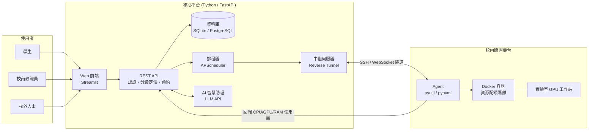

# PowerShare — 校園閒置算力租借平台

> **東吳大學第四屆「AI 時代・校園智慧創新黑客松競賽」參賽專案**
>
> 本文件是團隊的**執行手冊**,不是說明書。目標是:任何一位組員(或 AI coding assistant)打開這份文件,不需要問任何人,就知道自己現在該做什麼、做到什麼程度算完成、卡住了怎麼辦。

**核心運作原則:先把介面契約(§5)談好凍結,再五個人平行開工。每項工作都有驗收條件與降級方案,卡關就套 B 計畫往前走,不要卡死等別人。**

* * *

## 快速索引 — 我是誰,該看哪裡

| 你的角色 | 第一次看,請依序讀 | 每天工作時查 |
|---|---|---|
| **全員(必讀)** | §0 → §1 → §2 → §4 | §9 風險表 |
| 後端 / API / AI 助理 | §5 全部 → §7.1 | §5 契約、§7.1 驗收表 |
| 機台 Agent / 容器 | §3 架構 → §5 Agent 契約 → §7.2 | §5 Agent 契約、§6 隔離設計 |
| 前端 / 儀表板 | §5 資料模型 → §7.3 | §5 種子資料、§7.3 驗收表 |
| 測試 / 整合 / 部署 | §4 → §5 → §8 | §8 整合驗收表 |
| 專案管理 / 簡報 | §1 → §2 → §7.5 | §2.3 評分策略、附錄 B |
| **非資工背景組員** | §1.4 名詞對照表 先看這個 | §10 FAQ |

## 目錄

- [§0 給執行者的規則(★ 不可跳過)](#0-給執行者的規則--不可跳過)
- [§1 專案總覽](#1-專案總覽)
- [§2 比賽資訊與繳交時程(★ 硬性時間)](#2-比賽資訊與繳交時程--硬性時間)
- [§3 系統架構與技術棧](#3-系統架構與技術棧)
- [§4 共同前置工作(全員 Day 1)](#4-共同前置工作全員-day-1)
- [§5 資料與 API 介面契約(Frozen ★)](#5-資料與-api-介面契約frozen-)
- [§6 資源安全與隔離設計](#6-資源安全與隔離設計)
- [§7 分工任務與驗收](#7-分工任務與驗收)
- [§8 整合驗收(全員)](#8-整合驗收全員)
- [§9 風險與降級方案總表](#9-風險與降級方案總表)
- [§10 常見問題 FAQ](#10-常見問題-faq)
- [§11 延伸加分想法](#11-延伸加分想法)
- [§12 參考案例](#12-參考案例)
- [附錄 A:執行矩陣(人員 × 週次)](#附錄-a執行矩陣人員--週次)
- [附錄 B:繳交前檢查清單](#附錄-b繳交前檢查清單)
- [附錄 C:給 AI coding assistant 的用法](#附錄-c給-ai-coding-assistant-的用法)

* * *

# §0 給執行者的規則(★ 不可跳過)

**以下規則優先於文件其他所有章節。**

1. ★ **§5 是凍結契約**。裡面的欄位名稱、型別、API 路徑,任何人不得私自更動。要改就先在群組公告 → 全員確認 → 更新本文件 → 才動工。私自改的後果是整合當天全部對不上。
2. ★ **每人只在自己的資料夾內工作**(§7 有標明誰擁有哪個目錄)。`main` 分支保護,一律開 feature branch → PR → 至少一人看過才合併。
3. ★ **卡關超過預估時間 1.5 倍,立刻套降級方案**(§7、§9 每項工作都有寫)。不要在一個技術點上死磕三天,比賽拚的是完整度不是完美度。
4. **命名與風格**:程式碼識別字(變數/函式/類別)一律英文,註解用中文沒問題。Python 進 repo 前跑過 `black` + `ruff`。
5. **每完成一項工作,自己對照 §7 該項的「驗收條件」檢查**,通過才在群組回報完成。「我覺得應該好了」不算完成。
6. **W6 之後 feature freeze**(見附錄 A):功能凍結,只修 bug 不加新功能。決賽前手癢加東西把原本能跑的弄壞,是比賽現場最常見的死法。

* * *

# §1 專案總覽

## 1.1 一句話說明

> **電腦版的 Airbnb**:把校園裡閒置的電腦/GPU 工作站,變成可預約、可分級收費的共享運算資源池。

## 1.2 白話版:這東西怎麼運作

學校有一堆電腦(實驗室、系辦、研究室)晚上跟寒暑假都在發呆。同時間,學生修 AI 課要跑模型訓練,自己的筆電跑不動,只能去租昂貴的雲端 GPU。

PowerShare 做三件事:

1. **知道哪台電腦在發呆** — 每台參與的電腦裝一個小程式(Agent),每 10 秒回報一次「我現在多忙」,閒置就自動標記為可租。
2. **讓人可以預約它** — 網站上看得到每台機器的規格、目前狀態、以及「以你的身分租要多少錢」(學生最便宜、校內教職員次之、校外最貴)。
3. **安全地把電腦借出去** — 租客拿到的不是整台電腦的鑰匙,而是電腦裡隔出來的一間獨立小房間(Docker 容器),限制他只能用多少 CPU 跟記憶體,時間到整間房間直接拆掉,不會弄亂電腦主人的東西。

再加上一個 **AI 助理**:使用者不用自己翻機台列表,直接打一句「這週五下午要跑兩小時訓練,至少 16GB 顯示記憶體,用校內價」,AI 就幫他找到機台並完成預約。

## 1.3 包含 / 不包含

**MVP 包含(比賽要做出來的)**

* 機台清單與即時閒置狀態
* 三級身分(學生 / 校內教職員 / 校外)分級定價與預約
* 預約成功後,瀏覽器直接可用(Jupyter / code-server)
* AI 自然語言預約助理
* AI 使用報告生成(這次花多少錢、比雲端省多少、省下多少碳排)

**不包含(刻意不做,簡報要主動講清楚)**

* 真實金流與付款(demo 用虛擬額度)
* 跨校 / 多機房大規模調度
* 自己訓練 AI 模型(直接呼叫 Claude / OpenAI API)
* 真正的校務系統帳號整合(用 email 網域模擬身分判定)

> 「刻意選擇不做」跟「做不出來」在評審眼中是兩回事。簡報務必主動說明範圍界定的理由。

## 1.4 名詞對照表(給非資工背景組員)

| 名詞 | 白話解釋 |
|---|---|
| **API** | 程式之間溝通的窗口。像餐廳的點餐櫃台:前端(客人)去櫃台點餐,後端(廚房)做好送出來 |
| **後端 / Backend** | 看不見的部分。存資料、算錢、決定誰能租什麼,都在這裡 |
| **前端 / Frontend** | 使用者眼睛看得到、手點得到的網頁畫面 |
| **Agent** | 裝在每台出租電腦裡的小程式,像派駐的回報員,定時回報「我現在很閒」 |
| **Docker 容器** | 在一台電腦裡隔出來的獨立小房間。租客只能在房間裡活動,碰不到房東的東西,退租整間拆掉 |
| **反向隧道 / Relay** | 學校電腦躲在防火牆後面,外面找不到它。所以改成讓電腦自己主動打電話出來給總機,總機再幫忙轉接進去 |
| **資料模型 / Schema** | 規定「一筆資料長什麼樣」。例如一台機器一定要有:名稱、CPU 型號、記憶體大小、目前狀態 |
| **凍結契約 / Frozen contract** | 大家先講好的接縫規格,講好之後不能偷偷改,否則五個人的東西拼不起來 |
| **function calling** | 讓 AI 不只會聊天,還能真的去執行動作(例如真的幫你建立一筆預約) |
| **MVP** | 最小可行產品。能完整跑完一輪的陽春版,勝過做一半的豪華版 |
| **feature freeze** | 功能凍結。某個日期之後只准修 bug,不准加新功能 |

* * *

# §2 比賽資訊與繳交時程(★ 硬性時間)

## 2.1 賽事基本資訊

| 項目 | 內容 |
|---|---|
| 競賽全名 | 東吳大學第四屆「AI 時代・校園智慧創新黑客松競賽」 |
| 主辦單位 | 東吳大學教務處教學資源中心 |
| 參賽資格 | 限**東吳大學部在學生**,不限系所(研究生不符資格) |
| 組隊 | 2–5 人,可跨院系,需指定 1 名團隊代表人 |
| 限制 | 同一人不得跨隊,報名後不得更換隊員 |
| ★ 指導老師 | 每隊須邀請 1 位東吳專任或兼任教師,決賽需繳「輔導紀錄單」 |
| 獎金 | 總額 NT$150,000(壹獎 5 萬 ×1、貳獎 3 萬 ×2、參獎 1 萬 ×3、佳作 2 千 ×4、人氣獎 1 千 ×2) |
| 聯絡 | 陳秭霖 行政助理 · (02) 2881-9471 #5823 · ctl@scu.edu.tw |

> ★ **指導老師要最先處理**。牽涉到找老師、老師時間配合、最後還要簽輔導紀錄單,拖到 11 月才找會很痛苦。建議報名截止(10/26)前就談定。

## 2.2 時程與繳交清單

| 日期 | 階段 | 要交什麼 / 做什麼 |
|---|---|---|
| ~ **10/26 23:59** | 網路報名截止 | 完成線上報名(5 人名單 + 指導老師確定) |
| 9–11 月 | 說明會 / 培訓工作坊 | 建議派 1–2 人參加,**符合條件可列入初審加分** |
| ★ **10/30 12:00** | 初審繳件截止 | 解決方案**簡報** + **可編輯海報** 各一份 |
| 10/31 – 11/08 | 書面初審 | 三位校外評審審查,團隊**不用出席** |
| **11/10** | 初審結果公告 | 確認是否進決賽 |
| ★ **12/02 23:59** | 決賽繳件截止 | 完整簡報 + **指導老師輔導紀錄單** |
| 12/02 – 12/07 12:00 | 人氣獎投票 | 全校師生看**參賽影片**投票 → 影片要提前做好 |
| ★ **12/08 13:30–17:00** | 決賽暨頒獎 | **全員出席**,口頭報告 + 實作展示 |

> 影片規格(長度/格式/上傳方式)請對照[完整活動辦法 PDF](https://drive.google.com/file/d/1wCE1RQHIZ1NL9imMj-DFMrvZ3pMRVCbg/view?usp=sharing)確認,不要等 12 月才發現規格不符。

## 2.3 評分標準 → 我們的因應策略

| 評分項目 | 書面初審 | 現場決賽 | 我們怎麼拿分 |
|---|---|---|---|
| 創意性 | 30% | 30% | 「校內版 Vast.ai」+ AI 自然語言預約,講出跟現有校園 HPC 借用制度的差異 |
| 可行性 | 30% | 30% | §6 安全隔離設計 + §9 風險表主動回答「這真的能落地嗎」 |
| **應用性** | **40%** | 30% | ★ 書審權重最高。海報/簡報要用**實際使用情境**打頭陣,不要一開場就講技術架構 |
| 完成度 / 成果展示 | — | 10% | §8 端到端流程現場跑一遍 + 離線備援錄影 |

> ★ **書審階段「應用性」佔 40%,比創意性還高。** 評審看不到你們的人、也看不到 demo,只看文件。所以海報第一眼要讓人看懂「誰在什麼情況下會用這個、用了之後省了什麼」,技術架構往後放。

## 2.4 主題定位與必用工具

| 項目 | 選擇 | 理由 |
|---|---|---|
| **主軸題目** | **創新創業** | 本質是「校園服務 + 分級定價商業模式」,有明確價值主張、客群、獲利邏輯 |
| 輔助敘事 1 | 永續發展(SDG 9 / 12) | 活化閒置硬體、減少新增雲端運算的碳足跡 |
| 輔助敘事 2 | 流程改善 | 解決「機台閒置卻無從得知、無法預約」的資訊不透明 |
| 真實挑戰題 | 不適用 | 那是主辦方指定題目([題目表](https://docs.google.com/spreadsheets/d/14nnwoN2BBndKHToejf6ak_iaxTEhmxCT/edit?usp=sharing)),與自訂題目無關 |
| ★ **必用工具類別** | **生成式 AI 類** | AI 預約助理 + AI 使用報告(§5 契約、§7.1 #5) |

> 簡報開場定錨「創新創業」為主線,在痛點與影響力段落自然帶入永續與流程改善,不要硬拆成三段各講一次。

* * *

# §3 系統架構與技術棧

## 3.1 架構圖



## 3.2 一次租借的資料流

```
使用者在前端送出預約
    ↓
POST /api/bookings          ← 後端檢查時段衝突、額度、算價錢
    ↓
Booking 建立 (status=pending)
    ↓
排程器等到 start_time 到達
    ↓
透過 Relay 通知該機台的 Agent
    ↓
Agent 執行 start_session_container()   ← 啟動限流 Docker 容器
    ↓
回傳 access_url 存進 Booking (status=active)
    ↓
使用者開瀏覽器連進去跑程式
    ↓
end_time 到達 → stop_session_container() → 容器銷毀
    ↓
寫入 UsageReport,AI 生成白話使用報告 (status=done)
```

## 3.3 為什麼需要中繼伺服器(Relay)

★ 這是整個架構最容易被低估、也最值得在簡報講的技術點。

校園機台躲在實驗室網路的 NAT / 防火牆後面,**沒有公網 IP,外面根本連不進去**。常見的錯誤解法是去要求資訊處對外開 port——既不會被答應,資安風險也高。

正確解法:**讓機台主動對中繼伺服器建立 outbound 連線(反向隧道)**,使用者的請求由中繼伺服器沿著這條已建立的通道轉發進去。機台一個對外的門都不用開。

## 3.4 技術棧

| 模組 | 技術 | 為什麼選它 |
|---|---|---|
| 後端 API | **FastAPI** + SQLAlchemy + Pydantic | 自動產生 Swagger 文件(`/docs`),demo 可直接展示給評審 |
| 資料庫 | SQLite(開發/展示)→ PostgreSQL(正式) | 比賽期間用 SQLite 免安裝,省事 |
| 認證 | JWT,依 email 網域判定身分 | `@scu.edu.tw` → 校內;其餘 → 校外 |
| 機台監控 | `psutil`、`pynvml` / `GPUtil` | 純 Python,跨平台讀 CPU/RAM/GPU |
| 資源隔離 | Docker + `docker-py` | `--cpus` `--memory` `--gpus` 限制資源 |
| 遠端存取 | Jupyter / **code-server** | 使用者免安裝,開瀏覽器就能用 |
| 中繼隧道 | `frp` 或 SSH reverse tunnel | 解決無公網 IP 問題 |
| 排程 | **APScheduler** | 比 Celery 輕,不用另外架 Redis |
| 前端 | **Streamlit** | 純 Python,不用學 React,省下的時間拿去做後端 |
| AI 助理 | Claude API / OpenAI API(function calling) | 不用自己訓練模型 |
| 部署 | Docker Compose | 一鍵啟動,評審現場展示方便 |

* * *

# §4 共同前置工作(全員 Day 1)

## 4.1 ★ 檔案建立順序(照這個順序,不要跳)

> **為什麼順序重要**:契約類檔案(`models.py`)沒生出來,其他四個人就只能乾等。先把契約生出來,大家才能各自開工。

### 第一批 — repo 骨架(全員 clone 用)

```
powershare/
├── README.md              ← 本文件
├── .gitignore
├── .env.example
├── docker-compose.yml
├── backend/
├── agent/
├── frontend/
└── relay/
```

```bash
mkdir -p powershare/{backend/app/routers,agent,frontend,relay,tests}
cd powershare
git init
```

### 第二批 — ★ 凍結契約(最優先,其他人都靠這個開工)

| 順序 | 檔案 | 建立者 | 內容 |
|---|---|---|---|
| 1 | `backend/app/models.py` | 後端 | §5.1 的所有 Pydantic 模型,**照抄即可** |
| 2 | `backend/app/main.py` | 後端 | FastAPI 進入點,註冊 §5.2 的 6 條路由(先回假資料沒關係) |
| 3 | `backend/app/seed_data.py` | 後端 | §5.5 的測試種子資料 |
| 4 | `backend/requirements.txt` | 後端 | `fastapi` `uvicorn` `sqlalchemy` `pydantic` `apscheduler` `anthropic` |

> 這四個檔案一推上去,**前端、Agent、測試三個人就能立刻開工**,不用等後端邏輯寫完。

### 第三批 — 各角色起始檔(可先是空函式,但簽章要照 §5)

| 檔案 | 擁有者 | 內容 |
|---|---|---|
| `backend/app/routers/machines.py` | 後端 | 機台相關路由 |
| `backend/app/routers/bookings.py` | 後端 | 預約相關路由 |
| `backend/app/routers/agent.py` | 後端 | 心跳接收路由 |
| `backend/app/ai_assistant.py` | 後端/AI | §5.4 的 `handle_ai_request()` |
| `agent/monitor.py` | Agent | §5.3 的 `collect_metrics()` `send_heartbeat()` |
| `agent/container_manager.py` | Agent | §5.3 的 `start/stop_session_container()` |
| `frontend/app.py` | 前端 | Streamlit 進入點 |
| `frontend/requirements.txt` | 前端 | `streamlit` `requests` `plotly` |
| `tests/test_contract.py` | 測試 | 對照 §5 契約的基本測試 |

> 路由拆成多個檔案是刻意的:**一人改一個檔,減少 merge conflict**。

## 4.2 環境需求

* Python 3.11+
* Docker Desktop(Agent/容器負責人必裝,其他人建議裝)
* Git
* 有 NVIDIA GPU 的機台:對應 CUDA 驅動 + nvidia-container-toolkit

## 4.3 快速啟動

```bash
git clone <repo-url>
cd powershare
cp .env.example .env        # 填入 LLM API key

# 方式一:一鍵啟動全部
docker compose up --build

# 方式二:個別開發
cd backend && pip install -r requirements.txt && uvicorn app.main:app --reload
cd frontend && pip install -r requirements.txt && streamlit run app.py
cd agent && python monitor.py --server http://localhost:8000 --machine-id lab-pc-01
```

啟動後:
* API 文件(給評審看也很好用):http://localhost:8000/docs
* 前端畫面:http://localhost:8501

* * *

# §5 資料與 API 介面契約(Frozen ★)

> ★ **這是全專案唯一「不能私自改」的章節。** 要改先群組公告,全員同步後才動工。

## 5.1 資料模型

```python
# ---- backend/app/models.py(後端負責人建立,全員唯讀參照)----
from datetime import datetime
from typing import Literal
from pydantic import BaseModel

Role          = Literal["student", "staff", "external"]
MachineStatus = Literal["idle", "rented", "offline"]
BookingStatus = Literal["pending", "active", "done", "cancelled"]


class User(BaseModel):
    id: str
    email: str
    name: str
    role: Role                 # 依 email 網域自動判定
    credit: float              # 虛擬額度,demo 用


class Machine(BaseModel):
    id: str
    name: str
    cpu_model: str
    gpu_model: str | None
    ram_gb: int
    gpu_vram_gb: int | None
    status: MachineStatus
    owner_dept: str
    price_per_hour: dict[str, float]   # {"student": 10, "staff": 20, "external": 50}


class BookingCreate(BaseModel):
    machine_id: str
    start_time: datetime
    end_time: datetime


class Booking(BaseModel):
    id: str
    user_id: str
    machine_id: str
    start_time: datetime
    end_time: datetime
    status: BookingStatus
    access_url: str | None     # 容器啟動後才有值
    estimated_cost: float


class AgentHeartbeat(BaseModel):
    machine_id: str
    cpu_percent: float
    ram_percent: float
    gpu_percent: float | None
    gpu_vram_used_gb: float | None
    timestamp: datetime


class UsageReport(BaseModel):
    booking_id: str
    duration_hours: float
    cpu_avg: float
    gpu_avg: float | None
    cost: float
    summary_text: str          # AI 生成的白話摘要


class AIAssistRequest(BaseModel):
    user_id: str
    message: str               # 自然語言,例如「週五下午兩小時、16G VRAM」


class AIAssistResponse(BaseModel):
    reply: str                 # 給使用者看的自然語言回覆
    booking: Booking | None    # 若成功建立預約則帶回
```

## 5.2 API 路由

| 方法 | 路徑 | Body | 回傳 | 產出者 | 使用者 |
|---|---|---|---|---|---|
| GET | `/api/machines` | — | `list[Machine]` | 後端 | 前端、AI 助理 |
| POST | `/api/bookings` | `BookingCreate` | `Booking` | 後端 | 前端、AI 助理 |
| GET | `/api/bookings/{id}` | — | `Booking` | 後端 | 前端 |
| POST | `/api/bookings/{id}/cancel` | — | `Booking` | 後端 | 前端 |
| GET | `/api/bookings/{id}/report` | — | `UsageReport` | 後端 + AI | 前端 |
| POST | `/api/agent/heartbeat` | `AgentHeartbeat` | `200 OK` | 後端 | Agent |
| POST | `/api/ai/assist` | `AIAssistRequest` | `AIAssistResponse` | 後端/AI | 前端 |

**錯誤回傳格式(統一)**

```json
{ "detail": "時段與既有預約衝突", "code": "BOOKING_CONFLICT" }
```

常用 code:`BOOKING_CONFLICT`(時段衝突)、`MACHINE_OFFLINE`(機台離線)、`INSUFFICIENT_CREDIT`(額度不足)、`UNAUTHORIZED`(未登入)

## 5.3 Agent 端函式簽章

```python
# ---- agent/monitor.py(機台 Agent 負責人)----
def collect_metrics() -> dict:
    """讀取本機 CPU/RAM/GPU 使用率。回傳欄位需符合 AgentHeartbeat。
    無 GPU 的機器,gpu_* 欄位回 None。"""
    ...

def send_heartbeat(base_url: str, machine_id: str) -> None:
    """每 10 秒呼叫一次,POST collect_metrics() 的結果到 /api/agent/heartbeat"""
    ...
```

```python
# ---- agent/container_manager.py(機台 Agent 負責人)----
def start_session_container(
    machine_id: str,
    booking_id: str,
    cpu_limit: float,        # 例如 2.0 = 2 核
    mem_limit_gb: int,
    gpu: bool,
) -> str:
    """啟動限流 Docker 容器,回傳可存取的 URL(code-server / Jupyter token URL)。
    此 URL 會被寫進 Booking.access_url。"""
    ...

def stop_session_container(booking_id: str) -> None:
    """銷毀容器、清除暫存資料、回收資源。逾時也由排程器呼叫此函式。"""
    ...
```

## 5.4 AI 助理函式簽章

```python
# ---- backend/app/ai_assistant.py(後端 / AI 負責人)----
def handle_ai_request(user_id: str, message: str) -> AIAssistResponse:
    """用 LLM function calling 解析 message,可呼叫下列工具函式:

      list_available_machines(need_gpu: bool,
                              min_vram_gb: int | None,
                              start: datetime,
                              end: datetime) -> list[Machine]

      create_booking(user_id: str, machine_id: str,
                     start: datetime, end: datetime) -> Booking

    回傳自然語言回覆 + (若成功建立)對應的 Booking。
    """
    ...

def generate_usage_summary(report: UsageReport) -> str:
    """把使用紀錄轉成白話摘要,內容需包含:使用時長、平均使用率、
    花費、相較雲端 GPU 省下的金額、估算省下的碳排。"""
    ...
```

## 5.5 測試種子資料(全員共用)

> ★ 所有人的假資料都用這三台。這樣前端的截圖跟後端的 API 回傳會長一樣,demo 跟簡報畫面才不會前後矛盾。

```python
# ---- backend/app/seed_data.py ----
SEED_MACHINES = [
    {
        "id": "lab-gpu-01", "name": "資訊實驗室 GPU 工作站 #1",
        "cpu_model": "Intel i7-12700", "gpu_model": "NVIDIA RTX 3090",
        "ram_gb": 64, "gpu_vram_gb": 24, "status": "idle",
        "owner_dept": "資訊管理學系",
        "price_per_hour": {"student": 15, "staff": 25, "external": 60},
    },
    {
        "id": "lab-gpu-02", "name": "資訊實驗室 GPU 工作站 #2",
        "cpu_model": "AMD Ryzen 9 5900X", "gpu_model": "NVIDIA RTX 3060",
        "ram_gb": 32, "gpu_vram_gb": 12, "status": "rented",
        "owner_dept": "資訊管理學系",
        "price_per_hour": {"student": 10, "staff": 18, "external": 40},
    },
    {
        "id": "office-pc-07", "name": "系辦公室電腦 #7",
        "cpu_model": "Intel i5-11400", "gpu_model": None,
        "ram_gb": 16, "gpu_vram_gb": None, "status": "idle",
        "owner_dept": "巨量資料管理學院",
        "price_per_hour": {"student": 5, "staff": 8, "external": 20},
    },
]
```

* * *

# §6 資源安全與隔離設計

> 評審**一定會問**「讓陌生人在學校電腦上跑程式,不危險嗎?」。全員都要能回答這段。

| 機制 | 做法 | 一句話回答評審 |
|---|---|---|
| 容器隔離 | 每個 session 獨立 Docker 容器 | 「租客拿到的是電腦裡隔出的獨立小房間,碰不到主機系統與他人資料」 |
| 資源配額 | cgroups 限制 `--cpus` `--memory` `--gpus` | 「限制他只能用 2 核 8G,不可能把整台機器吃光」 |
| 網路隔離 | 機台零 inbound port,全走 outbound 反向隧道 | 「機台不需要對外開任何一個門」 |
| 身分審核 | 校外人士註冊需人工審核 | 「避免被拿去跑挖礦或攻擊工具,且有使用條款與日誌可究責」 |
| 逾時回收 | 到期強制銷毀容器 | 「不會有人佔著資源不放」 |
| 資料不落地 | 容器銷毀時清除暫存 | 「下一位租客看不到上一位留下的任何東西」 |

* * *

# §7 分工任務與驗收

> 每項工作都有**驗收條件**(怎樣算做完)與**降級方案**(卡住時的 B 計畫)。卡超過預估時間 1.5 倍就套 B 計畫。

## 7.1 後端 / API / AI 助理負責人 — 擁有 `backend/`

| # | 工作項目 | 驗收條件 | 降級方案 |
|---|---|---|---|
| 1 | ★ 建立 §5 契約檔案 | `models.py` `main.py` `seed_data.py` 推上 repo,其他四人能 clone 下來跑 | 無(這項不能降級,全隊都在等) |
| 2 | 機台清單 API | `GET /api/machines` 回傳 3 筆種子機台,欄位符合 `Machine` | DB 未就緒先回記憶體內的 `SEED_MACHINES`,格式一致即可 |
| 3 | 預約 CRUD + 衝突檢查 | 同機台重疊時段的第二筆請求回 `BOOKING_CONFLICT` | 先不做自動偵測,用 DB unique constraint 頂著 |
| 4 | 計費與使用紀錄 | session 結束產生 `UsageReport`,金額 = 時長 × 該身分單價 | 先寫死單一費率,分級定價留到打磨階段 |
| 5 | ★ AI 助理 `/api/ai/assist` | 輸入「這週五下午兩小時、要 16G VRAM」能正確建立對應 Booking | function calling 不穩時,先用關鍵字/正則解析常見句型 |
| 6 | AI 使用報告 | `generate_usage_summary()` 產出含花費、省下金額、碳排的白話摘要 | 先用固定模板字串填數字,LLM 潤飾留到後面 |
| 7 | 排程器 | 到 `start_time` 自動觸發開通,到 `end_time` 自動回收 | 做一個「手動觸發」的測試用 API,demo 時手動點,不強求全自動 |

## 7.2 機台 Agent / 容器負責人 — 擁有 `agent/` `relay/`

| # | 工作項目 | 驗收條件 | 降級方案 |
|---|---|---|---|
| 1 | 讀取硬體狀態 | `collect_metrics()` 能在自己電腦上讀出 CPU/RAM(有 GPU 則含 GPU) | GPU 函式庫裝不起來就先只回 CPU/RAM,GPU 欄位回 `None` |
| 2 | 心跳回報 | Agent 每 10 秒 POST 一次,後端能看到機台 `offline → idle` | 先做單次手動觸發,定時排程後面再加 |
| 3 | ★ 容器啟動 / 銷毀 | 預約 active 後真的起一個限流容器,瀏覽器能打開 code-server | GPU passthrough 卡關就先做 CPU-only 容器,GPU 用簡報說明 |
| 4 | 資源配額 | `docker stats` 看得到容器被限制在指定 CPU/記憶體內 | 先手動下 `docker run --cpus` 參數示範,自動化後面補 |
| 5 | 反向隧道 | 使用者能連進 NAT 後方機台,機台零 inbound port | demo 現場先用同網段直連,正式作法在簡報說明(§3.3) |
| 6 | 逾時強制回收 | 時間到容器自動消失,`docker ps` 查不到 | 排程器手動觸發回收 |

## 7.3 前端 / 儀表板負責人 — 擁有 `frontend/`

| # | 工作項目 | 驗收條件 | 降級方案 |
|---|---|---|---|
| 1 | 機台列表頁 | 顯示 3 台種子機台的規格、狀態、**以當前身分計算的價格** | API 未就緒先用 §5.5 種子資料寫死 |
| 2 | 登入 / 身分切換 | 能切換學生/教職員/校外三種身分,價格跟著變 | 做一個下拉選單假裝切換身分即可,不用真的做登入 |
| 3 | 預約表單 | 選機台+時段送出後,頁面能看到 booking 狀態 | — |
| 4 | 即時使用率圖表 | CPU/RAM 曲線隨心跳更新 | 用 `st.rerun()` 每 5 秒輪詢,不做 WebSocket |
| 5 | ★ AI 助理對話框 | 輸入自然語言,顯示 AI 回覆與新建立的預約 | — |
| 6 | 使用報告頁 | session 結束後顯示 AI 生成的白話摘要 | 先顯示原始數字表格,AI 摘要後面接 |

## 7.4 測試 / 整合 / 部署負責人 — 擁有 `tests/` `docker-compose.yml`

| # | 工作項目 | 驗收條件 | 降級方案 |
|---|---|---|---|
| 1 | Docker Compose | `docker compose up --build` 一鍵起 API + DB + 前端 | 各模組先各自跑,整合排在 W5 前完成即可 |
| 2 | 契約測試 | 每條 §5.2 路由都有測試(狀態碼 + 回傳欄位符合 schema) | 先用 `/docs` Swagger UI 手動點過一輪,自動化後補 |
| 3 | 端到端演練 | 依 §8 checklist 完整跑過一次無錯誤 | — |
| 4 | 壓力/異常測試 | 同時送 5 筆重疊預約,只有 1 筆成功;斷線後資源能回收 | 至少手動測過「重複預約」與「中途關掉 Agent」兩種狀況 |
| 5 | ★ 離線備援 | 錄好完整流程的 demo 影片 + 關鍵畫面截圖 | 這項不能省,現場網路出問題就靠它 |

## 7.5 專案管理 / 簡報負責人 — 擁有 `docs/`

| # | 工作項目 | 驗收條件 | 降級方案 |
|---|---|---|---|
| 1 | ★ 指導老師 | 10/26 前確定人選並取得同意 | 無(硬性規定,越早越好) |
| 2 | 報名 | 10/26 23:59 前完成線上報名 | 無 |
| 3 | ★ 初審海報 + 簡報 | 10/30 12:00 前繳交;海報第一眼看得懂「誰在什麼情況會用」 | 技術細節可以少,但**應用情境不能少**(§2.3 應用性佔 40%) |
| 4 | 進度追蹤 | 每週對照 §7 各角色驗收條件,標記完成度並在群組公告 | — |
| 5 | Demo 腳本 | 寫出現場報告 + 實作展示的逐步腳本與時間分配 | — |
| 6 | 人氣獎影片 | 12/02 前完成,規格對照活動辦法 PDF | 用 demo 錄影加旁白剪成,不用另外拍 |
| 7 | 輔導紀錄單 | 12/02 前取得指導老師簽核 | 無,提早約老師時間 |

> AI 助理模組(7.1 #5)若後端負責人時間吃緊,可由前端或測試負責人支援——呼叫 LLM API 本身不難,重點在 prompt 設計與 function calling 的參數定義。

* * *

# §8 整合驗收(全員)

依序跑完,每一步都要無錯誤:

```
1. 以學生身分登入
     ↓
2. 瀏覽機台列表 → 看到 3 台機器與學生價
     ↓
3. 用 AI 助理輸入「今天下午借兩小時,要 GPU」
     ↓
4. AI 回覆推薦機台並建立預約
     ↓
5. 時段開始 → 容器自動開通,拿到 access_url
     ↓
6. 開瀏覽器連進去,跑一段簡單的 Python / PyTorch 程式碼
     ↓
7. 時段結束 → 容器自動銷毀
     ↓
8. 查看 AI 生成的使用報告(花費 / 省下多少 / 碳排)
```

| 驗收項 | 條件 | 降級方案 |
|---|---|---|
| 三種身分 | 學生/教職員/校外各示範一次,價格不同 | 只完整做學生流程,其餘用簡報說明差異 |
| 容器隔離 | 現場示範真實容器啟動+銷毀(`docker ps` 給評審看) | 機台不足就用團隊筆電 + 一台真 GPU 機器 |
| AI 助理 | 現場自然語言建立一次真實預約 | ★ 準備 2–3 句**已測試過能穩定成功**的句子,不要臨場亂發揮 |
| 離線備援 | demo 全流程錄影已備妥 | ★ 這項不能省 |
| 問答準備 | 全員都能回答 §6 安全隔離與 §9 風險 | 至少兩人能答,避免只有一人會 |

* * *

# §9 風險與降級方案總表

| 風險 | 評審可能怎麼問 | 我們的回答 / 降級方案 |
|---|---|---|
| 實體機台管理 | 「誰負責開關機跟維護?」 | MVP 只用少數自願提供的機台(社團/實驗室),未來可由資訊處統一管理 |
| 資安與濫用 | 「有人拿去挖礦或攻擊怎麼辦?」 | 校外需人工審核 + 使用條款 + 完整日誌留存可究責(§6) |
| 電費與硬體損耗 | 「電費誰付?電腦跑壞誰賠?」 | ★ 定價已納入電費估算,主動在簡報講,不要等評審問 |
| Windows 機台 | 「系辦電腦都是 Windows 怎麼辦?」 | MVP 聚焦 Linux 實驗室機台,Windows 走 WSL2 列為擴充 |
| 斷線 / 當機 | 「使用者中途斷線資源不就卡死?」 | 逾時強制回收機制(§7.2 #6),優先度高於其他打磨項目 |
| 隱私 | 「電腦主人的檔案會被看到嗎?」 | 容器隔離 + 資料不落地(§6) |
| 現場網路 | — | 離線備援錄影(§7.4 #5) |

* * *

# §10 常見問題 FAQ

**Q:我不會寫程式,可以做什麼?**
A:§7.5 的工作(簡報、海報、影片、進度追蹤、Demo 腳本)不需要寫程式,而且佔比賽分數的比重不低——書審階段評審看到的**只有**你做的文件。

**Q:後端還沒寫好,我前端怎麼開工?**
A:用 §5.5 的種子資料。三台機器的假資料格式跟後端真實回傳一模一樣,之後把假資料換成 API 呼叫就好,畫面不用重做。

**Q:我想改一個欄位名稱,比較好懂。**
A:先在群組公告 → 全員確認 → 更新本文件 §5 → 才動工。私自改的後果是整合當天全部對不上(§0 規則 1)。

**Q:我這部分卡住了,要繼續弄嗎?**
A:超過預估時間 1.5 倍就套降級方案往前走(§0 規則 3)。比賽拚完整度不拚完美度,**一個能完整跑完的陽春版,遠勝一個很厲害但跑到一半掛掉的版本**。

**Q:一定要用 GPU 嗎?沒有 GPU 機台怎麼辦?**
A:不一定。整套流程用 CPU-only 容器也能完整示範,GPU 的部分用簡報說明作法即可(§7.2 #3 降級方案)。

**Q:AI 助理一定要做嗎?**
A:★ 要。比賽規定至少運用一類數位工具,我們選的是「生成式 AI 類」(§2.4),這是必要條件不是加分項。

**Q:demo 現場網路掛了怎麼辦?**
A:放錄影(§7.4 #5)。這是決賽最常見的翻車點,務必先錄。

* * *

# §11 延伸加分想法

> 行有餘力再做,或當成簡報裡的「未來展望」。

* **動態定價** — 依需求熱度自動調整價格,類似雲端 spot instance
* **閒置時間預測** — 用歷史紀錄預測哪些時段大概率閒置,主動推薦
* **碳足跡儀表板** — 累計全校因共享而省下的碳排,呼應永續主題
* **信譽系統** — 校外使用者評分,信譽低者降低優先權或需預付
* **LINE Bot** — 預約、到期提醒、狀態查詢做成 LINE 指令,展示更討喜
* **校務系統整合** — 串接學校既有帳號系統,提升落地說服力

* * *

# §12 參考案例

| 案例 | 參考什麼 |
|---|---|
| [Vast.ai](https://vast.ai) / [RunPod](https://www.runpod.io) / [Salad](https://salad.com) | 去中心化 GPU 租賃市場的定價與媒合模式 |
| 各校 HPC / GPU 共享中心(如陽明交大) | 校內資源額度制與排程管理 |
| [國網中心 TWCC](https://www.twcc.ai) | 分級收費(學術 vs 產業)邏輯 |
| [BOINC](https://boinc.berkeley.edu) | 「志願捐出閒置算力」的分散式運算概念 |
| [frp](https://github.com/fatedier/frp) | 開源反向隧道工具,中繼伺服器實作參考 |

* * *

# 附錄 A:執行矩陣(人員 × 週次)

## 階段一:初審前(今天 09/15 → 10/30 繳件)

| 週次 | 後端 / AI | Agent / 容器 | 前端 | 測試 / 整合 | PM / 簡報 |
|---|---|---|---|---|---|
| **W1** 09/15–09/21 | ★ §5 契約檔案推上 repo | 研究 psutil/pynvml 讀值 | Streamlit 骨架 + 種子資料畫面 | repo 結構、pytest 骨架 | ★ 敲定指導老師、主題定位 |
| **W2** 09/22–09/28 | 預約 CRUD + 衝突檢查 | 心跳串接後端 | 預約表單串真實 API | 契約測試 | 聯絡候選閒置機台、海報大綱 |
| **W3** 09/29–10/05 | AI 助理雛形 | Docker 限流容器(CPU-only) | 即時使用率圖表 | docker-compose 可一鍵啟動 | 簡報 v1、海報 v1 |
| **W4** 10/06–10/12 | AI function calling 正式串接 | 反向隧道 + GPU 容器 | AI 對話框 + 報告頁 | ★ 第一次端到端整合 | 依整合結果修敘事 |
| **W5** 10/13–10/19 | 計費 / 使用報告收尾 | 逾時自動回收 | UI 打磨、錯誤處理 | 壓力測試、★ 錄 demo 影片 | 簡報 v2、海報定稿 |
| **W6** 10/20–10/26 | ★ feature freeze,只修 bug | 同左 | 同左 | 第二次端到端整合 | ★ 10/26 前完成報名 |
| **W7** 10/27–10/30 | 最終檢查 | 最終檢查 | 最終檢查 | 備援錄影確認 | ★ **10/30 12:00 前繳件** |

## 階段二:決賽(11/10 公告 → 12/08 決賽)

| 期間 | 全隊重點 |
|---|---|
| 11/10–11/23 | 補完初審時降級處理的項目(GPU 隔離、反向隧道、自動排程) |
| 11/24–12/01 | 決賽簡報製作、人氣獎影片剪輯、★ 約指導老師簽輔導紀錄單 |
| **12/02 23:59** | ★ 決賽繳件(完整簡報 + 輔導紀錄單) |
| 12/02–12/07 | 人氣獎拉票(系上群組、社群)、Demo 排練至少 3 次 |
| **12/08 13:30** | ★ 決賽,全員出席,帶好備援錄影與離線環境 |

* * *

# 附錄 B:繳交前檢查清單

## 初審(10/30 12:00 前)

- [ ] 解決方案簡報(PDF/PPT)
- [ ] 可編輯海報(依主辦方指定格式)
- [ ] 海報第一眼能看懂「誰在什麼情況會用、省下什麼」(應用性 40%)
- [ ] 簡報有涵蓋:問題 → 方案 → AI 工具運用 → 可行性(含安全設計)→ 未來展望
- [ ] 5 人名單與指導老師資訊正確
- [ ] 檔名依主辦方規定命名

## 決賽(12/02 23:59 前)

- [ ] 完整簡報
- [ ] 指導老師輔導紀錄單(已簽核)
- [ ] 人氣獎參賽影片(規格對照活動辦法 PDF)
- [ ] demo 備援錄影

## 決賽當天(12/08)

- [ ] 全員到場
- [ ] 筆電 + 電源 + 轉接頭
- [ ] 離線可跑的 demo 環境(不依賴現場網路)
- [ ] 備援錄影放在本機(不是雲端)
- [ ] 全員複習過 §6 安全設計與 §9 風險問答

* * *

# 附錄 C:給 AI coding assistant 的用法

若要用 Claude Code / Copilot 之類的工具協助實作,**不要貼整份文件**,照下面貼對應段落即可:

| 你要做的事 | 貼給 AI 的內容 |
|---|---|
| 實作後端 API | §5.1 資料模型 + §5.2 路由表 + §7.1 你那幾列 |
| 實作 Agent | §5.3 函式簽章 + §7.2 你那幾列 + §6 隔離設計 |
| 實作前端 | §5.1 資料模型 + §5.5 種子資料 + §7.3 你那幾列 |
| 寫測試 | §5.2 路由表 + §8 整合流程 |

**提示詞範例:**

> 這是我們專案的介面契約(貼 §5.1、§5.2),請依照這個契約實作 FastAPI 的 `/api/bookings` 路由,包含時段衝突檢查,衝突時回傳 `{"detail": "...", "code": "BOOKING_CONFLICT"}`。資料庫先用 SQLite。**不要更動契約裡的任何欄位名稱或型別。**

★ 最後一句很重要,不然 AI 常會自作主張改欄位名,你的程式就跟隊友對不上了。

* * *

## 授權

MIT License(可依團隊需求調整)
