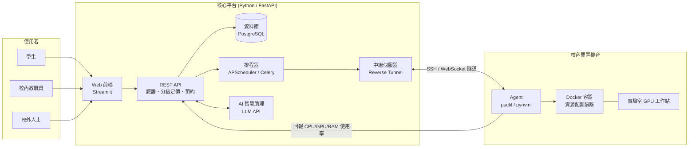

# PowerShare — 校園閒置算力租借平台

> 東吳大學黑客松競賽參賽專案
>
> 本文件是給 5 人團隊(可搭配 AI coding assistant 如 Claude Code 使用)直接執行的開發手冊。核心原則:**先把共用介面契約(§4)談好凍結,再各自平行開發**,每個工作項目都附驗收條件與降級方案,卡關時不需要等別人,先套降級方案往前走,回頭再補。

---

## 目錄

- [§0 給執行者的規則](#0-給執行者的規則)
- [§1 專案總覽](#1-專案總覽)
- [§2 系統架構與技術棧](#2-系統架構與技術棧)
- [§3 共同前置工作(全員)](#3-共同前置工作全員)
- [§4 資料與 API 介面契約(Frozen)](#4-資料與-api-介面契約frozen)
- [§5 資源安全與隔離設計](#5-資源安全與隔離設計)
- [§6 分工任務與驗收](#6-分工任務與驗收)
- [§7 整合驗收(全員)](#7-整合驗收全員)
- [§8 風險與降級方案總表](#8-風險與降級方案總表)
- [§9 參賽主題定位](#9-參賽主題定位)
- [§10 延伸加分想法](#10-延伸加分想法)
- [§11 參考案例](#11-參考案例)
- [§12 授權](#12-授權)
- [附錄:週次執行矩陣](#附錄週次執行矩陣)

---

## §0 給執行者的規則

★ 以下規則優先於其他章節,執行任何工作前先看這裡。

* **§4 定義的資料模型與 API 是凍結契約(frozen contract)**:欄位名稱、型別、路徑一旦寫進本文件,任何人不得私自更動。需要修改時,先在群組同步、更新本文件,再動工——否則會出現「我這邊測起來對不上你那邊」的整合地獄。
* **每人只在自己負責的資料夾內工作**(對照 §6 分工表),降低 merge conflict;`main` 分支保護,開 feature branch + PR 後再合併。
* **命名與風格**:程式碼識別字(變數/函式/類別)一律英文,註解可中文;Python 用 `black` + `ruff` 格式化,進 repo 前跑過一次。
* **卡關處理**:每個工作項目都有「驗收條件」與「降級方案」(§6、§7),卡超過預估時間的 1.5 倍就直接套降級方案往前走,不要卡死等一個模組。
* **若請 AI coding assistant 幫忙寫程式**:直接把 §4(自己負責模組的那段 frozen contract)和 §6 對應小節貼給它,不需要每次重新解釋整個專案背景。

## §1 專案總覽

**問題**:校園裡大量電腦資源(實驗室工作站、系辦電腦、研究室 GPU 主機)課餘時間幾乎完全閒置,但學生修 AI/深度學習課程時常缺乏運算資源,只能付費租用昂貴的雲端服務。

**方案**:PowerShare 讓學生、校內教職員、校外人士以分級定價預約校內閒置機台,並用 AI 助理讓「找機台、訂時段」這件事用一句話就能完成。

**包含**(MVP 範圍):

* 機台清單與即時閒置狀態
* 三級身分(學生/教職員/校外)分級定價與預約
* 預約成功後瀏覽器即可存取(Jupyter/code-server)
* AI 自然語言預約助理 + 使用報告生成

**不包含**(本次比賽範圍外,留作未來擴充):

* 真實金流/付費機制(demo 用虛擬額度即可)
* 大規模多校/多機房調度
* 自建 LLM 模型(直接呼叫 Claude/OpenAI API)

## §2 系統架構與技術棧

校園機台通常在實驗室網路的 NAT/防火牆後面,沒有公網 IP,因此**中繼伺服器(Relay)+ 反向隧道**是架構關鍵,不是單純「前端打後端 API」。



| 模組 | 技術 | 說明 |
|---|---|---|
| 後端 API | **FastAPI** + SQLAlchemy + Pydantic | 自動產生 Swagger 文件,demo 可直接展示給評審 |
| 資料庫 | PostgreSQL(正式)/ SQLite(展示) | 使用者、機台、預約、計費紀錄 |
| 認證 | JWT + OAuth2,依 email 網域判定身分 | 校園信箱 → 學生/教職員;其餘 → 校外(需審核) |
| 機台監控 Agent | `psutil`、`pynvml`/`GPUtil` | 背景常駐程式,定期回報硬體狀態 |
| 資源隔離 | Docker + `docker-py`,`--cpus`/`--memory`/`--gpus` | 每個租借 session 一個獨立容器,用完即銷毀 |
| 遠端存取 | Jupyter / **code-server** | 使用者免安裝,瀏覽器即可用 |
| 中繼隧道 | `frp` 或自製 SSH reverse tunnel | 解決機台無公網 IP 的問題 |
| 排程 | APScheduler(輕量)或 Celery+Redis | 時段自動開始/結束、逾時回收 |
| 前端 | **Streamlit** | 純 Python 開發快,適合 hackathon 時程 |
| AI 助理 | Claude API / OpenAI API(function calling) | 自然語言預約、使用報告生成 |
| 部署 | Docker Compose | 一鍵啟動,方便評審現場展示 |

## §3 共同前置工作(全員)

在分工開始前,全員一起完成:

1. 建立 repo,依 §6 分工建好資料夾(`backend/` `agent/` `frontend/` `relay/`)
2. 確認 §4 的資料模型與 API 契約沒有疑義,有疑義現在提出、現在改
3. 本機開發環境:Python 3.11+、Docker、（有 GPU 機台的人另裝對應 CUDA 驅動)
4. 起手式:

```bash
git clone <repo-url>
cd powershare

# 啟動整套服務(API + 資料庫 + 前端)
docker compose up --build

# 個別開發
cd backend && pip install -r requirements.txt && uvicorn app.main:app --reload
cd frontend && pip install streamlit && streamlit run app.py
```

## §4 資料與 API 介面契約(Frozen)

★ 這是全專案唯一「不能私自改」的部分。改之前先群組同步。

### 資料模型

```python
# backend/app/models.py
from datetime import datetime
from typing import Literal
from pydantic import BaseModel

class Machine(BaseModel):
    id: str
    name: str
    cpu_model: str
    gpu_model: str | None
    ram_gb: int
    gpu_vram_gb: int | None
    status: Literal["idle", "rented", "offline"]
    owner_dept: str

class BookingCreate(BaseModel):
    machine_id: str
    start_time: datetime
    end_time: datetime

class Booking(BaseModel):
    id: str
    user_id: str
    machine_id: str
    start_time: datetime
    end_time: datetime
    status: Literal["pending", "active", "done", "cancelled"]
    access_url: str | None

class AgentHeartbeat(BaseModel):
    machine_id: str
    cpu_percent: float
    ram_percent: float
    gpu_percent: float | None
    gpu_vram_used_gb: float | None
    timestamp: datetime

class AIAssistRequest(BaseModel):
    user_id: str
    message: str

class AIAssistResponse(BaseModel):
    reply: str
    booking: Booking | None
```

### API 路由(後端負責人實作,其他人依此串接)

```
GET  /api/machines                → list[Machine]
POST /api/bookings                → Booking          (body: BookingCreate)
GET  /api/bookings/{id}           → Booking
POST /api/bookings/{id}/cancel    → Booking
POST /api/agent/heartbeat         → 200 OK            (body: AgentHeartbeat)
POST /api/ai/assist               → AIAssistResponse  (body: AIAssistRequest)
```

### Agent 端函式簽章(機台代理負責人實作)

```python
# agent/monitor.py
def collect_metrics() -> dict:
    """回傳目前機台 CPU/RAM/GPU 使用率,欄位需符合 AgentHeartbeat"""
    ...

def send_heartbeat(base_url: str, machine_id: str) -> None:
    """每 10 秒呼叫一次,POST 到 /api/agent/heartbeat"""
    ...
```

```python
# agent/container_manager.py
def start_session_container(
    machine_id: str, booking_id: str,
    cpu_limit: float, mem_limit_gb: int, gpu: bool,
) -> str:
    """啟動限流 Docker 容器,回傳可存取的 URL(如 code-server token URL)"""
    ...

def stop_session_container(booking_id: str) -> None:
    """銷毀容器、回收資源"""
    ...
```

### AI 助理函式簽章(後端 / AI 整合負責人實作)

```python
# backend/app/ai_assistant.py
def handle_ai_request(user_id: str, message: str) -> AIAssistResponse:
    """
    用 LLM function calling 解析 message,可呼叫下列工具函式:
      - list_available_machines(need_gpu: bool, min_vram_gb: int | None,
                                  start: datetime, end: datetime) -> list[Machine]
      - create_booking(user_id: str, machine_id: str,
                        start: datetime, end: datetime) -> Booking
    回傳自然語言回覆,以及(若成功建立)對應的 Booking。
    """
    ...
```

## §5 資源安全與隔離設計

評審通常會追問這塊,務必準備好回答:

* **容器隔離**:每個租借 session 在獨立 Docker 容器執行,不碰主機作業系統或其他使用者資料。
* **資源配額**:cgroups(Docker 內建)限制 CPU 核心數、記憶體、GPU,避免一人拖垮整台機器。
* **網路隔離**:機台不開任何對外 inbound port,連線都經中繼伺服器的 outbound 隧道完成。
* **身分分級審核**:校外人士註冊需人工審核,避免被用來跑挖礦、攻擊工具等非法用途。
* **逾時強制回收**:時段結束強制銷毀容器,防止資源被長期佔用。
* **資料不落地**:容器銷毀時清除暫存資料,需保存結果需使用者主動下載。

## §6 分工任務與驗收

5 人各自負責一個模組;每項工作都附「驗收條件」與「降級方案」,卡關先套降級方案,不要卡死等別人。

### 6.1 後端 / API / AI 助理負責人

| # | 工作項目 | 驗收條件 | 降級方案 |
|---|---|---|---|
| 1 | 機台清單 API | `GET /api/machines` 回傳 ≥3 筆測試機台,欄位符合 §4 `Machine` | DB 未就緒時,先用記憶體 dict 模擬,回傳格式維持一致 |
| 2 | 預約 CRUD + 時段衝突檢查 | `POST /api/bookings` 建立後,同機台重疊時段的第二筆請求應被拒絕 | 先不做自動衝突偵測,用資料庫 unique constraint 頂著 |
| 3 | 計費與使用紀錄 | session 結束後產生一筆費用紀錄,金額 = 時長 × 對應身分單價 | 先寫死單一費率,分級定價留到打磨階段 |
| 4 | AI 助理 `/api/ai/assist` | 輸入「這週五下午兩小時、16GB VRAM、校內價」,能正確呼叫 `create_booking` 建立對應預約 | function calling 不穩時,先用關鍵字/正則解析常見句型當 fallback |

### 6.2 機台代理 / 容器負責人

| # | 工作項目 | 驗收條件 | 降級方案 |
|---|---|---|---|
| 1 | 心跳回報 | Agent process 每 10 秒 `POST /api/agent/heartbeat`,後端能看到機台從 offline→idle | 先手動觸發一次性回報,自動排程留到打磨階段 |
| 2 | 容器啟動/銷毀 | 預約進入 active 後,實際啟動一個限流 Docker 容器並可透過連結打開 Jupyter/code-server | GPU passthrough 卡關時,先示範 CPU-only 容器,GPU 隔離用口頭+投影片補充 |
| 3 | 反向隧道 | 使用者可透過中繼伺服器連進 NAT 後方的機台,機台本身無需開放任何 inbound port | 時間不足時,demo 現場先用同網段直連,正式版做法在簡報中說明 |

### 6.3 前端 / 儀表板負責人

| # | 工作項目 | 驗收條件 | 降級方案 |
|---|---|---|---|
| 1 | 機台列表頁 | Streamlit 頁面顯示所有機台規格、狀態、對應身分價格 | API 未就緒時先用假資料(需與 §4 Machine schema 一致)開發版面 |
| 2 | 預約表單 | 選機台+時段送出後,能在頁面看到 booking 狀態變化 | — |
| 3 | 即時使用率圖表 | CPU/RAM(GPU 若有)使用率曲線隨心跳更新 | 先用固定輪詢(如每 5 秒 refresh),不做 WebSocket 即時推送 |
| 4 | AI 助理對話框 | 使用者可在頁面輸入自然語言並看到 AI 回覆與(若有)新建立的預約 | — |

### 6.4 測試 / 整合 / 部署負責人

| # | 工作項目 | 驗收條件 | 降級方案 |
|---|---|---|---|
| 1 | Docker Compose 整合 | `docker compose up --build` 一鍵啟動 API + DB + 前端 | 個別模組先各自跑,整合排在打磨階段最後 1 週前完成即可 |
| 2 | 對 §4 契約的整合測試 | 針對每個 API 路徑寫基本 pytest(狀態碼 + 回傳欄位符合 schema) | 先手動用 Swagger UI ( `/docs` ) 逐一測試,自動化測試補上即可 |
| 3 | 端到端演練 | 依 §7 checklist 跑過一次完整流程無錯誤 | — |

### 6.5 專案管理 / 簡報負責人

| # | 工作項目 | 驗收條件 | 降級方案 |
|---|---|---|---|
| 1 | 主題定位與敘事 | 依 §9 定調簡報主軸與輔助敘事 | — |
| 2 | 進度追蹤 | 每週對照本文件 §6 各角色驗收條件,標記完成度 | — |
| 3 | Demo 腳本 | 寫出現場口頭報告 + 實作展示的完整腳本與時間分配 | — |
| 4 | 簡報製作 | 依 §7 整合結果與 §5 安全設計準備問答 | — |

> 若後端負責人時間吃緊,AI 助理模組(6.1 #4)可由前端或測試負責人支援,因為呼叫 LLM API 本身不難,重點在 prompt 設計與 function calling 參數定義。

## §7 整合驗收(全員)

全部模組完成後,依序跑過一次完整流程,每一步都要無錯誤才算過:

```
瀏覽機台列表
    ↓
選擇機台與時段 → 送出預約
    ↓
系統檢查時段衝突/額度 → 確認預約
    ↓
時段開始:自動開通容器,取得瀏覽器連線網址
    ↓
使用中:即時可見剩餘時間、當前使用率
    ↓
時段結束:自動關閉並回收資源,產生使用紀錄與費用
```

| 步驟 | 驗收條件 | 降級方案 |
|---|---|---|
| 完整流程 | 三種身分(學生/教職員/校外)至少各示範一次登入與定價差異 | 只做學生身分的完整流程,其餘身分用簡報說明差異 |
| 容器隔離 | 現場示範一次真實 Docker 容器啟動+銷毀 | 若機台不足,用團隊筆電 + 1 台真實 GPU 機器示範,不必真的用到校內閒置機台 |
| AI 助理 | 現場示範自然語言建立一次真實預約 | 準備 2–3 句已測試過能穩定成功的範例句子,避免臨場念錯關鍵字 |
| 離線備援 | 準備一份 demo 全流程錄影/截圖 | 校園網路或 Wi-Fi 不穩是決賽現場常見翻車點,務必準備 |

## §8 風險與降級方案總表

| 風險 | 說明 | 降級方案 |
|---|---|---|
| 實體機台管理 | 誰負責機台開關機、系統維護? | MVP 只用少數已知可控的機台(如社團/實驗室自願提供) |
| 資安與濫用 | 校外人士濫用資源跑違法用途如何究責? | 使用條款 + 日誌留存 + 人工審核機制 |
| 電費與硬體損耗成本 | 定價若只算「免費資源變現金」,商業模式站不住腳 | 定價模型明確納入電費估算,簡報中主動說明 |
| Windows vs Linux 機台差異 | Docker + GPU passthrough 在 Linux 最成熟 | MVP 先聚焦 Linux 實驗室機台,Windows 列為未來擴充(WSL2) |
| 時段衝突/異常斷線 | 使用者斷線或當機時資源卡死整個時段 | 加上逾時強制回收機制(§5),優先度高於其他打磨項目 |

## §9 參賽主題定位

| 項目 | 選擇 | 說明 |
|---|---|---|
| 主軸題目 | **創新創業** | 平台本質是「校園服務 + 分級定價商業模式」,具備明確價值主張、目標客群與獲利邏輯 |
| 輔助敘事 1 | 永續發展(SDG 9/12) | 活化閒置硬體、減少新增雲端運算的碳足跡 |
| 輔助敘事 2 | 流程改善 | 解決「機台閒置卻無從得知、無法預約」的資訊不透明痛點 |
| 必用工具類別 | **生成式 AI 類** | AI 智慧媒合助理(§4 AI 助理契約)、AI 使用報告生成 |

> 建議簡報開場先定錨「創新創業」為主線,痛點與影響力段落自然帶入永續發展與流程改善,不必把三個主題硬拆成三段各講一次。

## §10 延伸加分想法

* **動態定價**:依需求熱度(尖峰時段/熱門機型)自動調整價格,類似雲端 spot instance 概念
* **閒置時間預測**:用簡單規則式統計預測哪些時段大概率閒置,主動推薦時段
* **碳足跡計算**:共享閒置算力相對於新開雲端 GPU 省下的碳排放,作為社會價值敘事
* **信譽/評價系統**:校外使用者建立信譽分數,信譽不佳者降低優先權
* **LINE Bot 整合**:預約、到期提醒、機台狀態查詢做成 LINE Bot 指令

## §11 參考案例

* [Vast.ai](https://vast.ai)、[RunPod](https://www.runpod.io)、[Salad](https://salad.com) — 去中心化 GPU 租賃市場,參考定價與媒合模式
* 各校 HPC / GPU 共享中心(如陽明交大高效能運算平台)— 參考額度制與排程管理
* [國網中心 TWCC 台灣AI雲](https://www.twcc.ai) — 參考分級收費邏輯
* [BOINC](https://boinc.berkeley.edu) — 參考「志願捐出閒置算力」的分散式運算概念
* [frp](https://github.com/fatedier/frp) — 開源反向隧道工具,可作為中繼伺服器實作參考

## §12 授權

本專案採用 MIT License(可依團隊需求調整)。

---

## 附錄:週次執行矩陣

以今天(2026/09/15)到初審繳件(2026/10/30 12:00)反推的週次分工,每週結束前對照 §6 驗收條件自我檢查。

| 週次 | 後端/API/AI | Agent/容器 | 前端 | 測試/整合 | 專案管理/簡報 |
|---|---|---|---|---|---|
| W1 09/15–09/21 | §4 契約定案、API 骨架(假資料) | 研究 psutil/pynvml 讀值格式 | Streamlit 骨架,串假資料顯示機台列表 | repo 結構、CI/pytest 骨架 | 主題定位定案、簡報大綱 v0 |
| W2 09/22–09/28 | 預約 CRUD + 衝突檢查(6.1 #1–2) | heartbeat 串接後端(6.2 #1) | 預約表單串真實 API | 針對 §4 契約寫基本整合測試 | 聯絡校內候選閒置機台(實驗室/系辦) |
| W3 09/29–10/05 | AI 助理雛形(先不求完美 function calling) | Docker 限流容器啟動(先 CPU-only) | 即時使用率圖表 | Docker Compose 一鍵啟動可行 | 簡報 v1 草稿 |
| W4 10/06–10/12 | AI function calling 正式串接 | 反向隧道測試 + GPU 容器(若有機台) | AI 助理對話框 UI、使用報告頁 | 第一次端到端整合測試(§7) | 依整合結果修敘事 |
| W5 10/13–10/19 | 計費/使用紀錄收尾 | 逾時自動回收機制 | UI 打磨、錯誤處理 | 壓力測試、離線備援演練 | 簡報 v2、demo 腳本 |
| W6 10/20–10/26 | Feature freeze,之後只修 bug | 同左 | 同左 | 第二次端到端整合測試 | 簡報/demo 排練 |
| W7 10/27–10/30 12:00 | 最終檢查 | 最終檢查 | 最終檢查 | 最終檢查、備援錄影 | 準時繳交簡報 |

---

Co-Authored-By: Claude Sonnet 5 <noreply@anthropic.com>
