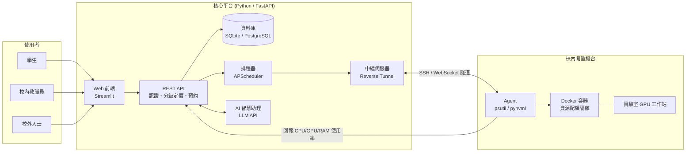

# PowerShare — 校園閒置算力租借平台

> 東吳大學黑客松競賽參賽專案

本文件為團隊開發手冊,定義專案的開發規範、介面契約、分工範圍與驗收標準。任一成員(或 AI coding assistant)依本文件即可確認自身工作內容、完成標準,以及卡關時的處理方式。

**核心原則:介面契約(§4)先行凍結,各模組再平行開發。每項工作均訂有驗收條件與降級方案,卡關時應改採降級方案繼續推進,不等待其他模組。**

* * *

## 模組與閱讀範圍

| 負責模組 | 初次閱讀順序 | 日常參照 |
|---|---|---|
| **全員(必讀)** | §0 → §1 → §2 → §3 | §8 風險表 |
| 後端 / API / AI 助理 | §4 全部 → §6.1 | §4 契約、§6.1 驗收表 |
| 機台 Agent / 容器 | §2 架構 → §4.3 → §6.2 | §4.3 契約、§5 隔離設計 |
| 前端 / 儀表板 | §4.1 → §4.5 → §6.3 | §4.5 種子資料、§6.3 驗收表 |
| 測試 / 整合 / 部署 | §3 → §4 → §7 | §7 整合驗收表 |

## 目錄

- [§0 開發規範](#0-開發規範)
- [§1 專案總覽](#1-專案總覽)
- [§2 系統架構與技術棧](#2-系統架構與技術棧)
- [§3 共同前置工作(全員)](#3-共同前置工作全員)
- [§4 資料與 API 介面契約(Frozen)](#4-資料與-api-介面契約frozen)
- [§5 資源安全與隔離設計](#5-資源安全與隔離設計)
- [§6 分工任務與驗收](#6-分工任務與驗收)
- [§7 整合驗收(全員)](#7-整合驗收全員)
- [§8 風險與因應方案](#8-風險與因應方案)
- [§9 未來擴充方向](#9-未來擴充方向)
- [§10 參考案例](#10-參考案例)
- [附錄 A:週次執行矩陣](#附錄-a週次執行矩陣)
- [附錄 B:AI coding assistant 使用方式](#附錄-bai-coding-assistant-使用方式)

* * *

# §0 開發規範

**本章規範優先於文件其他章節。**

1. **§4 為凍結契約**。其中的欄位名稱、型別與 API 路徑不得私自更動。如需修改,應先於群組公告、經全員確認並更新本文件後,方可動工。
2. **各成員僅在所屬資料夾內作業**(§6 標明各模組擁有的目錄)。`main` 分支受保護,一律開 feature branch,經 PR 且至少一人審閱後合併。
3. **卡關逾預估時間 1.5 倍,應立即改採降級方案**(§6、§8 各項均已列出)。
4. **命名與格式**:程式碼識別字(變數、函式、類別)一律使用英文,註解可用中文。Python 程式碼進 repo 前須執行 `black` 與 `ruff`。
5. **每完成一項工作,應自行對照 §6 該項驗收條件檢查**,通過後於群組回報。
6. **W6 起功能凍結**(見附錄 A),僅修正缺陷,不新增功能。

* * *

# §1 專案總覽

## 1.1 定位

PowerShare 將校園內閒置的電腦與 GPU 工作站(實驗室、系辦、研究室)整合為可預約、可分級計費的共享運算資源池。

## 1.2 運作方式

校內大量機台於課餘、夜間與寒暑假期間處於閒置狀態;同時,修習 AI 與深度學習課程的學生因本機設備效能不足,須另行租用成本較高的雲端運算服務。PowerShare 以三項機制銜接供需兩端:

1. **狀態監控** — 每台參與機台部署 Agent,每 10 秒回報 CPU / RAM / GPU 使用率,閒置機台自動標記為可租用。
2. **預約與分級定價** — 平台顯示各機台規格、即時狀態,以及依使用者身分(學生 / 校內教職員 / 校外人士)計算的費率。
3. **隔離執行環境** — 租用者取得的是機台上獨立的 Docker 容器,資源用量受配額限制,時段結束即銷毀,不影響主機環境與其他使用者資料。

平台另設 AI 助理,使用者可用自然語言描述需求(例如「本週五下午兩小時,至少 16GB VRAM」),由系統完成機台篩選與預約建立。

## 1.3 範圍界定

**MVP 包含**

* 機台清單與即時閒置狀態
* 三級身分(學生 / 校內教職員 / 校外人士)分級定價與預約
* 預約成功後透過瀏覽器直接存取(Jupyter / code-server)
* AI 自然語言預約助理
* AI 使用報告生成(費用、相較雲端節省金額、估算碳排)

**不包含**

* 真實金流與付款機制(以虛擬額度替代)
* 跨校 / 多機房大規模調度
* 自行訓練語言模型(直接呼叫 Claude / OpenAI API)
* 校務系統帳號整合(以 email 網域模擬身分判定)

> 上述不包含項目為刻意界定的範圍取捨,非技術限制。

* * *

# §2 系統架構與技術棧

## 2.1 架構圖



## 2.2 一次租借的資料流

```
使用者在前端送出預約
    ↓
POST /api/bookings          ← 後端檢查時段衝突、額度,並計算費用
    ↓
Booking 建立 (status=pending)
    ↓
排程器等待 start_time 到達
    ↓
透過 Relay 通知該機台的 Agent
    ↓
Agent 執行 start_session_container()   ← 啟動限流 Docker 容器
    ↓
回傳 access_url 寫入 Booking (status=active)
    ↓
使用者以瀏覽器連線執行運算作業
    ↓
end_time 到達 → stop_session_container() → 容器銷毀
    ↓
寫入 UsageReport,由 AI 生成使用報告 (status=done)
```

## 2.3 中繼伺服器(Relay)的必要性

校園機台位於實驗室網路的 NAT 與防火牆後方,**不具公網 IP,外部無法直接連入**。若要求資訊單位對外開放 port,除不易取得核准外,亦會擴大資安風險。

本專案採用的作法為:**由機台主動對中繼伺服器建立 outbound 連線(反向隧道)**,使用者請求由中繼伺服器沿既有通道轉發至機台。機台本身無須開放任何 inbound port。

## 2.4 技術棧

| 模組 | 技術 | 選用理由 |
|---|---|---|
| 後端 API | **FastAPI** + SQLAlchemy + Pydantic | 自動產生 Swagger 文件(`/docs`),便於介接與展示 |
| 資料庫 | SQLite(開發)→ PostgreSQL(正式) | 開發階段免安裝,降低環境建置成本 |
| 認證 | JWT,依 email 網域判定身分 | `@scu.edu.tw` 判定為校內,其餘為校外 |
| 機台監控 | `psutil`、`pynvml` / `GPUtil` | 純 Python 實作,跨平台讀取 CPU / RAM / GPU |
| 資源隔離 | Docker + `docker-py` | 以 `--cpus` `--memory` `--gpus` 限制資源用量 |
| 遠端存取 | Jupyter / **code-server** | 使用者免安裝環境,瀏覽器即可操作 |
| 中繼隧道 | `frp` 或 SSH reverse tunnel | 解決機台無公網 IP 的連線問題 |
| 排程 | **APScheduler** | 相較 Celery 輕量,無須另行部署 Redis |
| 前端 | **Streamlit** | 純 Python 開發,開發時程較短 |
| AI 助理 | Claude API / OpenAI API(function calling) | 無須自行訓練模型 |
| 部署 | Docker Compose | 單一指令啟動完整環境 |

* * *

# §3 共同前置工作(全員)

## 3.1 檔案建立順序

> 契約類檔案(`models.py`)未完成前,其餘模組無法開工,故須優先產出。

### 第一批 — repo 骨架

```
powershare/
├── README.md              ← 本文件
├── .gitignore
├── .env.example
├── docker-compose.yml
├── backend/
├── agent/
├── frontend/
├── relay/
└── tests/
```

```bash
mkdir -p powershare/{backend/app/routers,agent,frontend,relay,tests}
cd powershare
git init
```

### 第二批 — 凍結契約(最優先)

| 順序 | 檔案 | 建立者 | 內容 |
|---|---|---|---|
| 1 | `backend/app/models.py` | 後端 | §4.1 的所有 Pydantic 模型,照抄即可 |
| 2 | `backend/app/main.py` | 後端 | FastAPI 進入點,註冊 §4.2 的七條路由(先回傳假資料亦可) |
| 3 | `backend/app/seed_data.py` | 後端 | §4.5 的測試種子資料 |
| 4 | `backend/requirements.txt` | 後端 | `fastapi` `uvicorn` `sqlalchemy` `pydantic` `apscheduler` `anthropic` |

> 上述四個檔案推送至 repo 後,前端、Agent、測試三個模組即可同步開工,無須等待後端邏輯完成。

### 第三批 — 各模組起始檔(可為空函式,但簽章須符合 §4)

| 檔案 | 擁有者 | 內容 |
|---|---|---|
| `backend/app/routers/machines.py` | 後端 | 機台相關路由 |
| `backend/app/routers/bookings.py` | 後端 | 預約相關路由 |
| `backend/app/routers/agent.py` | 後端 | 心跳接收路由 |
| `backend/app/ai_assistant.py` | 後端 / AI | §4.4 的 `handle_ai_request()` |
| `agent/monitor.py` | Agent | §4.3 的 `collect_metrics()`、`send_heartbeat()` |
| `agent/container_manager.py` | Agent | §4.3 的 `start/stop_session_container()` |
| `frontend/app.py` | 前端 | Streamlit 進入點 |
| `frontend/requirements.txt` | 前端 | `streamlit` `requests` `plotly` |
| `tests/test_contract.py` | 測試 | 對照 §4 契約的基本測試 |

> 路由拆分為多個檔案係刻意設計,使各成員修改不同檔案,降低 merge conflict。

## 3.2 環境需求

* Python 3.11 以上
* Docker Desktop(Agent / 容器負責人必裝,其餘成員建議安裝)
* Git
* 具 NVIDIA GPU 的機台:對應 CUDA 驅動與 nvidia-container-toolkit

## 3.3 啟動方式

```bash
git clone <repo-url>
cd powershare
cp .env.example .env        # 填入 LLM API key

# 方式一:一鍵啟動全部服務
docker compose up --build

# 方式二:個別開發
cd backend && pip install -r requirements.txt && uvicorn app.main:app --reload
cd frontend && pip install -r requirements.txt && streamlit run app.py
cd agent && python monitor.py --server http://localhost:8000 --machine-id lab-pc-01
```

啟動後:

* API 文件:http://localhost:8000/docs
* 前端介面:http://localhost:8501

* * *

# §4 資料與 API 介面契約(Frozen)

> **本章為全專案唯一不得私自變更的章節。** 如需修改,應先於群組公告並經全員確認後,方可動工。

## 4.1 資料模型

```python
# ---- backend/app/models.py(後端負責人建立,全員唯讀參照)----
from datetime import datetime
from typing import Literal
from pydantic import BaseModel

Role          = Literal["student", "staff", "external"]
MachineStatus = Literal["idle", "rented", "offline"]
BookingStatus = Literal["pending", "active", "done", "cancelled"]


class User(BaseModel):
    id: str
    email: str
    name: str
    role: Role                 # 依 email 網域自動判定
    credit: float              # 虛擬額度


class Machine(BaseModel):
    id: str
    name: str
    cpu_model: str
    gpu_model: str | None
    ram_gb: int
    gpu_vram_gb: int | None
    status: MachineStatus
    owner_dept: str
    price_per_hour: dict[str, float]   # {"student": 10, "staff": 20, "external": 50}


class BookingCreate(BaseModel):
    machine_id: str
    start_time: datetime
    end_time: datetime


class Booking(BaseModel):
    id: str
    user_id: str
    machine_id: str
    start_time: datetime
    end_time: datetime
    status: BookingStatus
    access_url: str | None     # 容器啟動後才有值
    estimated_cost: float


class AgentHeartbeat(BaseModel):
    machine_id: str
    cpu_percent: float
    ram_percent: float
    gpu_percent: float | None
    gpu_vram_used_gb: float | None
    timestamp: datetime


class UsageReport(BaseModel):
    booking_id: str
    duration_hours: float
    cpu_avg: float
    gpu_avg: float | None
    cost: float
    summary_text: str          # AI 生成的摘要


class AIAssistRequest(BaseModel):
    user_id: str
    message: str               # 自然語言需求描述


class AIAssistResponse(BaseModel):
    reply: str                 # 給使用者的自然語言回覆
    booking: Booking | None    # 成功建立預約時帶回
```

## 4.2 API 路由

| 方法 | 路徑 | Body | 回傳 | 產出者 | 使用者 |
|---|---|---|---|---|---|
| GET | `/api/machines` | — | `list[Machine]` | 後端 | 前端、AI 助理 |
| POST | `/api/bookings` | `BookingCreate` | `Booking` | 後端 | 前端、AI 助理 |
| GET | `/api/bookings/{id}` | — | `Booking` | 後端 | 前端 |
| POST | `/api/bookings/{id}/cancel` | — | `Booking` | 後端 | 前端 |
| GET | `/api/bookings/{id}/report` | — | `UsageReport` | 後端 + AI | 前端 |
| POST | `/api/agent/heartbeat` | `AgentHeartbeat` | `200 OK` | 後端 | Agent |
| POST | `/api/ai/assist` | `AIAssistRequest` | `AIAssistResponse` | 後端 / AI | 前端 |

**統一錯誤回傳格式**

```json
{ "detail": "時段與既有預約衝突", "code": "BOOKING_CONFLICT" }
```

常用 code:`BOOKING_CONFLICT`(時段衝突)、`MACHINE_OFFLINE`(機台離線)、`INSUFFICIENT_CREDIT`(額度不足)、`UNAUTHORIZED`(未登入)。

## 4.3 Agent 端函式簽章

```python
# ---- agent/monitor.py(機台 Agent 負責人)----
def collect_metrics() -> dict:
    """讀取本機 CPU/RAM/GPU 使用率。回傳欄位需符合 AgentHeartbeat。
    無 GPU 的機器,gpu_* 欄位回 None。"""
    ...

def send_heartbeat(base_url: str, machine_id: str) -> None:
    """每 10 秒呼叫一次,POST collect_metrics() 的結果到 /api/agent/heartbeat"""
    ...
```

```python
# ---- agent/container_manager.py(機台 Agent 負責人)----
def start_session_container(
    machine_id: str,
    booking_id: str,
    cpu_limit: float,        # 例如 2.0 = 2 核
    mem_limit_gb: int,
    gpu: bool,
) -> str:
    """啟動限流 Docker 容器,回傳可存取的 URL(code-server / Jupyter token URL)。
    此 URL 會被寫進 Booking.access_url。"""
    ...

def stop_session_container(booking_id: str) -> None:
    """銷毀容器、清除暫存資料、回收資源。逾時也由排程器呼叫此函式。"""
    ...
```

## 4.4 AI 助理函式簽章

```python
# ---- backend/app/ai_assistant.py(後端 / AI 負責人)----
def handle_ai_request(user_id: str, message: str) -> AIAssistResponse:
    """用 LLM function calling 解析 message,可呼叫下列工具函式:

      list_available_machines(need_gpu: bool,
                              min_vram_gb: int | None,
                              start: datetime,
                              end: datetime) -> list[Machine]

      create_booking(user_id: str, machine_id: str,
                     start: datetime, end: datetime) -> Booking

    回傳自然語言回覆 + (若成功建立)對應的 Booking。
    """
    ...

def generate_usage_summary(report: UsageReport) -> str:
    """把使用紀錄轉成摘要,內容需包含:使用時長、平均使用率、
    花費、相較雲端 GPU 省下的金額、估算省下的碳排。"""
    ...
```

## 4.5 測試種子資料(全員共用)

> 所有模組的測試資料統一使用下列三台機台,確保前端畫面與後端回傳內容一致。

```python
# ---- backend/app/seed_data.py ----
SEED_MACHINES = [
    {
        "id": "lab-gpu-01", "name": "資訊實驗室 GPU 工作站 #1",
        "cpu_model": "Intel i7-12700", "gpu_model": "NVIDIA RTX 3090",
        "ram_gb": 64, "gpu_vram_gb": 24, "status": "idle",
        "owner_dept": "資訊管理學系",
        "price_per_hour": {"student": 15, "staff": 25, "external": 60},
    },
    {
        "id": "lab-gpu-02", "name": "資訊實驗室 GPU 工作站 #2",
        "cpu_model": "AMD Ryzen 9 5900X", "gpu_model": "NVIDIA RTX 3060",
        "ram_gb": 32, "gpu_vram_gb": 12, "status": "rented",
        "owner_dept": "資訊管理學系",
        "price_per_hour": {"student": 10, "staff": 18, "external": 40},
    },
    {
        "id": "office-pc-07", "name": "系辦公室電腦 #7",
        "cpu_model": "Intel i5-11400", "gpu_model": None,
        "ram_gb": 16, "gpu_vram_gb": None, "status": "idle",
        "owner_dept": "巨量資料管理學院",
        "price_per_hour": {"student": 5, "staff": 8, "external": 20},
    },
]
```

* * *

# §5 資源安全與隔離設計

> 「開放外部使用者於校內機台執行程式」的安全性是本專案的核心議題,全員均須理解並能說明本章內容。

| 機制 | 做法 | 對外說明 |
|---|---|---|
| 容器隔離 | 每個 session 使用獨立 Docker 容器 | 租用者取得的是機台上隔離的執行環境,無法存取主機系統與他人資料 |
| 資源配額 | 以 cgroups 限制 `--cpus` `--memory` `--gpus` | 用量上限由平台指定,單一使用者無法耗盡整台機器資源 |
| 網路隔離 | 機台零 inbound port,全數走 outbound 反向隧道 | 機台無須對外開放任何連接埠 |
| 身分審核 | 校外人士註冊須經人工審核 | 搭配使用條款與完整日誌留存,可追溯不當使用行為 |
| 逾時回收 | 時段結束強制銷毀容器 | 資源不會被長期佔用 |
| 資料不落地 | 容器銷毀時清除暫存資料 | 後續使用者無法取得前一位使用者遺留的任何資料 |

* * *

# §6 分工任務與驗收

> 每項工作均訂有**驗收條件**(完成標準)與**降級方案**(替代作法)。卡關逾預估時間 1.5 倍時應改採降級方案。

## 6.1 後端 / API / AI 助理負責人 — 擁有 `backend/`

| # | 工作項目 | 驗收條件 | 降級方案 |
|---|---|---|---|
| 1 | 建立 §4 契約檔案 | `models.py`、`main.py`、`seed_data.py` 推送至 repo,其餘成員可 clone 後執行 | 無(本項為其他模組的前置條件,不可降級) |
| 2 | 機台清單 API | `GET /api/machines` 回傳 3 筆種子機台,欄位符合 `Machine` | 資料庫未就緒時先回傳記憶體內的 `SEED_MACHINES`,格式維持一致 |
| 3 | 預約 CRUD 與衝突檢查 | 同機台重疊時段的第二筆請求回傳 `BOOKING_CONFLICT` | 暫不做自動偵測,改以資料庫 unique constraint 處理 |
| 4 | 計費與使用紀錄 | session 結束產生 `UsageReport`,金額 = 時長 × 該身分單價 | 先採單一費率,分級定價延後實作 |
| 5 | AI 助理 `/api/ai/assist` | 輸入「這週五下午兩小時、需 16G VRAM」能建立對應 Booking | function calling 不穩定時,先以關鍵字與正則解析常見句型 |
| 6 | AI 使用報告 | `generate_usage_summary()` 產出含花費、節省金額、碳排的摘要 | 先以固定模板填入數值,LLM 潤飾延後實作 |
| 7 | 排程器 | `start_time` 到達自動開通,`end_time` 到達自動回收 | 提供手動觸發的測試用 API,不強求全自動 |

## 6.2 機台 Agent / 容器負責人 — 擁有 `agent/`、`relay/`

| # | 工作項目 | 驗收條件 | 降級方案 |
|---|---|---|---|
| 1 | 讀取硬體狀態 | `collect_metrics()` 能讀出本機 CPU / RAM(具 GPU 者含 GPU) | GPU 函式庫無法安裝時僅回傳 CPU / RAM,GPU 欄位回 `None` |
| 2 | 心跳回報 | Agent 每 10 秒 POST 一次,後端可見機台由 `offline` 轉為 `idle` | 先實作單次手動觸發,定時排程延後實作 |
| 3 | 容器啟動 / 銷毀 | 預約轉為 active 後實際啟動限流容器,瀏覽器可開啟 code-server | GPU passthrough 卡關時先實作 CPU-only 容器 |
| 4 | 資源配額 | `docker stats` 可見容器受限於指定的 CPU 與記憶體上限 | 先以手動 `docker run --cpus` 參數驗證,自動化延後實作 |
| 5 | 反向隧道 | 使用者可連入 NAT 後方機台,機台零 inbound port | 測試階段先採同網段直連,正式作法依 §2.3 實作 |
| 6 | 逾時強制回收 | 時段結束後容器自動銷毀,`docker ps` 查無該容器 | 由排程器手動觸發回收 |

## 6.3 前端 / 儀表板負責人 — 擁有 `frontend/`

| # | 工作項目 | 驗收條件 | 降級方案 |
|---|---|---|---|
| 1 | 機台列表頁 | 顯示 3 台種子機台的規格、狀態,以及依當前身分計算的價格 | API 未就緒時先使用 §4.5 種子資料 |
| 2 | 登入 / 身分切換 | 可切換學生、教職員、校外三種身分,價格隨之變動 | 以下拉選單模擬身分切換,不實作完整登入流程 |
| 3 | 預約表單 | 選擇機台與時段送出後,頁面可見 booking 狀態 | — |
| 4 | 即時使用率圖表 | CPU / RAM 曲線隨心跳更新 | 以 `st.rerun()` 每 5 秒輪詢,不實作 WebSocket |
| 5 | AI 助理對話框 | 輸入自然語言後顯示 AI 回覆與新建立的預約 | — |
| 6 | 使用報告頁 | session 結束後顯示 AI 生成的使用摘要 | 先顯示原始數值表格,AI 摘要延後接入 |

## 6.4 測試 / 整合 / 部署負責人 — 擁有 `tests/`、`docker-compose.yml`

| # | 工作項目 | 驗收條件 | 降級方案 |
|---|---|---|---|
| 1 | Docker Compose | `docker compose up --build` 可一次啟動 API、DB 與前端 | 各模組先個別執行,整合作業於 W5 前完成即可 |
| 2 | 契約測試 | §4.2 每條路由均有測試(狀態碼與回傳欄位符合 schema) | 先以 `/docs` Swagger UI 手動驗證,自動化測試後補 |
| 3 | 端到端演練 | 依 §7 流程完整執行一次且無錯誤 | — |
| 4 | 壓力與異常測試 | 同時送出 5 筆重疊預約僅 1 筆成功;連線中斷後資源能正常回收 | 至少手動驗證「重複預約」與「Agent 中途離線」兩種情境 |

* * *

# §7 整合驗收(全員)

依序執行下列流程,每一步均須無錯誤:

```
1. 以學生身分登入
     ↓
2. 瀏覽機台列表 → 顯示 3 台機台與學生價
     ↓
3. 於 AI 助理輸入「今天下午借兩小時,需要 GPU」
     ↓
4. AI 回覆推薦機台並建立預約
     ↓
5. 時段開始 → 容器自動開通,取得 access_url
     ↓
6. 以瀏覽器連入,執行一段 Python / PyTorch 程式碼
     ↓
7. 時段結束 → 容器自動銷毀
     ↓
8. 檢視 AI 生成的使用報告(花費 / 節省金額 / 碳排)
```

| 驗收項 | 條件 | 降級方案 |
|---|---|---|
| 三種身分 | 學生、教職員、校外各執行一次,價格正確反映身分差異 | 僅完整執行學生流程,其餘身分以資料驗證價格計算 |
| 容器隔離 | 實際執行容器啟動與銷毀,並以 `docker ps` 驗證 | 機台不足時以團隊筆電搭配一台 GPU 機器驗證 |
| AI 助理 | 以自然語言完成一次實際預約 | 準備 2–3 句已驗證可穩定成功的語句作為測試基準 |

* * *

# §8 風險與因應方案

| 風險 | 問題描述 | 因應方案 |
|---|---|---|
| 實體機台管理 | 機台的開關機與系統維護由誰負責 | MVP 僅使用少數自願提供的機台(社團 / 實驗室),後續可由資訊單位統一管理 |
| 資安與濫用 | 使用者可能將資源用於挖礦或攻擊行為 | 校外身分須人工審核,搭配使用條款與完整日誌留存(§5) |
| 電費與硬體損耗 | 電費負擔與設備折舊成本歸屬 | 定價模型納入電費與折舊估算 |
| Windows 機台 | 系辦電腦多為 Windows,Docker 與 GPU 支援度較低 | MVP 聚焦 Linux 實驗室機台,Windows 經 WSL2 列為後續擴充 |
| 連線中斷 / 當機 | 使用者中途斷線導致資源閒置佔用 | 逾時強制回收機制(§6.2 #6),優先度高於其他優化項目 |
| 隱私 | 機台擁有者的檔案是否可能被存取 | 容器隔離與資料不落地機制(§5) |

* * *

# §9 未來擴充方向

* **動態定價** — 依需求熱度自動調整價格,類似雲端 spot instance 機制
* **閒置時間預測** — 依歷史紀錄預測高機率閒置時段,主動推薦
* **碳足跡統計** — 累計全校因資源共享而減少的碳排放量
* **信譽制度** — 校外使用者評分機制,信譽較低者降低優先權或須預付
* **LINE Bot** — 將預約、到期提醒與狀態查詢整合為 LINE 指令
* **校務系統整合** — 串接學校既有帳號系統,提升落地可行性

* * *

# §10 參考案例

| 案例 | 參考重點 |
|---|---|
| [Vast.ai](https://vast.ai) / [RunPod](https://www.runpod.io) / [Salad](https://salad.com) | 去中心化 GPU 租賃市場的定價與媒合模式 |
| 各校 HPC / GPU 共享中心(如陽明交大) | 校內資源額度制與排程管理 |
| [國網中心 TWCC](https://www.twcc.ai) | 分級收費(學術 vs 產業)邏輯 |
| [BOINC](https://boinc.berkeley.edu) | 志願提供閒置算力的分散式運算概念 |
| [frp](https://github.com/fatedier/frp) | 開源反向隧道工具,中繼伺服器實作參考 |

* * *

# 附錄 A:週次執行矩陣

| 週次 | 後端 / AI | Agent / 容器 | 前端 | 測試 / 整合 |
|---|---|---|---|---|
| **W1** 09/15–09/21 | §4 契約檔案推送至 repo | 研究 psutil / pynvml 讀值 | Streamlit 骨架與種子資料畫面 | repo 結構、pytest 骨架 |
| **W2** 09/22–09/28 | 預約 CRUD 與衝突檢查 | 心跳回報串接後端 | 預約表單串接實際 API | 契約測試 |
| **W3** 09/29–10/05 | AI 助理雛形 | Docker 限流容器(CPU-only) | 即時使用率圖表 | docker compose 一鍵啟動 |
| **W4** 10/06–10/12 | AI function calling 正式串接 | 反向隧道與 GPU 容器 | AI 對話框與使用報告頁 | 第一次端到端整合測試 |
| **W5** 10/13–10/19 | 計費與使用報告收尾 | 逾時自動回收 | UI 優化與錯誤處理 | 壓力與異常測試 |
| **W6** 10/20–10/26 | 功能凍結,僅修正缺陷 | 同左 | 同左 | 第二次端到端整合測試 |
| **W7** 10/27–10/30 | 最終檢查 | 最終檢查 | 最終檢查 | 最終檢查 |

* * *

# 附錄 B:AI coding assistant 使用方式

若使用 Claude Code 等工具協助實作,不需提供整份文件,依下表貼上對應段落即可:

| 工作內容 | 提供的段落 |
|---|---|
| 實作後端 API | §4.1 資料模型 + §4.2 路由表 + §6.1 對應項目 |
| 實作 Agent | §4.3 函式簽章 + §6.2 對應項目 + §5 隔離設計 |
| 實作前端 | §4.1 資料模型 + §4.5 種子資料 + §6.3 對應項目 |
| 撰寫測試 | §4.2 路由表 + §7 整合流程 |

**提示詞範例:**

> 以下是專案的介面契約(貼上 §4.1、§4.2),請依此契約實作 FastAPI 的 `/api/bookings` 路由,包含時段衝突檢查,衝突時回傳 `{"detail": "...", "code": "BOOKING_CONFLICT"}`。資料庫使用 SQLite。**不得變更契約中任何欄位名稱或型別。**

最後一句為必要條件,否則模型可能自行變更欄位名稱,導致與其他模組的實作不一致。
