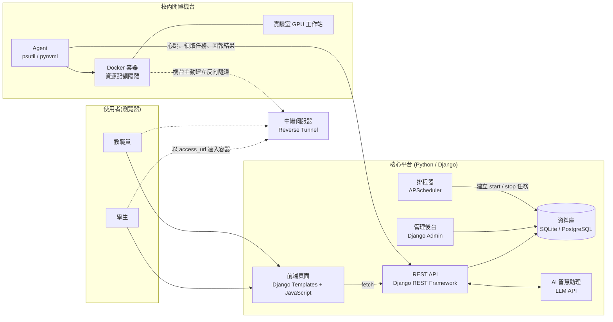

# PowerShare — 校園閒置算力租借平台

> 東吳大學黑客松競賽參賽專案

本文件為團隊開發手冊,定義專案的開發規範、介面契約、分工範圍與驗收標準。任一成員(或 AI coding assistant)依本文件即可確認自身工作內容、完成標準,以及卡關時的處理方式。

**核心原則:介面契約(§4)先行凍結,各模組再平行開發。每項工作均訂有驗收條件與降級方案,卡關時應改採降級方案繼續推進,不等待其他模組。**

* * *

## 模組與閱讀範圍

| 負責模組 | 初次閱讀順序 | 日常參照 |
|---|---|---|
| **全員(必讀)** | §0 → §1 → §2 → §3 | §8 風險表 |
| 後端 / API / AI 助理 | §4 全部 → §6.1 | §4 契約、§6.1 驗收表 |
| 機台 Agent / 容器 | §2 架構 → §4.3 → §4.6 → §6.2 | §4.6 Agent 通道、§5 隔離設計 |
| 前端 / 儀表板 | §4.2 → §4.3 → §4.9 → §6.3 | §4.8 種子資料、§4.9 呼叫方式、§6.3 驗收表 |
| 測試 / 整合 / 部署 | §3 → §4 → §7 | §3.4 對外測試部署、§7 整合驗收表 |
| 使用者測試 | §1 → §3.3 → §6.5 | §6.5 驗收表、附錄 A |

## 目錄

- [§0 開發規範](#0-開發規範)
- [§1 專案總覽](#1-專案總覽)
- [§2 系統架構與技術棧](#2-系統架構與技術棧)
- [§3 共同前置工作(全員)](#3-共同前置工作全員)
- [§4 資料與 API 介面契約(Frozen)](#4-資料與-api-介面契約frozen)
- [§5 資源安全與隔離設計](#5-資源安全與隔離設計)
- [§6 分工任務與驗收](#6-分工任務與驗收)
- [§7 整合驗收(全員)](#7-整合驗收全員)
- [§8 風險與因應方案](#8-風險與因應方案)
- [§9 未來擴充方向](#9-未來擴充方向)
- [§10 參考案例](#10-參考案例)
- [附錄 A:週次執行矩陣](#附錄-a週次執行矩陣)
- [附錄 B:AI coding assistant 使用方式](#附錄-bai-coding-assistant-使用方式)

* * *

# §0 開發規範

**本章規範優先於文件其他章節。**

1. **§4 為凍結契約**。其中的模型欄位、JSON 欄位名稱與型別、API 路徑與錯誤代碼不得私自更動。如需修改,應先於群組公告、經全員確認並更新本文件後,方可動工。
2. **各成員僅在所屬資料夾內作業**(§3.1 標明各目錄的負責模組)。一律開 feature branch,經 PR 且至少一人審閱後合併至 `main`;`main` 須由 repo 擁有者於 GitHub 設定分支保護。
3. **卡關逾預估時間 1.5 倍,應立即改採降級方案**(§6、§8 各項均已列出)。
4. **命名與格式**:程式碼識別字(變數、函式、類別)一律使用英文,註解可用中文。Python 程式碼進 repo 前須執行 `black` 與 `ruff`;JavaScript 採 ES module 撰寫。
5. **前端呼叫 API 一律透過 `frontend/static/js/api.js`**(§4.9),不得於各頁面自行呼叫 `fetch`。
6. **資料庫 migration 僅由後端負責人產生**。`models.py` 的變更須連同對應的 migration 檔於同一個 PR 提交。
7. **帳號密碼與金鑰不得提交至 repo**,包含 `.env`、受測帳號密碼檔與 Agent token。
8. **每完成一項工作,應自行對照 §6 該項驗收條件檢查**,通過後於群組回報。
9. **10/23 起功能凍結**(見附錄 A),僅修正缺陷與使用者測試發現的問題。

* * *

# §1 專案總覽

## 1.1 定位

PowerShare 將校園內閒置的電腦與 GPU 工作站(實驗室、研究室)整合為可預約的共享運算資源池,供校內學生與教職員使用。

## 1.2 運作方式

校內大量機台於課餘、夜間與寒暑假期間處於閒置狀態;同時,修習 AI 與深度學習課程的學生因本機設備效能不足,須另行租用成本較高的雲端運算服務。PowerShare 以三項機制銜接供需兩端:

1. **狀態監控** — 每台參與機台部署 Agent,每 10 秒回報 CPU / RAM / GPU 使用率,以及機台擁有者是否正在使用本機。
2. **開放時段與預約** — 機台提供單位設定可開放的時段,使用者於開放時段內預約,系統檢查時段衝突。
3. **隔離執行環境** — 使用者取得的是機台上獨立的 Docker 容器;CPU 與記憶體受配額限制,GPU 整張指派,時段結束即銷毀,不影響主機環境與其他使用者資料。

平台另設 AI 助理,使用者可用自然語言描述需求(例如「本週五下午兩小時,至少 16GB VRAM」),由系統完成機台篩選與預約建立。

## 1.3 範圍界定

**MVP 包含**

* 機台清單、開放時段與即時狀態
* 校內學生與教職員的預約(不收費)
* 預約成功後透過瀏覽器直接存取(Jupyter / code-server)
* AI 自然語言預約助理
* AI 使用報告生成(使用時長、平均使用率)
* 使用者測試所需的個人帳號批次建立

**不包含**

* 校外人士使用、收費與額度機制
* 真實金流與付款機制
* 跨校 / 多機房大規模調度
* 自行訓練語言模型(直接呼叫 Claude / OpenAI API)
* 校務系統帳號整合(身分驗證方式見 §2.4)

> 上述不包含項目為刻意界定的範圍取捨,非技術限制。

* * *

# §2 系統架構與技術棧

## 2.1 架構圖



前端頁面與 REST API 由同一個 Django 服務提供(同源)。機台與平台之間的連線一律由機台主動發起:Agent 主動回報心跳、領取任務;使用者則經由中繼伺服器的反向隧道連入容器。

## 2.2 一次租借的資料流

```
使用者於前端頁面送出預約(JavaScript)
    ↓
POST /api/bookings          ← 鎖定機台後,檢查開放時段與時段衝突
    ↓
Booking 建立 (status=pending)
    ↓
start_time 到達:排程器建立 start 任務(AgentTask)
    ↓
Agent 領取任務,執行 start_session_container()
    ↓
Agent 回報結果:成功則寫入 access_url (status=active);失敗則 status=failed
    ↓
使用者經中繼伺服器,以瀏覽器連入容器執行運算作業
    ↓
end_time 到達:排程器建立 stop 任務,Agent 執行 stop_session_container()
    ↓
Agent 回報完成 (status=done),寫入 UsageReport 並由 AI 生成使用報告
```

排程器無法運作時,管理員可於 Django Admin 對預約執行「建立開通任務」或「建立回收任務」,由 Agent 照常領取執行。

## 2.3 連線設計

校園機台位於實驗室網路的 NAT 與防火牆後方,**不具公網 IP,外部無法直接連入**。若要求資訊單位對外開放 port,除不易取得核准外,亦會擴大資安風險。本專案的連線因此全部由機台端主動發起:

* **控制通道**:Agent 以 outbound HTTPS 定期回報心跳、領取任務並回報結果(§4.6)。後端不主動連線機台,僅於資料庫建立任務。
* **使用者存取**:容器服務經由機台主動建立的反向隧道(`frp` 或 SSH reverse tunnel)提供,使用者透過中繼伺服器連入。

機台本身無須開放任何 inbound port。

## 2.4 技術棧

| 模組 | 技術 | 選用理由 |
|---|---|---|
| 後端框架 | **Django 5.2 LTS** | 內建 ORM、migration、認證系統與管理後台,減少自行建置的基礎設施 |
| REST API | **Django REST Framework** | 以 serializer 定義 JSON 格式;提供可瀏覽 API,可直接於瀏覽器測試 |
| 資料庫 | SQLite(本機開發)→ PostgreSQL(Docker Compose) | 以 `DATABASE_URL` 環境變數切換,程式碼無須修改 |
| 認證 | Django session;帳號由管理員以 `import_users` 批次建立 | 前端與 API 同源,無須另行管理 token。正式的身分驗證方式(Google OAuth 或 email 驗證碼)尚待決定,決定前以個人帳號登入 |
| 管理後台 | **Django Admin**(`/admin/`) | 維護機台、開放時段、預約、任務與帳號,並可手動建立 Agent 任務 |
| 前端 | **HTML + CSS + JavaScript(ES modules)**,由 Django Templates 提供 | 無須 Node.js 與建置工具,瀏覽器原生支援 |
| 圖表 | **Chart.js**(CDN 載入) | 輕量,適合繪製使用率曲線 |
| 機台監控 | `psutil`、`pynvml`(套件名稱 `nvidia-ml-py`) | 跨平台讀取 CPU / RAM / GPU |
| 資源隔離 | Docker + `docker-py` | CPU 與記憶體以 `--cpus`、`--memory` 限制;GPU 以 `--gpus` 整張指派 |
| 遠端存取 | Jupyter / **code-server** | 使用者免安裝環境,瀏覽器即可操作 |
| 中繼隧道 | `frp` 或 SSH reverse tunnel | 使用者連入 NAT 後方的容器 |
| 排程 | **APScheduler**(`run_scheduler` 指令,Docker Compose 中為獨立服務) | 每 30 秒依資料庫現況補建任務,重啟後不遺漏;無須另行部署 Redis |
| AI 助理 | Claude API / OpenAI API(function calling) | 無須自行訓練模型 |
| 部署 | Docker Compose + **gunicorn** + **WhiteNoise** | gunicorn 提供 WSGI 服務;WhiteNoise 於 DEBUG 關閉時提供靜態檔 |

* * *

# §3 共同前置工作(全員)

## 3.1 專案結構與檔案歸屬

```
SCU_contest/
├── README.md
├── .env.example                  環境變數範本
├── docker-compose.yml            [測試/整合] db、migrate、web、scheduler 四個服務
├── pytest.ini                    [測試/整合]
├── backend/                      [後端] Django 專案
│   ├── manage.py
│   ├── requirements.txt
│   ├── Dockerfile
│   ├── config/                   settings.py、settings_test.py、根路由 urls.py
│   └── core/                     主要應用程式
│       ├── models.py             凍結契約 §4.1
│       ├── serializers.py        凍結契約 §4.2
│       ├── urls.py               凍結契約 §4.3
│       ├── exceptions.py         錯誤格式 §4.4
│       ├── services.py           預約規則 §4.5
│       ├── authentication.py     Agent token 驗證 §4.6
│       ├── permissions.py
│       ├── throttles.py          登入次數限制
│       ├── tasks.py              建立 Agent 任務
│       ├── scheduling.py         排程器的掃描邏輯
│       ├── views/                依功能拆分:auth、machines、bookings、agent、ai
│       ├── ai_assistant.py       AI 助理 §4.7
│       ├── seed_data.py          種子資料 §4.8
│       ├── admin.py              Django Admin 設定
│       ├── management/commands/  seed、import_users、issue_agent_token、run_scheduler
│       └── migrations/
├── agent/                        [Agent] 機台端程式
│   ├── monitor.py                心跳 §4.6
│   ├── task_runner.py            任務領取與回報 §4.6
│   ├── container_manager.py      容器管理 §4.6
│   └── requirements.txt
├── frontend/                     [前端] 由 Django 直接提供
│   ├── templates/                base、login、index、bookings、assistant
│   └── static/
│       ├── css/style.css
│       └── js/                   api.js(共用)、auth.js、login.js、machines.js、bookings.js、assistant.js
├── relay/                        [Agent] 中繼伺服器
└── tests/                        [測試/整合] 契約、Agent、預約規則、管理指令
```

> `views/` 依功能拆分為多個檔案,`frontend/static/js/` 依頁面拆分,目的在於讓不同工作項目修改不同檔案,降低 merge conflict。

**頁面路由**

| 路徑 | 模板 | 腳本 | 內容 |
|---|---|---|---|
| `/login/` | `login.html` | `login.js` | 登入 |
| `/` | `index.html` | `machines.js` | 機台列表、即時使用率 |
| `/bookings/` | `bookings.html` | `bookings.js` | 開放時段、預約表單、我的預約、使用報告 |
| `/assistant/` | `assistant.html` | `assistant.js` | AI 助理對話框 |
| `/admin/` | Django Admin | — | 資料維護後台 |

除登入頁外,所有頁面皆載入 `auth.js`,未登入時導向 `/login/`。

## 3.2 環境需求

* Python 3.11 以上
* Git
* 瀏覽器(Chrome、Edge 或 Firefox 最新版);前端無須安裝 Node.js
* Docker Desktop(Agent / 容器負責人與整合負責人必裝,其餘成員建議安裝)
* 具 NVIDIA GPU 的機台:對應 CUDA 驅動與 nvidia-container-toolkit

> gunicorn 僅在 Docker(Linux)中使用;本機開發一律使用 `runserver`。

## 3.3 啟動方式

**本機開發**(預設使用 SQLite)

```bash
git clone https://github.com/thechi222/SCU_contest.git
cd SCU_contest
cp .env.example .env                  # 本機開發保留 DJANGO_DEBUG=1

cd backend
python -m venv .venv
source .venv/bin/activate             # Windows:.venv\Scripts\activate
pip install -r requirements.txt
python manage.py migrate
python manage.py seed --demo-users    # 建立模擬機台與示範帳號,示範帳號密碼只顯示於終端機
python manage.py createsuperuser      # 建立 Django Admin 管理員帳號
python manage.py runserver
```

```bash
# 排程器(另開終端機)
cd backend
python manage.py run_scheduler

# 機台 Agent(另開終端機):先核發該機台的 token
cd backend
python manage.py issue_agent_token lab-gpu-01
cd ../agent
pip install -r requirements.txt
export AGENT_TOKEN=<上一步顯示的 token>   # Windows PowerShell:$env:AGENT_TOKEN="<token>"
python monitor.py --server http://localhost:8000 --machine-id lab-gpu-01

# 測試(於 repo 根目錄執行)
pip install -r tests/requirements.txt
pytest
```

啟動後:

* 前端頁面:http://localhost:8000/(未登入時導向 `/login/`)
* 可瀏覽 API:登入後以瀏覽器開啟 http://localhost:8000/api/machines
* 管理後台:http://localhost:8000/admin/

**Docker Compose**(PostgreSQL + gunicorn,容器內固定 `DJANGO_DEBUG=0`)

```bash
# .env 須先設定 DJANGO_SECRET_KEY 與 POSTGRES_PASSWORD
docker compose up --build
docker compose exec web python manage.py seed
docker compose exec web python manage.py createsuperuser
```

`migrate` 服務完成 migration 後即結束,`web` 與 `scheduler` 於其後啟動。種子資料不會在啟動時自動載入,既有資料不會因重啟而被覆寫。

**建立受測者帳號**

```bash
# accounts.csv 欄位:email,name,role(role 為 student 或 staff)
python manage.py import_users accounts.csv --output ~/powershare-credentials.csv
```

密碼為隨機產生,只寫入 `--output` 指定的檔案(檔案已存在時拒絕執行)。請將該檔存放於 repo 以外的位置並妥善保管。

## 3.4 對外測試部署

以 HTTPS tunnel 對外提供服務(例如使用者測試期間)時,須完成下列設定:

1. `DJANGO_DEBUG=0`,並設定長度至少 50 字元的 `DJANGO_SECRET_KEY`;不符合時服務拒絕啟動。Docker Compose 已固定 `DJANGO_DEBUG=0`。
2. `DJANGO_ALLOWED_HOSTS` 加入 tunnel 網域,以及其他機台 Agent 連線用的後端區網 IP。
3. `DJANGO_CSRF_TRUSTED_ORIGINS` 設為 tunnel 的 HTTPS 網址,例如 `https://powershare.example.com`。未設定時,登入後的所有寫入請求都會回傳 403;設定後,session 與 CSRF cookie 僅經 HTTPS 傳送。
4. 使用固定網域的 tunnel。臨時網域每次重啟都會變更,須同步修改第 2、3 項。
5. `/admin/` 以 tunnel 的存取控制(例如 Cloudflare Access)限制,或僅於本機使用;管理員帳號使用長隨機密碼。
6. 於 Django Admin 停用示範帳號(取消 `is_active`),受測者一律使用 `import_users` 建立的個人帳號。
7. 對外開放前,以受測帳號實際完成一次「登入 → 建立預約」。

* * *

# §4 資料與 API 介面契約(Frozen)

> **本章為全專案唯一不得私自變更的章節。** 如需修改,應先於群組公告並經全員確認後,方可動工。

## 4.1 資料模型

```python
# ---- backend/core/models.py(後端負責人維護,全員唯讀參照)----
import uuid

from django.contrib.auth.models import AbstractUser
from django.db import models


class User(AbstractUser):
    class Role(models.TextChoices):
        STUDENT = "student", "學生"
        STAFF = "staff", "教職員"

    email = models.EmailField(unique=True)
    name = models.CharField(max_length=100)
    role = models.CharField(max_length=10, choices=Role.choices)   # 無預設值,建立帳號時須指定

    USERNAME_FIELD = "email"
    REQUIRED_FIELDS = ["username", "name", "role"]

    class Meta:
        constraints = [
            models.CheckConstraint(condition=models.Q(role__in=["student", "staff"]), name="user_role_valid"),
        ]


class Machine(models.Model):
    class Status(models.TextChoices):
        IDLE = "idle", "閒置"
        BUSY = "busy", "擁有者使用中"
        RENTED = "rented", "租用中"
        OFFLINE = "offline", "離線"

    id = models.CharField(primary_key=True, max_length=50)   # 例如 "lab-gpu-01"
    name = models.CharField(max_length=100)
    cpu_model = models.CharField(max_length=100)
    gpu_model = models.CharField(max_length=100, null=True, blank=True)
    ram_gb = models.IntegerField()
    gpu_vram_gb = models.IntegerField(null=True, blank=True)
    status = models.CharField(max_length=10, choices=Status.choices, default=Status.OFFLINE)
    owner_dept = models.CharField(max_length=100)
    agent_token_hash = models.CharField(                     # Agent token 的 SHA-256,不存明文
        max_length=64, unique=True, null=True, blank=True, editable=False,
    )


class AvailabilityWindow(models.Model):
    machine = models.ForeignKey(Machine, on_delete=models.CASCADE, related_name="availability_windows")
    start_time = models.DateTimeField()
    end_time = models.DateTimeField()

    class Meta:
        constraints = [
            models.CheckConstraint(condition=models.Q(end_time__gt=models.F("start_time")), name="window_end_after_start"),
        ]
        indexes = [models.Index(fields=["machine", "start_time"])]


class Booking(models.Model):
    class Status(models.TextChoices):
        PENDING = "pending", "待開始"
        ACTIVE = "active", "使用中"
        DONE = "done", "已結束"
        CANCELLED = "cancelled", "已取消"
        FAILED = "failed", "開通失敗"

    id = models.UUIDField(primary_key=True, default=uuid.uuid4, editable=False)
    user = models.ForeignKey(User, on_delete=models.PROTECT, related_name="bookings")
    machine = models.ForeignKey(Machine, on_delete=models.PROTECT, related_name="bookings")
    start_time = models.DateTimeField()
    end_time = models.DateTimeField()
    status = models.CharField(max_length=10, choices=Status.choices, default=Status.PENDING)
    access_url = models.URLField(max_length=500, null=True, blank=True)   # 容器開通後才有值

    class Meta:
        constraints = [
            models.CheckConstraint(condition=models.Q(end_time__gt=models.F("start_time")), name="booking_end_after_start"),
        ]
        indexes = [models.Index(fields=["machine", "start_time"])]


class AgentHeartbeat(models.Model):
    machine = models.ForeignKey(Machine, on_delete=models.CASCADE, related_name="heartbeats")
    cpu_percent = models.FloatField()
    ram_percent = models.FloatField()
    gpu_percent = models.FloatField(null=True, blank=True)
    gpu_vram_used_gb = models.FloatField(null=True, blank=True)
    owner_active = models.BooleanField(default=False)        # 機台擁有者正在使用本機
    timestamp = models.DateTimeField()

    class Meta:
        indexes = [models.Index(fields=["machine", "-timestamp"])]


class AgentTask(models.Model):
    class Action(models.TextChoices):
        START = "start", "開通容器"
        STOP = "stop", "回收容器"

    class Status(models.TextChoices):
        PENDING = "pending", "待領取"
        CLAIMED = "claimed", "執行中"
        SUCCEEDED = "succeeded", "成功"
        FAILED = "failed", "失敗"

    id = models.UUIDField(primary_key=True, default=uuid.uuid4, editable=False)
    machine = models.ForeignKey(Machine, on_delete=models.CASCADE, related_name="tasks")
    booking = models.ForeignKey(Booking, on_delete=models.CASCADE, related_name="tasks")
    action = models.CharField(max_length=10, choices=Action.choices)
    status = models.CharField(max_length=10, choices=Status.choices, default=Status.PENDING)
    error_message = models.TextField(blank=True)
    created_at = models.DateTimeField(auto_now_add=True)
    updated_at = models.DateTimeField(auto_now=True)

    class Meta:
        constraints = [
            models.UniqueConstraint(fields=["booking", "action"], name="one_task_per_booking_action"),
        ]
        indexes = [models.Index(fields=["machine", "status", "created_at"])]


class UsageReport(models.Model):
    booking = models.OneToOneField(
        Booking, on_delete=models.CASCADE, primary_key=True, related_name="report",
    )
    duration_hours = models.FloatField()
    cpu_avg = models.FloatField()
    gpu_avg = models.FloatField(null=True, blank=True)
    summary_text = models.TextField()                        # AI 生成的摘要
```

**狀態定義**

| 模型 | 狀態 | 意義 |
|---|---|---|
| Machine | `idle` | 在線且可開通新的 session |
| Machine | `busy` | 機台擁有者正在使用(心跳 `owner_active=true`),不開通新的 session |
| Machine | `rented` | 有 session 執行中 |
| Machine | `offline` | 超過 60 秒未回報心跳 |
| Booking | `pending` → `active` → `done` | 待開始 → 容器已開通 → 容器已回收 |
| Booking | `cancelled` | 使用者於開始前取消 |
| Booking | `failed` | 開始時機台不可用,或容器開通失敗 |
| AgentTask | `pending` → `claimed` → `succeeded` / `failed` | 待領取 → Agent 執行中 → 已回報結果 |

## 4.2 API 資料格式

API 的 JSON 格式由下列 serializer 定義,前端依此讀寫欄位。

```python
# ---- backend/core/serializers.py(後端負責人維護,全員唯讀參照)----
from datetime import timedelta

from django.utils import timezone
from rest_framework import serializers

from core.models import (
    AgentHeartbeat, AgentTask, AvailabilityWindow, Booking, Machine, UsageReport, User,
)

START_TIME_TOLERANCE = timedelta(minutes=5)   # 容許表單送出前的填寫時間差


class UserSerializer(serializers.ModelSerializer):
    class Meta:
        model = User
        fields = ["id", "email", "name", "role"]


class LoginSerializer(serializers.Serializer):
    email = serializers.EmailField()
    password = serializers.CharField(write_only=True)


class MachineSerializer(serializers.ModelSerializer):
    class Meta:
        model = Machine
        fields = [
            "id", "name", "cpu_model", "gpu_model", "ram_gb",
            "gpu_vram_gb", "status", "owner_dept",
        ]


class AvailabilityWindowSerializer(serializers.ModelSerializer):
    class Meta:
        model = AvailabilityWindow
        fields = ["start_time", "end_time"]


class BookingCreateSerializer(serializers.Serializer):
    machine_id = serializers.CharField()
    start_time = serializers.DateTimeField()
    end_time = serializers.DateTimeField()

    def validate(self, attrs):
        if attrs["end_time"] <= attrs["start_time"]:
            raise serializers.ValidationError({"end_time": "結束時間必須晚於開始時間"})
        if attrs["start_time"] < timezone.now() - START_TIME_TOLERANCE:
            raise serializers.ValidationError({"start_time": "開始時間不得早於現在"})
        return attrs


class BookingSerializer(serializers.ModelSerializer):
    class Meta:
        model = Booking
        fields = [
            "id", "user_id", "machine_id", "start_time", "end_time",
            "status", "access_url",
        ]


class AgentHeartbeatSerializer(serializers.ModelSerializer):
    machine_id = serializers.PrimaryKeyRelatedField(
        source="machine", queryset=Machine.objects.all(),
    )

    class Meta:
        model = AgentHeartbeat
        fields = [
            "machine_id", "cpu_percent", "ram_percent", "gpu_percent",
            "gpu_vram_used_gb", "owner_active", "timestamp",
        ]


class AgentTaskSerializer(serializers.ModelSerializer):
    end_time = serializers.DateTimeField(source="booking.end_time", read_only=True)

    class Meta:
        model = AgentTask
        fields = ["id", "booking_id", "action", "end_time"]


class AgentTaskResultSerializer(serializers.Serializer):
    status = serializers.ChoiceField(choices=["succeeded", "failed"])
    access_url = serializers.URLField(max_length=500, required=False, allow_null=True)   # start 成功時必填
    error_message = serializers.CharField(required=False, allow_blank=True)             # failed 時填寫原因


class UsageReportSerializer(serializers.ModelSerializer):
    class Meta:
        model = UsageReport
        fields = ["booking_id", "duration_hours", "cpu_avg", "gpu_avg", "summary_text"]


class AIAssistRequestSerializer(serializers.Serializer):
    message = serializers.CharField()              # 自然語言需求描述


class AIAssistResponseSerializer(serializers.Serializer):
    reply = serializers.CharField()                # 給使用者的自然語言回覆
    booking = BookingSerializer(allow_null=True)   # 成功建立預約時帶回
```

**格式約定**

* `user_id` 為整數;`machine_id` 為字串(例如 `"lab-gpu-01"`);預約與任務的 `id`、`booking_id` 為 UUID 字串。
* 時間欄位採 ISO 8601。未帶時區的輸入(例如 `<input type="datetime-local">` 的 `2026-10-15T14:00`)以台北時間解讀,回傳值一律帶 `+08:00`。
* 無值欄位回傳 `null`。
* 建立預約時,`end_time` 須晚於 `start_time`,且 `start_time` 不得早於現在(容許 5 分鐘誤差);不符合時回傳 `VALIDATION_ERROR`。

**回傳範例**(`BookingSerializer`)

```json
{
  "id": "5e2deb6b-4df1-4c0e-91e5-e8d765f0b392",
  "user_id": 1,
  "machine_id": "lab-gpu-01",
  "start_time": "2026-10-15T14:00:00+08:00",
  "end_time": "2026-10-15T16:00:00+08:00",
  "status": "pending",
  "access_url": null
}
```

## 4.3 API 路由

| 方法 | 路徑 | Request Body | 回傳 | 認證 | 呼叫端 |
|---|---|---|---|---|---|
| POST | `/api/auth/login` | `LoginSerializer` | `UserSerializer` | 公開(每個帳號每分鐘 10 次) | 前端 |
| POST | `/api/auth/logout` | — | `204 No Content` | 需登入 | 前端 |
| GET | `/api/auth/me` | — | `UserSerializer` | 需登入 | 前端 |
| GET | `/api/machines` | — | `MachineSerializer[]` | 需登入 | 前端、AI 助理 |
| GET | `/api/machines/{id}/availability` | — | `AvailabilityWindowSerializer[]`(尚未結束者,由早到晚) | 需登入 | 前端 |
| GET | `/api/machines/{id}/metrics` | — | `AgentHeartbeatSerializer[]`(最近 60 筆,由舊到新) | 需登入 | 前端 |
| GET | `/api/bookings` | — | `BookingSerializer[]`(僅本人) | 需登入 | 前端 |
| POST | `/api/bookings` | `BookingCreateSerializer` | `201` `BookingSerializer` | 需登入 | 前端 |
| GET | `/api/bookings/{id}` | — | `BookingSerializer` | 需登入 | 前端 |
| POST | `/api/bookings/{id}/cancel` | — | `BookingSerializer`(僅 `pending` 可取消) | 需登入 | 前端 |
| GET | `/api/bookings/{id}/report` | — | `UsageReportSerializer` | 需登入 | 前端 |
| POST | `/api/agent/heartbeat` | `AgentHeartbeatSerializer` | `200 OK` | Agent Token | Agent |
| POST | `/api/agent/tasks/claim` | — | `AgentTaskSerializer`;無任務時 `204` | Agent Token | Agent |
| POST | `/api/agent/tasks/{id}/result` | `AgentTaskResultSerializer` | `200 OK` | Agent Token | Agent |
| POST | `/api/ai/assist` | `AIAssistRequestSerializer` | `AIAssistResponseSerializer` | 需登入 | 前端 |

* 路徑結尾不加斜線。無法對應的 `/api/` 路徑一律回傳 JSON 格式的 `404 NOT_FOUND`。
* 本平台不提供免登入的資料 API。
* **需登入**:使用 Django session;寫入類請求須附 `X-CSRFToken` 標頭(由 `api.js` 自動處理)。
* **Agent Token**:Header `X-Agent-Token` 為該機台以 `issue_agent_token` 核發的 token。心跳的 `machine_id` 須與 token 所屬機台一致,且只能領取、回報本機台的任務,否則回傳 403 或 404。
* 預約相關路由僅能存取本人的預約,存取他人預約時回傳 `404 NOT_FOUND`。
* 任務結果回報的效果:
  * `start` 成功:寫入 `access_url`,預約轉為 `active`,機台轉為 `rented`。
  * `start` 失敗:預約轉為 `failed`。
  * `stop` 成功:預約轉為 `done`,機台轉為 `idle`。

## 4.4 錯誤回傳格式

所有錯誤統一回傳:

```json
{ "detail": "時段與既有預約衝突", "code": "BOOKING_CONFLICT" }
```

業務錯誤由後端以 `ApiError` 拋出;DRF 內建錯誤由 `core.exceptions.api_exception_handler` 轉為相同格式。`DJANGO_DEBUG=0` 時,未預期的例外與無法對應的 `/api/` 路徑也回傳相同格式,不含任何錯誤細節。

```python
from core.exceptions import ApiError

raise ApiError("時段與既有預約衝突", code="BOOKING_CONFLICT", status_code=409)
```

| code | HTTP 狀態 | 說明 |
|---|---|---|
| `BOOKING_CONFLICT` | 409 | 時段與既有預約重疊 |
| `OUTSIDE_AVAILABILITY` | 409 | 時段不在機台的開放時段內 |
| `MACHINE_UNAVAILABLE` | 409 | 機台為 `offline` 或 `busy` |
| `NOT_AUTHENTICATED` | 403 | 未登入,或 Agent 未附 token |
| `AUTHENTICATION_FAILED` | 403 | Agent token 無效 |
| `PERMISSION_DENIED` | 403 | 權限不足(含 CSRF 驗證失敗、心跳 `machine_id` 與 token 不符) |
| `NOT_FOUND` | 404 | 資源不存在,或非本人的預約、非本機台的任務 |
| `THROTTLED` | 429 | 登入嘗試次數過多 |
| `VALIDATION_ERROR` | 400 | 欄位驗證失敗,`detail` 為各欄位的錯誤訊息 |
| `SERVER_ERROR` | 500 | 未預期的伺服器錯誤 |

## 4.5 預約規則

建立預約的 view 與 AI 助理都必須呼叫 `services.create_booking()`,不得各自實作檢查。

```python
# ---- backend/core/services.py(後端負責人維護,全員唯讀參照)----
from datetime import datetime

from core.models import Booking, Machine, User


def list_available_machines(
    need_gpu: bool, min_vram_gb: int | None, start: datetime, end: datetime,
) -> list[Machine]:
    """回傳 [start, end) 期間可預約的機台:狀態不是 offline / busy、
    該時段完整落在某個 AvailabilityWindow 內,且不與 pending / active 預約重疊。"""
    ...


def create_booking(user: User, machine_id: str, start: datetime, end: datetime) -> Booking:
    """在 transaction.atomic() 內以 select_for_update() 鎖定該 Machine 列,再依序檢查:

      1. 機台存在                                 否則 ApiError NOT_FOUND (404)
      2. 機台狀態不是 offline / busy               否則 ApiError MACHINE_UNAVAILABLE (409)
      3. 時段完整落在某個 AvailabilityWindow 內     否則 ApiError OUTSIDE_AVAILABILITY (409)
      4. 不與同機台 pending / active 預約重疊       否則 ApiError BOOKING_CONFLICT (409)
         重疊條件:既有.start_time < end 且 既有.end_time > start

    BookingListCreateView 與 AI 助理的 create_booking 工具共用本函式。
    """
    ...
```

> SQLite 會忽略 `select_for_update()`,併發情境須於 PostgreSQL(Docker Compose)環境驗證。PostgreSQL 可再加上 `ExclusionConstraint` 作為資料庫層的防護(選用)。

## 4.6 Agent 通道

機台與後端之間只有 Agent 發出的 outbound 請求:

1. 管理員於 Django Admin 建立機台與開放時段,並以 `python manage.py issue_agent_token <machine_id>` 核發該機台的 token(只顯示一次,重新核發即取代舊 token)。
2. Agent 每 10 秒回報心跳,每 5 秒領取一次任務。
3. `start` 任務:啟動容器後回報 `access_url`;`stop` 任務:銷毀容器後回報完成。
4. 超過任務的 `end_time` 仍未收到 `stop` 任務時,Agent 自行回收容器。

**Agent 端環境變數**

| 變數 | 說明 |
|---|---|
| `AGENT_TOKEN` | 本機台的 token |
| `AGENT_CPU_LIMIT` | 每個 session 可使用的 CPU 核心數,例如 `2` |
| `AGENT_MEM_LIMIT_GB` | 每個 session 可使用的記憶體(GB) |

```python
# ---- agent/monitor.py(機台 Agent 負責人)----
def collect_metrics() -> dict:
    """讀取本機 CPU/RAM/GPU 使用率與擁有者使用狀態,回傳欄位需符合
    AgentHeartbeatSerializer(machine_id、timestamp 除外)。無 GPU 的機器,gpu_* 欄位回 None。"""
    ...


def send_heartbeat(base_url: str, machine_id: str) -> None:
    """每 10 秒呼叫一次,POST 到 /api/agent/heartbeat。
    Header 須帶 X-Agent-Token,值取自環境變數 AGENT_TOKEN(以 issue_agent_token 指令核發給本機台)。"""
    ...
```

```python
# ---- agent/task_runner.py(機台 Agent 負責人)----
def claim_task(base_url: str) -> dict | None:
    """POST /api/agent/tasks/claim,回傳 AgentTaskSerializer 格式的任務;無任務(204)時回傳 None。
    Header 須帶 X-Agent-Token。"""
    ...


def report_task_result(
    base_url: str,
    task_id: str,
    status: str,                     # "succeeded" 或 "failed"
    access_url: str | None = None,   # start 成功時必填
    error_message: str = "",
) -> None:
    """POST /api/agent/tasks/{task_id}/result。Header 須帶 X-Agent-Token。"""
    ...


def run_forever(base_url: str, machine_id: str) -> None:
    """每 5 秒領取一次任務:start 呼叫 start_session_container(),stop 呼叫
    stop_session_container(),完成後以 report_task_result() 回報。
    機台只發出 outbound 請求,無須開放任何 inbound port。"""
    ...
```

```python
# ---- agent/container_manager.py(機台 Agent 負責人)----
def start_session_container(
    machine_id: str,
    booking_id: str,
    cpu_limit: float,        # 例如 2.0 = 2 核,取自環境變數 AGENT_CPU_LIMIT
    mem_limit_gb: int,       # 取自環境變數 AGENT_MEM_LIMIT_GB
    gpu: bool,               # True 時以 --gpus 指派整張 GPU,由該預約獨占
) -> str:
    """啟動限流 Docker 容器,回傳可存取的 URL(code-server / Jupyter token URL)。
    Docker 無法限制 GPU 使用率與顯示記憶體,因此 GPU 一律整張指派。"""
    ...


def stop_session_container(booking_id: str) -> None:
    """銷毀容器、清除暫存資料、回收資源。由 stop 任務觸發;
    超過任務的 end_time 仍未收到 stop 任務時,Agent 應自行呼叫本函式。"""
    ...
```

## 4.7 AI 助理函式簽章

```python
# ---- backend/core/ai_assistant.py(後端 / AI 負責人)----
from dataclasses import dataclass

from core.models import Booking, UsageReport, User


@dataclass
class AIAssistResult:
    reply: str                   # 給使用者的自然語言回覆
    booking: Booking | None      # 成功建立預約時帶回


def handle_ai_request(user: User, message: str) -> AIAssistResult:
    """用 LLM function calling 解析 message,工具函式使用 core.services 的:

      list_available_machines(need_gpu, min_vram_gb, start, end) -> list[Machine]
      create_booking(user, machine_id, start, end) -> Booking

    create_booking 拋出 ApiError 時,將錯誤原因轉為自然語言回覆,booking 為 None。
    由 AIAssistView 以 AIAssistResponseSerializer 序列化後回傳。
    """
    ...


def generate_usage_summary(report: UsageReport) -> str:
    """把使用紀錄轉成摘要,內容須包含使用時長與平均使用率。
    若加入估算值(例如相較雲端 GPU 的等值費用、碳排),須註明計算假設與資料來源。"""
    ...
```

## 4.8 測試種子資料(全員共用)

> 所有模組的開發資料統一使用下列機台,確保前端畫面與後端回傳內容一致。

```python
# ---- backend/core/seed_data.py ----
# 開發用模擬資料;正式測試前改為實際參與的機台
SEED_MACHINES = [
    {
        "id": "lab-gpu-01", "name": "資訊實驗室 GPU 工作站 #1(模擬)",
        "cpu_model": "Intel i7-12700", "gpu_model": "NVIDIA RTX 3090",
        "ram_gb": 64, "gpu_vram_gb": 24, "status": "idle",
        "owner_dept": "資訊管理學系",
    },
    {
        "id": "lab-gpu-02", "name": "資訊實驗室 GPU 工作站 #2(模擬)",
        "cpu_model": "AMD Ryzen 9 5900X", "gpu_model": "NVIDIA RTX 3060",
        "ram_gb": 32, "gpu_vram_gb": 12, "status": "offline",
        "owner_dept": "資訊管理學系",
    },
    {
        "id": "team-laptop-01", "name": "專題團隊筆電 #1(模擬)",
        "cpu_model": "Intel i5-1240P", "gpu_model": None,
        "ram_gb": 16, "gpu_vram_gb": None, "status": "idle",
        "owner_dept": "專題團隊",
    },
]

# 新建的種子機台自今日起開放預約的天數
SEED_AVAILABILITY_DAYS = 90

# 本機開發用示範帳號,密碼於建立時隨機產生
SEED_USERS = [
    {"email": "demo.student@scu.edu.tw", "name": "示範學生", "role": "student"},
    {"email": "demo.staff@scu.edu.tw", "name": "示範教職員", "role": "staff"},
]
```

* `python manage.py seed` 只建立不存在的機台,並為新建立的機台加上自當日起 90 天的開放時段;既有資料一律不修改。
* 加上 `--demo-users` 時另建立示範帳號,密碼隨機產生,只顯示於終端機。
* 名稱標示「(模擬)」的機台為開發用資料,使用者測試前須改為實際參與的機台。

## 4.9 前端 API 呼叫方式

前端頁面一律透過 `frontend/static/js/api.js` 呼叫 API:

```js
import { api, ApiError } from "./api.js";

const machines = await api("/api/machines");

try {
  const booking = await api("/api/bookings", {
    method: "POST",
    body: { machine_id: "lab-gpu-01", start_time: "2026-10-15T14:00", end_time: "2026-10-15T16:00" },
  });
} catch (err) {
  if (err instanceof ApiError && err.code === "BOOKING_CONFLICT") {
    // 顯示時段衝突訊息
  }
}
```

`api()` 統一處理下列事項:

* 以 `credentials: "same-origin"` 附帶 session cookie。
* 非 GET 請求自動附上 `X-CSRFToken` 標頭。值於每次請求時從 `csrftoken` cookie 讀取,因此登入後 token 更換也不受影響。
* 自動序列化 request body 並解析 JSON 回應;`204` 回應回傳 `null`。
* 非 2xx 回應拋出 `ApiError`,可讀取 `status`、`detail`、`code`(對應 §4.4)。

* * *

# §5 資源安全與隔離設計

> 「開放他人於校內機台執行程式」的安全性是本專案的核心議題,全員均須理解並能說明本章內容。

| 機制 | 做法 | 對外說明 |
|---|---|---|
| 容器隔離 | 每個 session 使用獨立 Docker 容器 | 使用者取得的是機台上隔離的執行環境,無法存取主機系統與他人資料 |
| 資源配額 | CPU 與記憶體以 cgroups(`--cpus`、`--memory`)限制,上限由機台端設定 | 單一使用者無法耗盡整台機器的 CPU 與記憶體 |
| GPU 分配 | 以 `--gpus` 將整張 GPU 指派給單一預約獨占 | Docker 無法限制 GPU 使用率與顯示記憶體,因此同一張卡不與他人共用 |
| 網路隔離 | 機台零 inbound port,控制通道與使用者連線皆由機台主動建立 | 機台無須對外開放任何連接埠 |
| 機台驗證 | 每台機台各有一把 token,資料庫只存雜湊,且只能代表所屬機台 | 無法冒用其他機台的身分回報狀態或領取任務 |
| 帳號發放 | 管理員以 `import_users` 批次建立個人帳號,密碼隨機產生 | 每位使用者的操作與數據可個別追溯 |
| 登入保護 | 每個帳號每分鐘最多嘗試登入 10 次 | 降低密碼遭暴力破解的風險 |
| 跨站請求防護 | 寫入類 API 須通過 Django CSRF 驗證 | 防止惡意網站冒用已登入使用者的身分送出預約 |
| 錯誤資訊 | 對外環境關閉 DEBUG,錯誤只回傳代碼與簡短說明 | 不外洩原始碼、檔案路徑與資料庫連線字串 |
| 逾時回收 | 時段結束由排程器建立回收任務,Agent 端另有逾時保護 | 資源不會被長期佔用 |
| 資料不落地 | 容器銷毀時清除暫存資料 | 後續使用者無法取得前一位使用者遺留的任何資料 |

* * *

# §6 分工任務與驗收

> 每項工作均訂有**驗收條件**(完成標準)與**降級方案**(替代作法)。卡關逾預估時間 1.5 倍時應改採降級方案。
>
> 標示為 `xfail` 的測試是尚未實作功能的驗收條件。功能完成後,這些測試會轉為失敗以提醒移除標記;移除後須全數通過。

## 6.1 後端 / API / AI 助理負責人 — 擁有 `backend/`

| # | 工作項目 | 驗收條件 | 降級方案 |
|---|---|---|---|
| 1 | 維護 §4 契約檔案 | `models.py`、`serializers.py`、`urls.py`、`services.py`、`seed_data.py` 與 migration 均與本文件一致 | 無(本項為其他模組的前置條件,不可降級) |
| 2 | 認證 API | 個人帳號可登入、登出,`me` 回傳目前使用者;短時間內重複嘗試登入時回傳 429 | 先完成登入,登出與 `me` 延後實作 |
| 3 | 機台與開放時段 API | `machines` 回傳種子機台;`availability` 回傳尚未結束的開放時段 | — |
| 4 | 心跳接收與使用率 API | 心跳寫入紀錄,並依 `owner_active` 將機台設為 `idle` 或 `busy`;`metrics` 回傳最近 60 筆 | 暫不更新機台狀態,僅寫入心跳紀錄 |
| 5 | 預約建立與規則檢查 | 依 §4.5 實作 `create_booking()`;`tests/test_booking_rules.py` 的待實作測試全數通過 | 暫不鎖定機台列,僅以查詢檢查重疊(併發時可能失效,須於使用者測試前補上) |
| 6 | 預約查詢與取消 | 無法存取他人預約;僅 `pending` 可取消 | — |
| 7 | Agent 任務 API | `claim` 依建立時間取出本機台的任務;`result` 依 §4.3 更新預約與機台狀態;心跳待實作測試通過 | — |
| 8 | 排程器 | `sync_booking_tasks()` 依其說明建立任務,並標記 `failed` 與 `offline`;重啟後不遺漏 | 以 Django Admin 的「建立開通任務」「建立回收任務」手動觸發 |
| 9 | AI 助理 `/api/ai/assist` | 輸入「這週五下午兩小時、需 16G VRAM」能透過 `create_booking()` 建立預約 | function calling 不穩定時,先以關鍵字與正則解析常見句型 |
| 10 | AI 使用報告 | 摘要包含使用時長與平均使用率;若含估算值,須註明假設與來源 | 先以固定模板填入數值,LLM 潤飾延後實作 |

## 6.2 機台 Agent / 容器負責人 — 擁有 `agent/`、`relay/`

| # | 工作項目 | 驗收條件 | 降級方案 |
|---|---|---|---|
| 1 | 讀取硬體狀態 | `collect_metrics()` 能讀出 CPU / RAM(具 GPU 者含 GPU)與 `owner_active` | GPU 函式庫無法安裝時,GPU 欄位回 `None` |
| 2 | 心跳回報 | 每 10 秒以本機台 token 回報,後端可見機台由 `offline` 轉為 `idle` | 先實作單次手動觸發,定時排程延後實作 |
| 3 | 任務領取與回報 | `task_runner.py` 每 5 秒領取任務,執行後回報結果 | 先以手動執行單次領取驗證 |
| 4 | 容器啟動 / 銷毀 | `start` 任務啟動限流容器,瀏覽器可開啟 code-server;`stop` 任務銷毀容器 | GPU passthrough 卡關時先實作 CPU-only 容器 |
| 5 | 資源配額 | `docker stats` 可見容器受限於 `AGENT_CPU_LIMIT` 與 `AGENT_MEM_LIMIT_GB` | 先以手動 `docker run --cpus` 參數驗證,自動化延後實作 |
| 6 | 反向隧道 | 使用者可連入 NAT 後方的容器,機台零 inbound port | 測試階段先採同網段直連,正式作法依 §2.3 實作 |
| 7 | 逾時保護 | 超過 `end_time` 仍未收到 `stop` 任務時自行回收,`docker ps` 查無該容器 | 僅依賴 `stop` 任務回收 |

## 6.3 前端 / 儀表板負責人 — 擁有 `frontend/`

| # | 工作項目 | 驗收條件 | 降級方案 |
|---|---|---|---|
| 1 | 登入頁(`/login/`) | 個人帳號可登入,失敗時顯示原因 | — |
| 2 | 頁首登入狀態 | 顯示使用者名稱與登出按鈕;未登入時導向 `/login/` | — |
| 3 | 機台列表(`/`) | 顯示各機台的規格與狀態 | API 未就緒時,先以 §4.8 種子資料的 JSON 版本於前端模擬 |
| 4 | 即時使用率圖表 | 以 Chart.js 繪製 CPU / RAM 曲線,每 5 秒輪詢更新 | 僅顯示最新一筆數值,不繪製曲線 |
| 5 | 開放時段與預約表單(`/bookings/`) | 選擇機台後顯示開放時段;送出後可見預約狀態;`BOOKING_CONFLICT`、`OUTSIDE_AVAILABILITY`、`MACHINE_UNAVAILABLE` 各有明確提示 | — |
| 6 | 我的預約 | 顯示狀態(含 `failed`)、連線網址與剩餘時間,結束前 10 分鐘提醒 | 不顯示倒數,僅顯示結束時間 |
| 7 | AI 助理對話框(`/assistant/`) | 輸入自然語言後顯示 AI 回覆與新建立的預約 | — |
| 8 | 使用報告 | 顯示 AI 生成的使用摘要 | 先顯示原始數值表格,AI 摘要延後接入 |

> 若無成員熟悉 JavaScript,預約表單與清單可改以 Django 模板於伺服器端渲染,僅圖表與 AI 對話使用 JavaScript。此決定須於 9/20 前確認。

## 6.4 測試 / 整合 / 部署負責人 — 擁有 `tests/`、`docker-compose.yml`、`pytest.ini`

| # | 工作項目 | 驗收條件 | 降級方案 |
|---|---|---|---|
| 1 | Docker Compose | `docker compose up --build` 啟動 db、migrate、web、scheduler;首頁與 JavaScript 正常載入 | 各模組先以 SQLite 本機執行,整合作業於 10/5 前完成 |
| 2 | 契約測試 | `pytest` 全數通過;§4.3 每條路由均有回傳格式測試 | 先以 DRF 可瀏覽 API 手動驗證,自動化測試後補 |
| 3 | 對外測試部署 | 依 §3.4 完成設定,經 HTTPS tunnel 以受測帳號完成一次「登入 → 建立預約」 | 暫無固定網域時使用臨時網域,每次重啟後同步更新設定 |
| 4 | 端到端演練 | 依 §7 流程完整執行一次且無錯誤 | — |
| 5 | 壓力與異常測試 | PostgreSQL 環境下同時送出 5 筆重疊預約僅 1 筆成功;Agent 中途離線時機台轉為 `offline`,資源能正常回收 | 至少手動驗證「重複預約」與「Agent 中途離線」兩種情境 |

## 6.5 使用者測試負責人 — 擁有使用者測試的計畫、紀錄與數據

| # | 工作項目 | 驗收條件 | 降級方案 |
|---|---|---|---|
| 1 | 測試計畫 | 10/5 前定稿,內容包含受測任務(登入 → 預約 → 連線 → 查看使用報告)、成功標準、量測指標(任務完成率、完成時間、SUS 問卷)與訪談題綱 | — |
| 2 | 招募與同意 | 10/12 前確認 15 位校內受測者,並取得每位受測者的知情同意 | 人數不足時以實際招募人數進行,並於結果中註明 |
| 3 | 受測帳號 | 以 `import_users` 為每位受測者建立個人帳號;帳號密碼檔不提交至 repo | — |
| 4 | 測試執行 | 10/13–10/19 完成測試,記錄每項任務的完成情形、耗時與遇到的問題 | 無法到場者改以線上方式進行 |
| 5 | 數據整理 | 10/23 前彙整量化數據(完成率、完成時間、SUS 分數)與質化回饋,並將缺陷回報給對應模組 | — |

* * *

# §7 整合驗收(全員)

依序執行下列流程,每一步均須無錯誤:

```
1. 以個人帳號登入
     ↓
2. 瀏覽機台列表與開放時段
     ↓
3. 於 AI 助理輸入「明天下午借兩小時,需要 GPU」
     ↓
4. AI 回覆推薦機台並建立預約
     ↓
5. 時段開始 → 排程器建立 start 任務 → Agent 開通容器,取得 access_url
     ↓
6. 以瀏覽器連入,執行一段 Python / PyTorch 程式碼
     ↓
7. 結束前 10 分鐘收到提醒;時段結束 → stop 任務 → 容器銷毀
     ↓
8. 檢視 AI 生成的使用報告
```

| 驗收項 | 條件 | 降級方案 |
|---|---|---|
| 預約規則 | 時段重疊、超出開放時段、機台離線三種情境皆回傳對應錯誤代碼 | — |
| Agent 通道 | 於 Django Admin 手動建立任務後,Agent 能領取並回報結果 | — |
| 容器隔離 | 實際執行容器啟動與銷毀,並以 `docker ps` 驗證 | 機台不足時以團隊筆電搭配一台 GPU 機器驗證 |
| AI 助理 | 以自然語言完成一次實際預約 | 準備 2–3 句已驗證可穩定成功的語句作為測試基準 |
| 對外部署 | 經 HTTPS tunnel 以受測帳號完成一次登入與預約 | — |

* * *

# §8 風險與因應方案

| 風險 | 問題描述 | 因應方案 |
|---|---|---|
| 實體機台管理 | 機台的開關機與系統維護由誰負責 | MVP 僅使用少數自願提供的機台(社團 / 實驗室),後續可由資訊單位統一管理 |
| 帳號濫用 | 受測帳號外流或遭他人冒用 | 個人帳號、隨機密碼、登入次數限制;對外測試前停用示範帳號(§3.4) |
| 電費與硬體損耗 | 校內版不收費,電費與設備損耗由提供單位負擔 | MVP 僅使用自願提供、可控的機台 |
| Windows 機台 | 部分機台為 Windows,Docker 與 GPU 支援度較低 | MVP 聚焦 Linux 實驗室機台,Windows 經 WSL2 列為後續擴充 |
| 連線中斷 / 當機 | 使用者或 Agent 中途斷線,導致資源遭佔用 | 排程器判定 `offline`,Agent 端逾時保護(§6.2 #7) |
| 對外部署設定 | tunnel 網域、CSRF 或 DEBUG 設定錯誤,導致測試當天無法使用 | 依 §3.4 設定,測試前以受測帳號實際演練 |
| 前端開發人力 | 前端須手寫 JavaScript | 9/20 前確認前端負責人;必要時改以伺服器端渲染(§6.3) |
| Migration 衝突 | 多人同時修改模型,導致 migration 編號衝突 | 僅後端負責人產生 migration(§0 規範 6) |
| 數據依據 | 模擬資料或估算數字被誤認為實測結果 | 模擬資料一律標示「(模擬)」;估算值須註明假設與來源 |

* * *

# §9 未來擴充方向

* **校外開放與收費機制** — 校外身分審核、分級定價與額度管理
* **動態定價** — 收費機制上線後,依需求熱度調整價格
* **閒置時間預測** — 依歷史紀錄預測高機率閒置時段,主動推薦
* **碳足跡統計** — 以可查證的電力碳排係數,累計資源共享減少的碳排放量
* **信譽制度** — 依使用紀錄調整預約優先權
* **LINE Bot** — 將預約、到期提醒與狀態查詢整合為 LINE 指令
* **帳號系統整合** — 串接學校既有帳號系統或 Google 帳號

* * *

# §10 參考案例

| 案例 | 參考重點 |
|---|---|
| [Vast.ai](https://vast.ai) / [RunPod](https://www.runpod.io) / [Salad](https://salad.com) | 去中心化 GPU 租賃市場的媒合與定價模式 |
| [國網中心 TWCC](https://www.twcc.ai) | 學術與產業用戶的分級收費邏輯(未來收費機制參考) |
| [BOINC](https://boinc.berkeley.edu) | 志願提供閒置算力的分散式運算概念 |
| [frp](https://github.com/fatedier/frp) | 開源反向隧道工具,中繼伺服器實作參考 |

* * *

# 附錄 A:週次執行矩陣

| 週次 | 後端 / AI | Agent / 容器 | 前端 | 測試 / 整合 | 使用者測試 |
|---|---|---|---|---|---|
| **W1** 09/15–09/21 | 確認 §4 契約與 migration | 研究 psutil / pynvml 讀值 | 頁面骨架;9/20 前確認前端做法 | pytest 與 Docker Compose 骨架 | 擬定測試計畫大綱 |
| **W2** 09/22–09/28 | 認證、機台與開放時段 API、預約規則 | 心跳回報 | 登入頁、機台列表 | 補齊回傳格式測試 | 設計受測任務與問卷 |
| **W3** 09/29–10/05 | 心跳與任務 API、排程器 | 任務領取、CPU-only 容器 | 預約表單、使用率圖表 | §3.4 對外部署設定(10/5 檢查點) | 10/5 測試計畫定稿 |
| **W4** 10/06–10/12 | AI function calling 正式串接 | 反向隧道與 GPU 容器 | AI 對話框與使用報告 | 第一次端到端整合,10/12 完成可測試版本 | 招募受測者、建立受測帳號 |
| **W5** 10/13–10/19 | 修正測試回報的缺陷 | 同左 | 同左 | 測試期間監控服務狀態 | 執行使用者測試 |
| **W6** 10/20–10/26 | 10/23 起功能凍結,僅修正缺陷 | 同左 | 同左 | 第二次端到端整合測試 | 10/23 前完成數據整理 |
| **W7** 10/27–10/30 | 最終檢查 | 最終檢查 | 最終檢查 | 最終檢查 | 測試結果歸檔 |

* * *

# 附錄 B:AI coding assistant 使用方式

若使用 Claude Code 等工具協助實作,不需提供整份文件,依下表貼上對應段落即可:

| 工作內容 | 提供的段落 |
|---|---|
| 實作後端 API | §4.1–§4.5 + §6.1 對應項目 |
| 實作 Agent | §4.3 路由表 + §4.6 Agent 通道 + §6.2 對應項目 + §5 隔離設計 |
| 實作前端 | §4.2 資料格式 + §4.3 路由表 + §4.8 種子資料 + §4.9 呼叫方式 + §6.3 對應項目 |
| 撰寫測試 | §4.3 路由表 + §4.4 錯誤格式 + §4.5 預約規則 + §7 整合流程 |

**提示詞範例:**

> 以下是專案的介面契約(貼上 §4.1–§4.5),請依 §4.5 的說明實作 `core/services.py` 的 `create_booking()`,並讓 `BookingListCreateView.post` 呼叫它。衝突時拋出 `ApiError("時段與既有預約衝突", code="BOOKING_CONFLICT", status_code=409)`。完成後移除 `tests/test_booking_rules.py` 中對應測試的 `xfail` 標記,並確認 `pytest` 全數通過。**不得變更契約中任何欄位名稱或型別,也不得修改 `models.py` 與 `serializers.py`。**

最後一句為必要條件,否則模型可能自行變更欄位名稱或模型定義,導致與其他模組的實作不一致。
